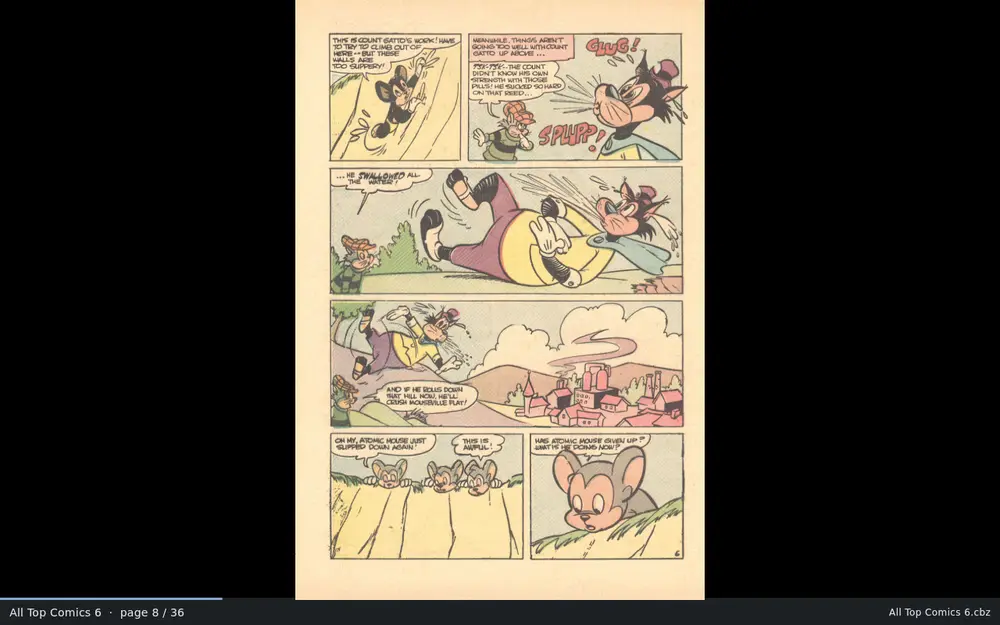
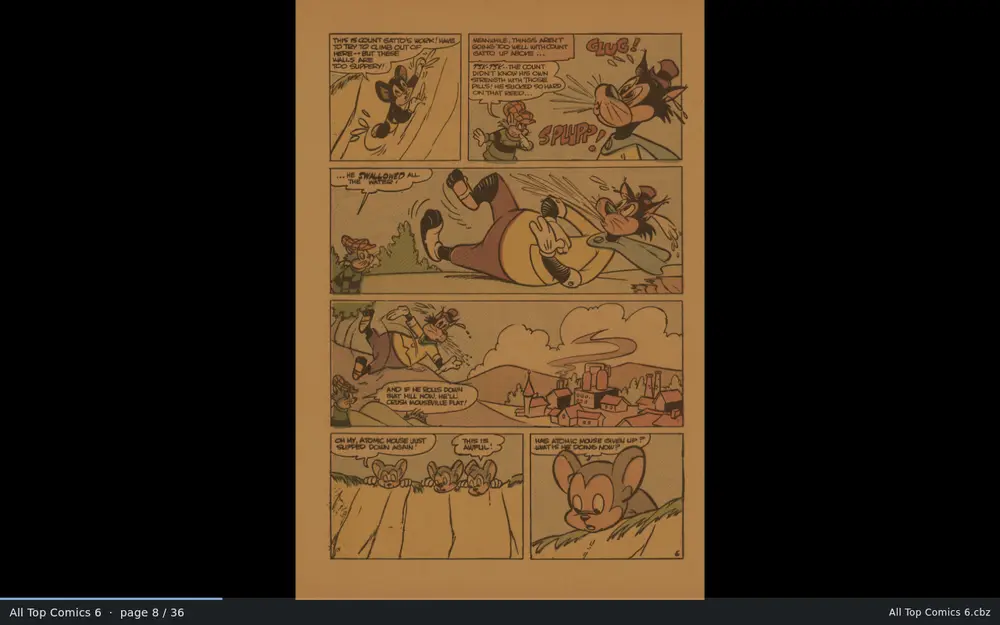

<p align="center">
  
</p>

<h1 align="center">ComicRedr</h1>

A comic reader with Comixology-style guided view, for a Fedora laptop and
an Android phone. It reads CBZ, CBT, comic EPUB, PDF, folders of page
images and one-page PNG, JPEG or WebP comics, runs entirely on your own
machine, and needs no account, sync or network.

## Screenshots


The library: every book in your comics folders as a cover, grouped by
series, with the selected book's details beside them.

| | |
|---|---|
|  |  |
| Single page, with the page counter and progress bar | Two-page spread (`d`) |
|  |  |
| Guided view (`v`) on panel 2 of 6, found by the trained detector | Balloon mode (`b`) steps through the speech balloons in each panel |
|  |  |
| Guided view on painted art with no gutters | Night filter (`i`) |

The comics are golden- and silver-age books that are in the public domain
because their copyright was not renewed, from the Digital Comic Museum's
archive.org mirror (the reader screenshots show *All Top Comics* 6, Norlen,
1959), and [Pepper&Carrot](https://www.peppercarrot.com) episode 6, *The
Potion Contest*, by David Revoy, licensed
[CC BY 4.0](https://creativecommons.org/licenses/by/4.0/).

## Features

- **Guided view** glides from panel to panel, and **balloon mode** from
  speech balloon to speech balloon inside each panel. Panels are found by a
  small detector that runs on your own CPU. On a page it can't guide,
  the first press stays and turns the background a dark wine red, so you
  look at the whole page before the next press turns it (or the page
  zooms out and back instead, `gw`; `W` turns it off).
- **Single page or two-page spreads**, with zoom, a night filter and
  automatic trimming of white scanner margins. A scanned double-page
  spread stays whole, and the pages after it keep their sides.
- **Fullscreen** (`f` or F11): only the comic, with no title bar or
  status line; move the mouse to the bottom edge to see where you are.
- **See before you jump**: `p` opens a grid of page thumbnails, and
  dragging along the progress bar previews the page under your finger.
- **Bookmarks** on a page, or on a panel in guided view, with a short
  note if you like. `mm` or the bookmark button sets one and takes it off
  again, `M` lists them with a picture of each page, `}` and `{` jump
  between them, and the library's Bookmarks tab gathers every book's.
- **Details of every comic** (`I`): file and format, page sizes and how
  sharp the scans are on your screen, JPEG quality, the images inside a
  PDF, metadata, reading time, and what panel and balloon detection found
  on each page.
- **Clean-up for old scans**: yellowed paper turns white, faded ink dark,
  and pages with fewer pixels than your screen are enlarged and sharpened.
- **A library** of your comics folders: covers, series, search,
  collections, a folder view and a reading history. Fix a
  book's title, series or issue in the app; the comic file stays as it is.
- **Picks up where you left off**, on the same page, panel and zoom, even
  after you rename or copy the file.
- **Keyboard first**, with a vi layer on top of the usual keys and your
  own key bindings, plus full touch support on the phone and on a laptop
  touchscreen, with tap zones you can rearrange.
- **Your data travels with the comic**: panels, bookmarks and your position
  live in a small hidden `.crdb` file beside it, so a comic copied to the phone
  opens there ready to read. Settings can keep those files in one folder
  instead.
- **CBZ, CBT, comic EPUB, PDF and folders of page images**, on Fedora and
  Android. EPUBs made of page images open like any comic; text ebooks don't.
- **One-pagers**: a PNG, JPEG or WebP beside your other comics is a
  one-page comic, with guided view like any other. A folder holding only
  images is still one book.

## Install on Fedora

Install the build tools and Flutter once:

```sh
sudo dnf install git clang cmake ninja-build pkgconf-pkg-config gtk3-devel
git clone --depth 1 -b stable https://github.com/flutter/flutter.git ~/flutter
echo 'export PATH="$HOME/flutter/bin:$PATH"' >> ~/.bashrc && source ~/.bashrc
flutter doctor        # the "Linux toolchain" line should be green
```

Then build and install ComicRedr:

```sh
git clone https://github.com/snonux/comicredr.git && cd comicredr
make model MODEL=path/to/comicredr-panels.onnx   # once; The trained detector below has other ways
make                  # build it
make run              # try it without installing
make install          # add it to the GNOME app grid, no sudo needed
```

After `make install`, ComicRedr is in Activities with its own icon, and
**Open With → ComicRedr** works on CBZ, CBT, EPUB and PDF files, on
folders, and on PNG, JPEG and WebP images without becoming your image
viewer or file manager. To update, run
`git pull && make && make install`; `make uninstall` removes it and keeps
your reading progress. `make help` lists everything else.

To install on another Fedora machine without Flutter, `make tarball`
builds `build/comicredr-VERSION-linux-x64.tar.gz`; unpack it there and run
`./install.sh`.

### The trained detector

The trained model finds panels much more reliably than classic computer
vision and is the only way to get balloon mode. It is one file,
`comicredr-panels.onnx`.

**Why it isn't included.** The model is fine-tuned from a public
checkpoint that was trained partly on Manga109, a manga dataset licensed
for academic research only. Weights derived from it shouldn't be handed
out publicly, so the file is neither in this repository nor downloadable
from anywhere public. Everything needed to build it yourself is here,
though: the training comics are free, and their labels are in the repo.

Get the model into the checkout once, in one of three ways:

- **Train it yourself:** `make train-model` (below).
- **Fetch your own copy** from wherever you keep it (your own server, a
  private Hugging Face repository with `HF_TOKEN` set):
  `make fetch-model URL=https://your.server/comicredr-panels.onnx`. It
  checks the file is the detector before using it.
- **Use a file you already have:** `make model MODEL=path/to/comicredr-panels.onnx`.

#### Train it yourself

You need Python 3.11 or later, about 7 GB of free disk (5 GB of it for
PyTorch and the other Python packages), and network access to
archive.org, peppercarrot.com and huggingface.co. Install the
Python packages once, then run the one command:

```sh
python3 -m pip install --user opencv-python-headless numpy pillow pypdfium2 huggingface_hub ultralytics onnx onnxruntime onnxslim
make train-model
```

It downloads the training comics (public-domain golden- and silver-age
books from archive.org, Pepper&Carrot and other freely shared comics,
about 750 MB) and the base checkpoint from Hugging Face, cuts out the 305
labelled pages, and fine-tunes for 45 epochs on the CPU: about three and
a half minutes an epoch on 4 cores, so two and a half to three hours in
all. The result lands in `spike/out/comicredr-panels.onnx` and is copied
into the checkout, so the next `make` or `make apk` uses it.

To check it worked: the last step prints `Checked: ONNX model, output
[1, 300, 6]`. Then `make run`, open a comic and press `v` and `b`: balloon
mode steps through the speech balloons instead of saying `no balloons
found`. `make train-model EPOCHS=1` runs the whole pipeline in about ten
minutes, to try your setup before the long run. How the labels were
drawn and how to score a model are in [AGENTS.md](AGENTS.md).

With the model in the checkout, `make` builds it into the Linux app and
`make apk` into the Android APK, so an installed app needs nothing else:

| Make target | What it does |
|---|---|
| `make && make install` | Builds and installs the Linux app with the model inside. |
| `make apk && make install-apk` | Builds and installs the Android APK with the model inside. |
| `make install-model MODEL=file.onnx` | Adds a model to the installed Linux app without rebuilding; it wins over the built-in one. |
| `make push-model MODEL=file.onnx` | The same on the phone, over USB. |
| `make NO_MODEL=1` | Builds without a model; the app uses classic computer vision. |

Without the model, `make` and `make apk` stop and say what to run. Restart
the app after `install-model` or `push-model`.

## Install on an Android phone

ComicRedr is sideloaded as an APK; there is no app store build. You build
it on the laptop and install it over USB. On top of the Fedora setup above,
you need a JDK and the Android command-line tools:

```sh
sudo dnf install java-21-openjdk-devel android-tools
mkdir -p ~/Android/Sdk/cmdline-tools && cd ~/Android/Sdk/cmdline-tools
curl -LO https://dl.google.com/android/repository/commandlinetools-linux-16111833_latest.zip
unzip commandlinetools-linux-*_latest.zip && mv cmdline-tools latest
export ANDROID_HOME=~/Android/Sdk   # put this in ~/.bashrc too
~/Android/Sdk/cmdline-tools/latest/bin/sdkmanager "platform-tools"
flutter config --android-sdk ~/Android/Sdk
flutter doctor --android-licenses
```

Turn on **USB debugging** on the phone, plug it in, and from the checkout:

```sh
make keystore       # once: creates your signing key
make apk            # build the APK
make install-apk    # install it, keeping the app's data
```

> **Back up `~/.config/comicredr/release.jks` and `android/key.properties`.**
> Android only installs an update over the old app, keeping your library
> and positions, when it is signed with the same key. On a new laptop,
> restore both files instead of running `make keystore` again.

On first start, copy some comics to the phone (for example into `Comics`),
tap the folder button, allow **All files access** on the settings page it
opens, then add the folder. The buttons on the reader's status line switch
guided view, balloons and bookmarks, and a Bluetooth keyboard gets the same
keys as the laptop.

## Quick start

1. **Add your comics.** Press `A`, or click **Add your comics folder**, and
   pick the folder your comics are in. Every CBZ, CBT, EPUB, PDF, one-page image
   and folder of page images under it turns up as a cover, grouped into series.
2. **Read.** Pick a book and press `Enter`. `→` and `←` (or `Space`) turn
   pages; `Esc` goes back to the library.
3. **Try guided view.** Press `v` to go panel by panel, and `b` to step
   through the speech balloons too. Pages the detector isn't sure about,
   such as a splash page, are shown whole.
4. **Press `?` whenever you need a key.** It shows the full keymap, and `/`
   searches it (`zoom`, `bookmark`, `night`).

A single file opens without the library too: `comicredr book.cbz`,
**Open With → ComicRedr** in Files, `o` in the app, or drag it onto the
window. A folder of comics, `comicredr ~/Comics/Marvel` or dropped on the
window, opens the Folders tab there, and is added to the library if it
isn't in it yet. To take a comic to the phone or another laptop, copy its
hidden `.crdb` file along with it (`.book.cbz.crdb` beside `book.cbz`).

Any key can be changed in `~/.config/comicredr/keys.toml`: `make keys`
starts one from [docs/keys.toml](docs/keys.toml), which lists every action.

### Touch

Tap or swipe at the left and right edges to turn, pinch or double-tap to
zoom, drag to pan, and tap the middle to hide the status line. Drag along
the progress bar to scrub through the book, or tap the grid button for
every page at once. Android's
back gesture leaves guided view, then the book.

Settings has a left-handed and a one-thumb layout, and `gt` shows the
zones while reading. The `[touch]` section of `keys.toml` gives any action
to a tap, double-tap or long press in each of nine zones, to a swipe, or
to a two-finger tap.

### The CBR files you already have

ComicRedr doesn't read RAR archives. Convert them to CBZ once; it takes a
couple of seconds a book:

```sh
sudo dnf install unar zip
for f in *.cbr; do
  d=$(mktemp -d)
  unar -q -o "$d" "$f"
  (cd "$d" && zip -qr0 "$OLDPWD/${f%.cbr}.cbz" .)
  rm -rf "$d"
done
```

A `.cbr` that is really a ZIP opens as it is.

## More

What changed in each version is in [CHANGELOG.md](CHANGELOG.md).
Development notes, the test scripts and how the detector is trained are in
[AGENTS.md](AGENTS.md).
