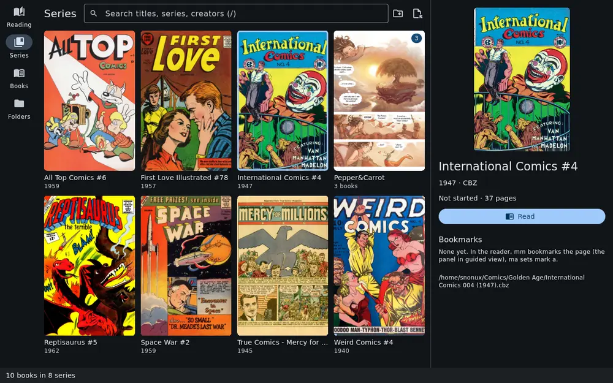
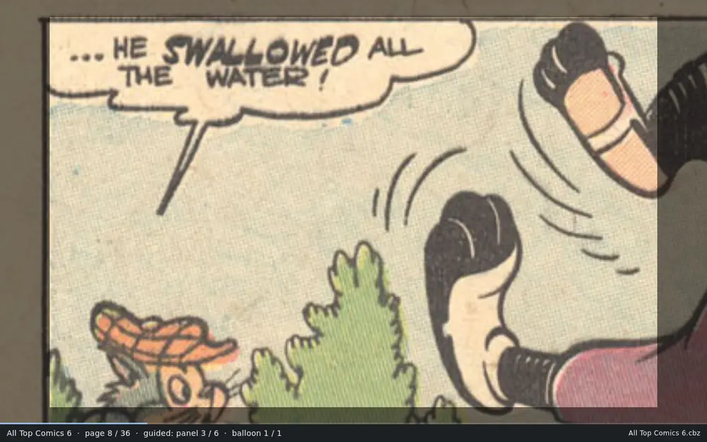
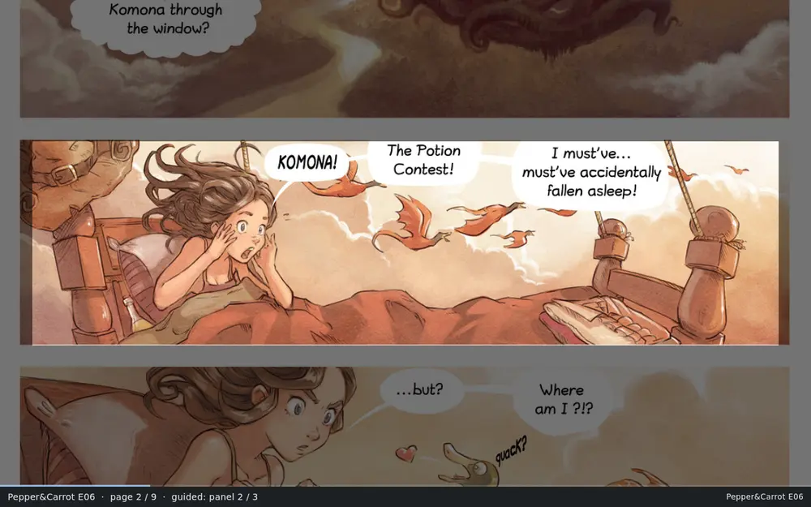
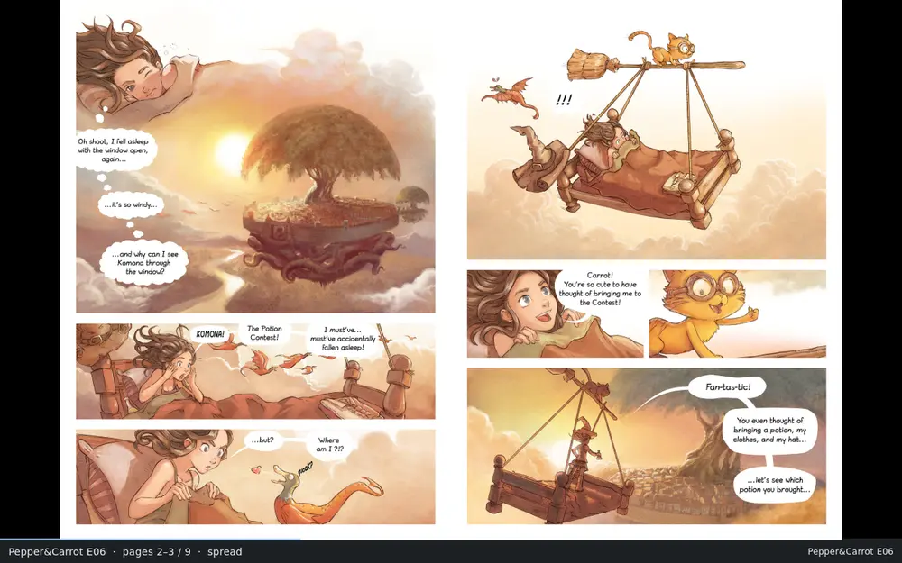

  

<h1 align="center">ComicRedr</h1>

A comic reader for a Linux laptop and an Android phone, made for reading
panel by panel. It should work on any Linux distribution, but has only
been tested on Fedora. Its **guided view** glides from one panel to the next, and
from one speech balloon to the next, like Comixology did. It reads the
comics you already have, runs entirely on your own machine, and needs no
account, cloud or network.

**[Read the guide](docs/guide/README.md)**: installing, then every
feature with screenshots and short animations, as a small book with a
table of contents.

| | |
|---|---|
|  |  |
| **Guided view** (`v`): the page whole, then panel by panel | **Balloon mode** (`b`): one speech balloon at a time |

## Highlights

- **Guided view** and **balloon mode**, found by a small detector built
  into the app that runs on your own CPU.
- **CBZ, CBT, comic EPUB, PDF**, folders of page images and single PNG,
  JPEG or WebP pages.
- Single pages or two-page spreads, with zoom, a night filter, margin
  trimming and clean-up for yellowed old scans.
- A **library** of your comics folders: covers, series, folders, search,
  collections, favourites, bookmarks with notes and a reading history.
- **Picks up where you left off**, on the same page, panel and zoom, and
  carries that and your bookmarks to the phone with the file.
- **Keyboard first**, with a vi layer for those who want it, full touch
  support, and every key and tap zone can be changed.
- Free software under the Apache License 2.0.

| | |
|---|---|
|  |  |
| Guided view on panel 2 of 6 | Balloon mode, one speech balloon at a time |
|  |  |
| Guided view on painted art with no gutters | Two pages side by side |

The comics are public-domain golden- and silver-age books from the
Digital Comic Museum's archive.org mirror (*All Top Comics* 6, Norlen,
1959) and [Pepper&Carrot](https://www.peppercarrot.com) episode 6, *The
Potion Contest*, by David Revoy, licensed
[CC BY 4.0](https://creativecommons.org/licenses/by/4.0/).

## Quick start

1. **Install it.** On Linux, build it from source:
   [Installing on Linux](docs/install-linux.md). On Android, add the
   [snonux F-Droid repository](https://github.com/snonux/fdroid) to
   F-Droid and install ComicRedr from there, or build the APK yourself:
   [Installing on Android](docs/install-android.md).
2. **Add your comics.** Put them in `~/Comics` and they are in the
   library the first time ComicRedr starts, or press `A` to add another
   folder.
3. **Read.** Pick a book and press `Enter`. `→` and `←` turn pages, `Esc`
   goes back to the library.
4. **Try guided view.** Press `v` to go panel by panel, and `b` to step
   through the speech balloons too.
5. **Press `?` whenever you need a key.** It lists every key and `/`
   searches them.

**Carry on with [the guide](docs/guide/README.md)**: the library,
reading, guided view, bookmarks, touch, the phone, your data and
settings, one chapter each.

## More

- How it works inside, with diagrams and the detector model explained:
  [docs/architecture.md](docs/architecture.md)
- Training the panel detector: [docs/training.md](docs/training.md)
- Notes for developers, the test scripts and conventions: [AGENTS.md](AGENTS.md)
- What changed in each version: [CHANGELOG.md](CHANGELOG.md)
