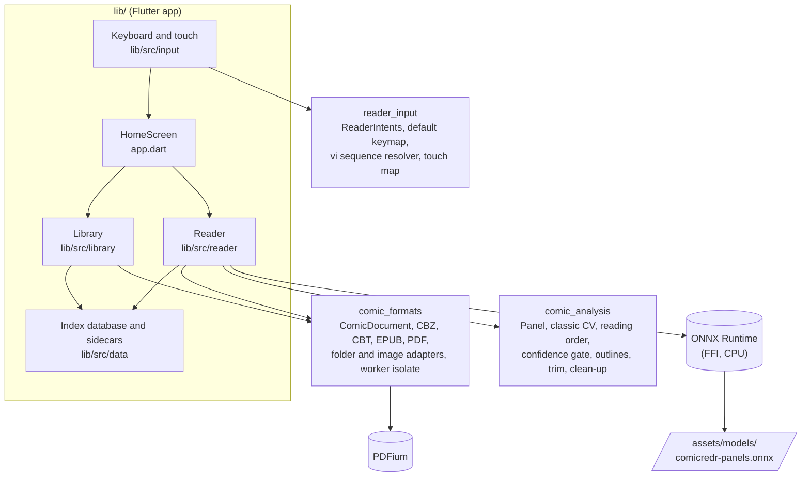
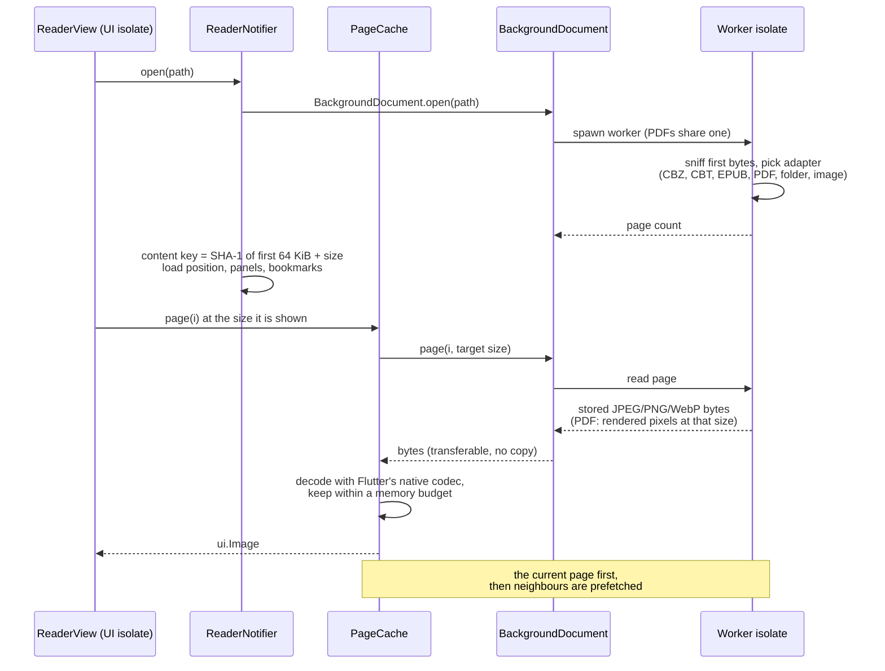
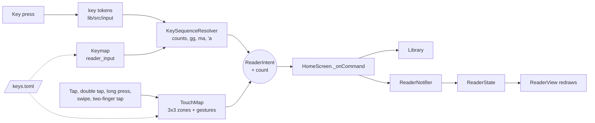
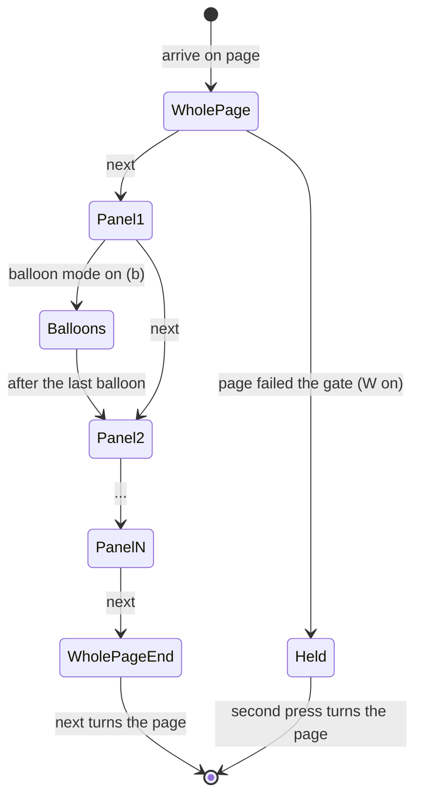
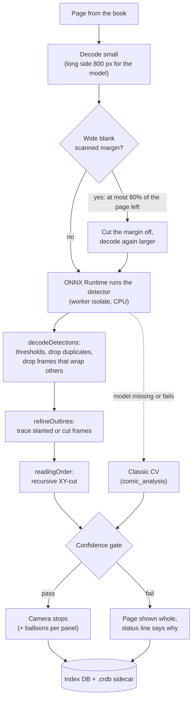
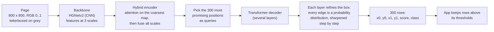
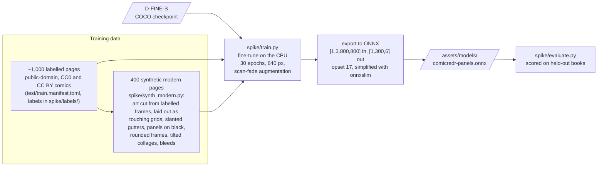
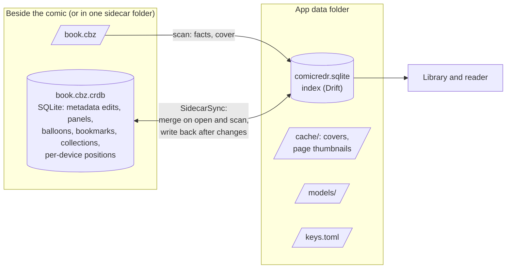
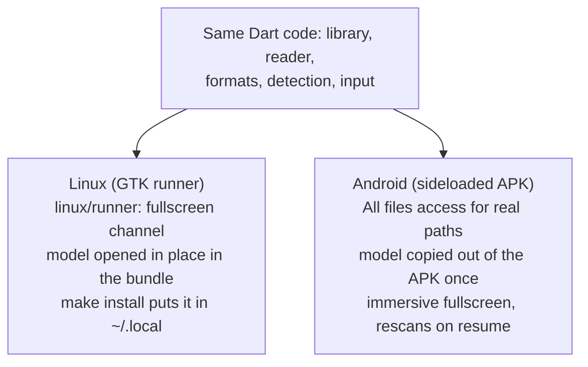

# How ComicRedr works

This is a map of the app: what the parts are, how a page gets from a file
to the screen, how guided view finds its panels, and what the detector
model is. For using the app, see [the guide](guide/README.md); for building,
testing and the finer details of each feature, see [AGENTS.md](../AGENTS.md).

The diagrams are [Mermaid](https://mermaid.js.org); GitHub draws them.

## The big picture

ComicRedr is one Flutter app for Linux (Fedora) and Android, split into
the app itself and three pure-Dart packages in a pub workspace. The
packages know nothing about Flutter widgets, so they are tested with plain
`dart test` and could be reused on their own.

| Part | What it does |
|---|---|
| `packages/comic_formats` | Opens a book. One interface, `ComicDocument`, with an adapter per format. The first bytes of a file decide the format, not its extension. `BackgroundDocument` runs the adapter on a worker isolate so reading a page never blocks the UI. |
| `packages/comic_analysis` | Everything about what is on a page: the `Panel` type, classic computer-vision panel detection, the model's input and output format, reading order, the confidence gate, frame outlines, margin trimming and scan clean-up. |
| `packages/reader_input` | Every action the reader can take is a named `ReaderIntent`. The default keymap, the vi-style resolver (counts like `5l`, sequences like `gg`) and the touch map all produce intents. |
| `lib/src/library` | The library screen: scanning folders, covers, series, collections, search, settings, the background detection pass. |
| `lib/src/reader` | The reader: `ReaderNotifier` holds the reading state, `ReaderView` draws it, `PageCache` decodes pages, `PanelDetector` and `ModelDetector` find panels. |
| `lib/src/data` | The app's index database (Drift/SQLite) and the per-comic `.crdb` sidecar files that carry panels, bookmarks and positions with the comic. |
| `lib/src/input` | Turns Flutter key and pointer events into key tokens and gestures, and loads `keys.toml`. |

State is held in Riverpod providers (`lib/src/providers.dart`,
`lib/src/library/providers.dart`). Everything slow (unzipping, PDF
rendering, decoding, detection, hashing) runs off the UI isolate.

## From a file to a page on screen

- **Formats.** Archives and folders hand back the stored image untouched;
  Flutter's decoder scales it down to the screen. PDFs are rendered by
  PDFium at the size they are shown at, capped at 300 dpi. All PDFs share
  one worker, because two PDFium workers at once crash the process.
- **Content key.** Progress, panels and bookmarks are keyed on a SHA-1 of
  the first 64 KiB plus the file size, so they follow a renamed or copied
  file.
- **Page cache.** Decoded pages live in a least-recently-used cache sized
  to the device. Zooming in asks for a sharper tile of just the part on
  screen.

## Input: one set of intents for keys and touch

Every key and gesture ends up as the same `ReaderIntent`, so the keyboard,
a phone's touchscreen and a laptop touchscreen all do the same things, and
the `?` help and `docs/keys.toml` are generated from the one keymap. Pinch
zoom and panning are the only gestures handled directly by the view.

## Guided view

Guided view moves a camera from panel to panel. The camera is just a
transform on the page: `ReaderView` zooms and pans so the current panel
fills the screen and dims the rest of the page, outside the panel's real
outline when the frame isn't a rectangle.

Where the panels come from is the interesting part.

### Finding panels on a page

1. **Decode.** The page is decoded straight to the detector's size by
   Flutter's native codec (PDFs render at that size).
2. **Trim.** A page scanned with a wide blank margin would leave the
   frames covering too little of it. When trimming leaves at most 80% of
   the page, the detector looks at the trimmed part, and the gate judges
   the frames against that part.
3. **Detect.** The trained model runs on a long-lived worker isolate that
   owns the ONNX Runtime session, with all cores but two, so reading stays
   smooth. See [The detector model](#the-detector-model) below.
4. **Clean up the boxes.** Frames below a score of 0.3 and balloons below
   0.4 are dropped, near-duplicates (overlap above 0.7) fold into the
   stronger one, and a frame that wraps two or more others (a whole row
   reported as one more panel) is dropped.
5. **Outlines.** The model outputs boxes. `refineOutlines` walks the
   gutter around each box to find the real shape of slanted and cut
   frames, so the dim follows the art.
6. **Reading order.** A recursive XY-cut: split the panels into rows along
   gutters no panel crosses, read rows top to bottom; when there is no
   such gutter, peel off the leading column. A wide two-page spread reads
   one page at a time. Balloons inside a panel use the same order.
7. **The confidence gate.** A wrong camera move is worse than none, so a
   page only gets guided view when its frames look like a real layout:
   2 to 20 panels, no two overlapping by more than 15%, none filling the
   page, together covering at least 60% of it, and at most four tiny
   scraps (ads and text pages look like a crowd of scraps). Otherwise the
   page is shown whole on a wine-red background, and a press within
   5 seconds of arriving is held once.
8. **Cache.** The result is stored in the app's index database and in the
   comic's `.crdb` sidecar, keyed by content key, page and detector
   version. A comic copied to the phone opens there with its panels
   already known.

Detection runs in the background for the open comic only, guided view on
or off (`_ensurePanels` in `reader_notifier.dart`): the page being read,
the two ahead and the one behind at once, then the rest of the comic ahead
at low priority, resting between pages as long as the last one took.
Closing the comic stops it; other comics are analysed when opened.

**Classic CV** (`packages/comic_analysis/lib/src/classic_cv.dart`) is the
fallback when there is no model, or the model fails on a page: find
everything that isn't paper-coloured gutter, add Canny edges so thin
borders close, fill holes, take connected components as boxes, split big
boxes along full-length gutters, drop slivers, then reading order and the
gate. It is fast and needs no model file, but it gets the camera wrong
far more often and finds no balloons.

## The detector model

### What it is

The model is **D-FINE-S**, a small real-time object detector, fine-tuned
to find three kinds of things on a comic page:

| Class | What it is | What the app does with it |
|---|---|---|
| 0 `frame` | a panel | a camera stop in guided view |
| 1 `caption` | a narration box | nothing: balloon mode skips captions |
| 2 `balloon` | a speech or thought balloon | a stop in balloon mode (`b`) |

It is not a language model and reads no text: it looks at the page as an
image and draws boxes. It is one ONNX file,
`assets/models/comicredr-panels.onnx`, about 43 MB (roughly 10 million
parameters in 32-bit floats), built into every Linux build and APK, and
run on the CPU through ONNX Runtime. On 4 cores a page takes about
150 ms.

D-FINE ("Fine-grained Distribution Refinement") comes from the USTC team's
2024 paper and is Apache-2.0 licensed, code and weights. The app starts
from its **COCO-only** checkpoint (`ustc-community/dfine-small-coco` on
Hugging Face), never from checkpoints trained on Objects365 or Manga109,
whose data is licensed for research only. So the fine-tuned model can be
published under Apache 2.0 with the rest of ComicRedr; [NOTICE](../NOTICE)
credits the base model and every training book.

### How it works

D-FINE belongs to the DETR family of detectors, which treat detection as
"predict a fixed set of boxes" rather than "score thousands of candidate
boxes and then weed out duplicates".

1. **Backbone.** A compact convolutional network (HGNetv2) turns the page
   into feature maps at three scales: fine ones for small balloons, coarse
   ones for whole panels.
2. **Hybrid encoder.** Self-attention runs on the coarsest map, so every
   position can "see" the whole page (a gutter on the left says something
   about a panel on the right), then the scales are fused back together.
3. **Queries.** The 300 most promising positions become queries, each one
   a slot that will turn into one box.
4. **Decoder with fine-grained refinement.** Each decoder layer lets the
   queries look at the image features and at each other. Instead of
   guessing four box coordinates outright, D-FINE predicts, for each edge
   of the box, a probability distribution over small offsets, and every
   layer sharpens the previous layer's distributions. This is what makes
   its boxes tight on the edges, which matters for a panel camera. During
   training the last layer also teaches the earlier ones (self-distillation),
   which costs nothing at run time.
5. **No NMS.** Training matches each real panel to exactly one query
   (Hungarian matching), so the model learns not to report the same panel
   twice. The output is final: 300 rows, most of them low-scoring, and the
   app only thresholds them. That keeps the Dart side simple.

The app's side of the contract (`packages/comic_analysis/lib/src/model_io.dart`):

- **In:** one float32 tensor `[1, 3, 800, 800]`. The page is scaled so its
  long side is at most 800 px, placed at the top-left of a grey (114)
  square, as R, G, B planes in 0..1 (`letterboxTensor`).
- **Out:** one tensor `[1, 300, 6]`: box corners in input pixels, score,
  class (`decodeDetections`).
- The model was trained at 640 px; the exported graph resizes the 800 px
  input itself, so the app's side stays the same whatever size a model was
  trained at.

### How it was trained

- **Real pages.** About 1,000 pages from public-domain golden- and
  silver-age comics and CC BY modern books (Pepper&Carrot among them),
  labelled with panels, captions and balloons. The comics themselves are
  fetched, never committed; the labels are. How labels are drawn is in
  `spike/LABELLING.md`.
- **Synthetic pages.** Free modern comics are rare, so
  `spike/synth_modern.py` builds 400 modern-style layouts from the art of
  the labelled real frames. Their labels are exact by construction. They
  are added on top of the real pages, never instead of them.
- **Augmentation.** Brightness, contrast and saturation are varied so the
  model copes with yellowed and faded scans, and pages are shrunk a
  little inside the input.
- **Everything on the CPU.** No GPU is needed anywhere, for training or
  reading. `make train-model` runs the whole pipeline; the steps and
  requirements are in [docs/training.md](training.md).

**How good is it?** `spike/evaluate.py` runs a model over labelled pages
from books it never trained on and asks, per page, whether guided view
would move the camera right, show the page whole, or move it wrong. The
shipped model gets 73 of 100 golden-age pages right and 47 of 66 modern
ones, with about one page in twelve getting a wrong camera move. The full
tables and the history of earlier models are in AGENTS.md. Its known
weak spots: rounded frames on black, thin-lined tilted collages, and
dense golden-age pages with narrow caption strips.

### When the model changes

The detector version stored with cached panels is a code generation
(`modelDetectorVersion`, bumped when decoding or thresholds change) times
10^8 plus a hash of the model file. A new model file or new decoding code
therefore means every page is detected again, the first time it is
shown; nothing needs clearing by hand. A user can also put their own
model in the app data folder's `models/` or point `COMICREDR_MODEL` at
one, and `COMICREDR_MODEL=none` forces classic CV.

## Where data lives

- **The index database** is the working store the library and the reader
  read and write. It is rebuilt from the files and their sidecars, so it
  is really a cache of them plus this install's settings.
- **Sidecars** (`.book.cbz.crdb`, hidden, beside each comic; or all in one
  folder if chosen in Settings) are small SQLite files that make a comic
  self-contained: copy the comic and its sidecar to the phone and it opens
  with its panels, bookmarks, favourites and your position. Merging is
  per row: bookmarks are unioned by id with removals winning, metadata
  edits take the later edit per field, positions are kept per device.
- **The comic file is never written.** Metadata edits live in the
  sidecar, since rewriting the comic would change its content key.
- **A settings file** (Settings → Export settings, `SettingsFile` in
  `lib/src/data/settings_file.dart`) is the index's own part as JSON:
  the settings, library folders, `keys.toml`, and positions, bookmarks,
  collections, edits and reading history by content key. Import merges
  it by the sidecar rules; what a rescan or a sidecar rebuilds (books,
  panels, covers) stays out.
- **App data** goes in `~/Comics/.comicredr/` on a fresh Fedora install
  that has a `~/Comics` folder, otherwise the usual XDG folders; Android
  keeps its private app folders. The `?` help shows which.

## Platforms

Almost everything is shared. The platform-specific parts are small: the
GTK runner's window channel for fullscreen, the launcher and icons on
Linux, file access and immersive mode on Android, and where the bundled
model is read from.
