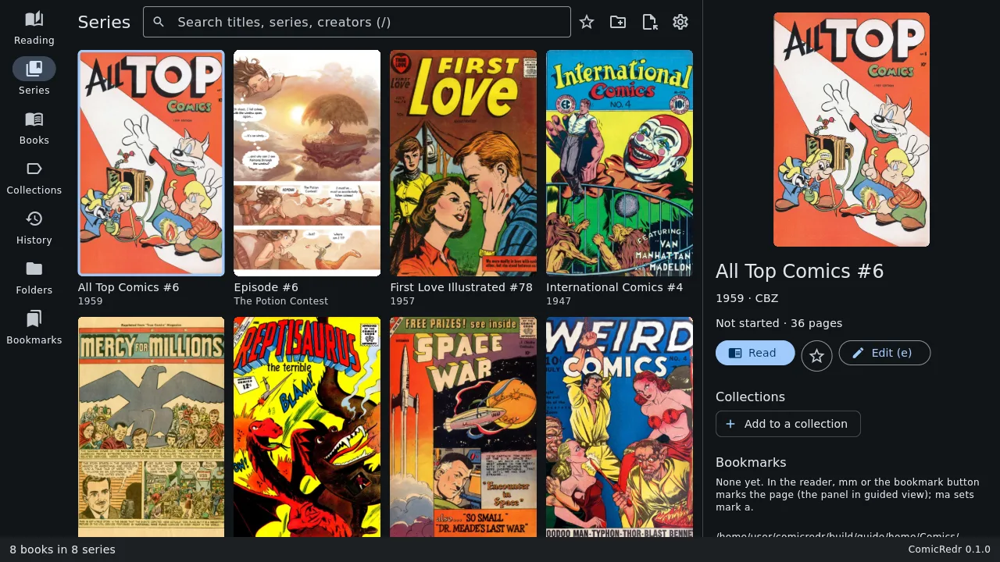
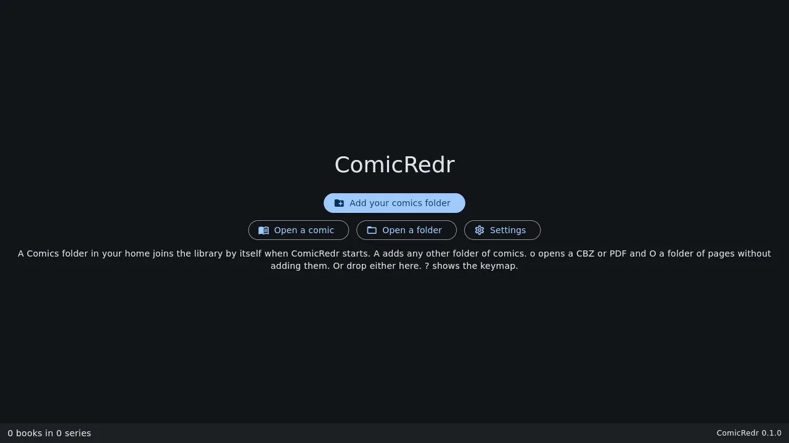
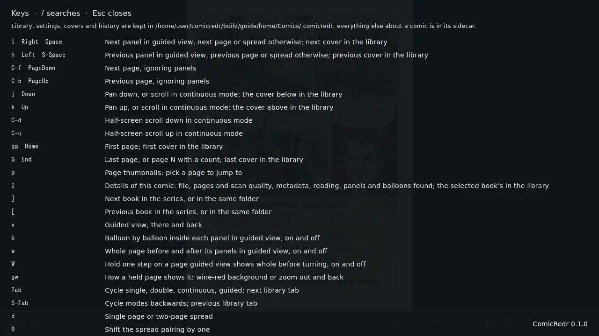

# 2. Getting started

[Contents](README.md) · Previous: [Installing](01-installing.md) · Next: [The library](03-library.md)

ComicRedr is a comic reader for a Linux laptop (tested on Fedora) and an
Android phone. It
reads the comics you already have, from your own folders, and it never
needs an account or the network. Its best trick is **guided view**: it
finds the panels on each page and glides from one to the next, the way
Comixology did.

Once it is [installed](01-installing.md), this chapter gets you to reading
your first comic.

## What it reads

| Kind of comic | What ComicRedr does with it |
|---|---|
| CBZ (a ZIP of page images) | Reads it. The most common comic format. |
| CBT (a tar of page images) | Reads it, like a CBZ. |
| PDF | Renders each page at the size you look at it, so zooming in stays sharp. |
| EPUB made of page images | Reads it like any comic. EPUBs that are mostly text are refused: they are ebooks, not comics. |
| A folder of page images | One book. JPEG, PNG, WebP, GIF and BMP pages, in natural order (page 2 before page 10), subfolders included. |
| A single PNG, JPEG or WebP | A one-page comic, with guided view like any other. |
| CBR (a RAR archive) | Not read. Converting your CBR files to CBZ takes a moment: see [The CBR files you already have](01-installing.md#the-cbr-files-you-already-have). |

ComicRedr looks at the first bytes of a file, not at its name, so a
`.cbr` that is really a ZIP opens as it is.

## Add your comics

Put your comics in a folder called `Comics` in your home folder
(`~/Comics`). The first time ComicRedr starts it finds that folder, adds
it to the library and shows every comic in it as a cover.

Keep them somewhere else? Press `A` (or click **Add your comics folder**)
and pick the folder. You can add as many folders as you like.

If ComicRedr finds no comics folder at all, it opens on a short welcome
page with buttons to add a folder, open a single comic or open a folder
of pages:

On the phone, ComicRedr first asks for permission to read your comics
where they are; [On the phone](10-phone.md#first-start) walks through it.

## Open a comic

In the library, pick a cover with the arrow keys or the mouse and press
`Enter` (or click it twice). The comic opens where you left off, or on
page 1 the first time.

- `→` or `Space` turns the page, `←` goes back.
- `Esc` goes back to the library.

You can also open a single comic without adding it to the library:

- `o` in the app opens a file picker.
- `comicredr book.cbz` from a terminal.
- **Open With → ComicRedr** on a comic in the Files app.
- Drag a comic onto the window.

A folder works the same way: `comicredr ~/Comics/Marvel`, `O` in the app,
or a folder dropped on the window. A folder of page images opens as a
book; a folder that holds comics opens in the library's
[Folders tab](03-library.md#folders), and is added to the library if it
isn't in it yet.

### Carry on where you stopped: `C`

`C` opens the comic you read last, on the page you left it at, even after
the app was closed: start ComicRedr and press `C`, and you are back on
that page, in guided view on the same panel if that is how you were
reading. The library's header shows the same thing as a button, a round
play arrow whose tooltip names the comic, for touch and the mouse (on a
phone, on the Reading tab).

Inside a comic, `C` opens the one you read before it, so it takes you back
and forth between two comics. A comic you moved to another folder of the
library is still found. One that was deleted or moved out of the library
gets a short notice instead, and pressing `C` again goes on to the comic
read before it.

## Try guided view

Open a comic, go to a page with a few panels and press `v`. The page
first shows whole, then each press of `→` moves to the next panel, and
the rest of the page dims. Press `b` too and it stops on every speech
balloon inside each panel. [Chapter 5](05-guided-view.md) has the
details.

## When you need a key: `?`

Press `?` anywhere to see every key, with what it does. Type `/` in that
list to search it: `zoom`, `bookmark` or `night` find the keys for those.
[Chapter 9](09-keyboard.md) explains the keyboard in full.

[Contents](README.md) · Previous: [Installing](01-installing.md) · Next: [The library](03-library.md)
