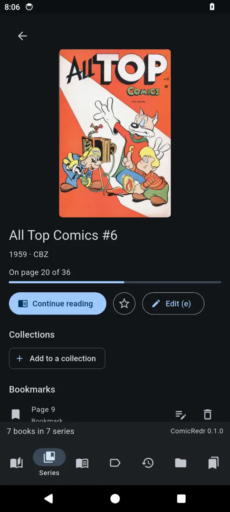
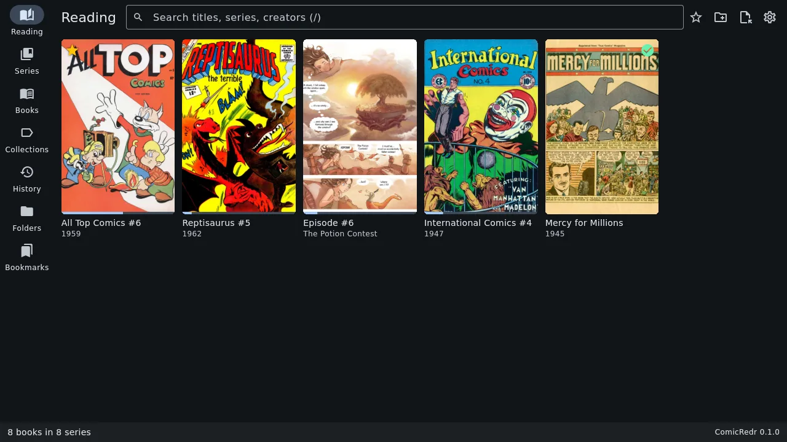
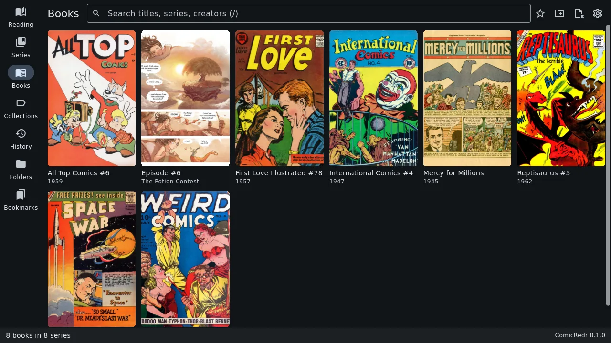
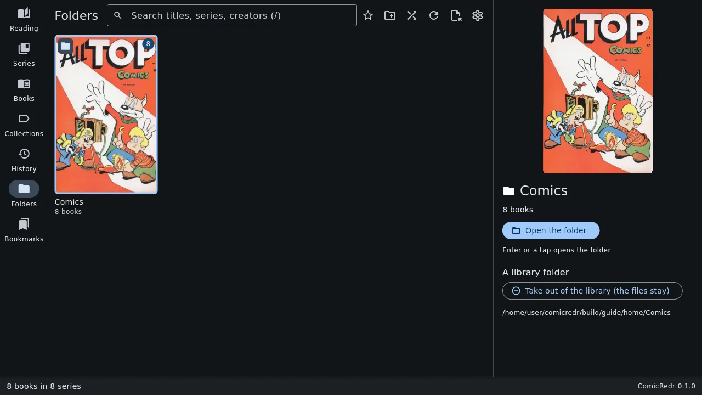
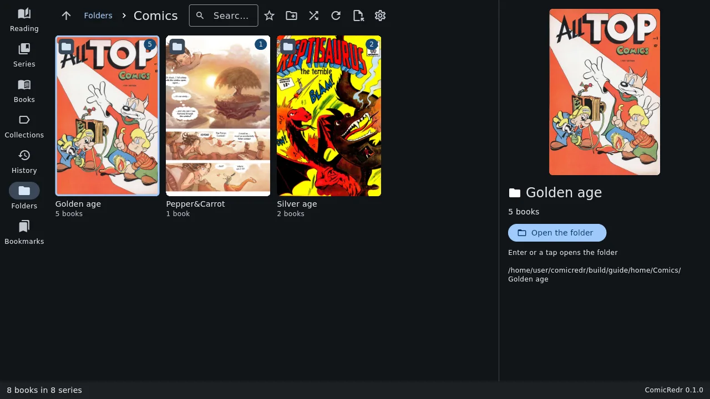
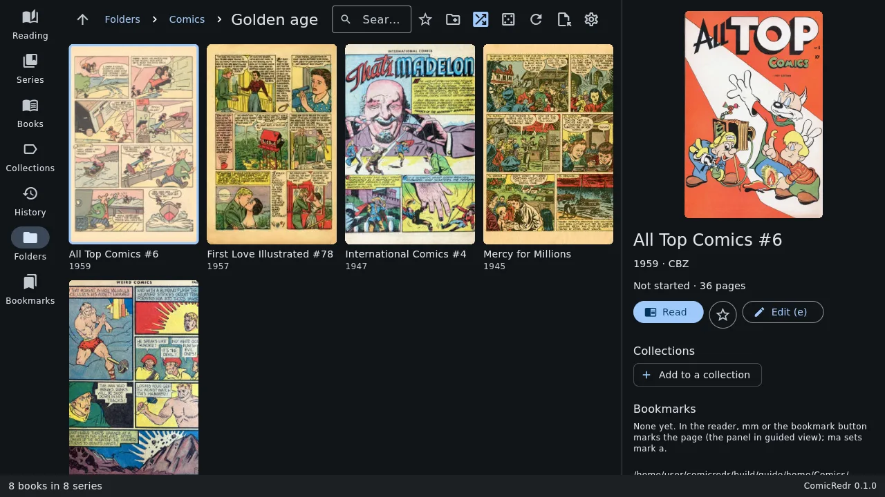
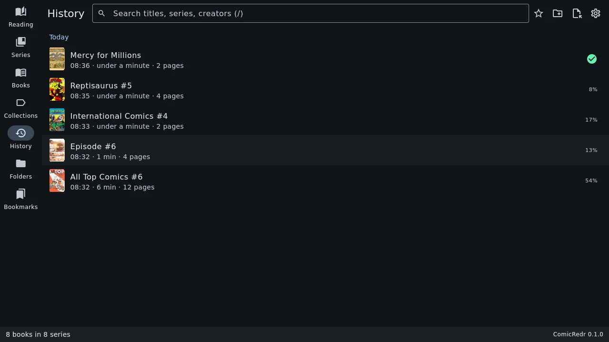
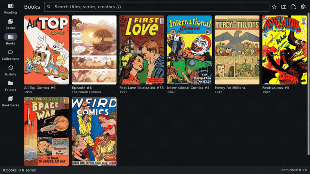
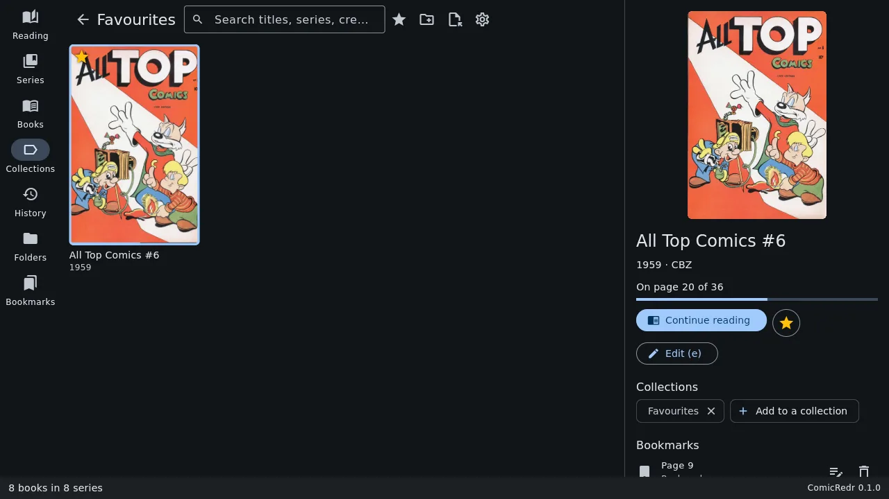

# 3. The library

[Contents](README.md) · Previous: [Getting started](02-getting-started.md) · Next: [Reading a comic](04-reading.md)

The library is every comic in the folders you gave ComicRedr, as covers.
It is where the app opens, and `Esc` from a comic brings you back to it.

## Moving around

- The arrow keys (or `h` `j` `k` `l`) move from cover to cover; `PageUp`
  and `PageDown` move a screenful, `Home` and `End` go to the first and
  last cover.
- `Enter` opens the selected book, series or folder. With the mouse, one
  click selects a cover and a second click opens it.
- `Tab` and `Shift+Tab` go to the next and previous tab.
- `Esc` backs out one step: out of a series, a folder or a search.

On a wide window the selected book's details sit beside the covers: its
cover, how far you are, a **Read** (or **Continue reading**) button, a
star for [Favourites](#favourites), **Edit**, its
[collections](#collections), its [bookmarks](06-bookmarks.md) and the
file's path.

On the phone the tabs sit along the bottom, and a tap on a cover opens a
page with the same details:

| | |
|---|---|
|  |  |
| The library on the phone | A tap on a cover shows its details |

Small marks on the covers tell you where you are:

- a **thin bar** along the bottom: you are part way through it;
- a **green check**: you have read it to the end;
- an **amber star**: it is one of your favourites.

## The tabs

| Tab | What it shows |
|---|---|
| **Reading** | The books you have started, unfinished ones first, most recent first. ComicRedr opens on this tab once you have started a book. |
| **Series** | One cover per series. A series with more than one book opens to show its books. |
| **Books** | Every book, series by series, in issue order. |
| **Collections** | Your own groups of books, including [Favourites](#favourites). |
| **History** | What you read, day by day. |
| **Folders** | Your comics as they are on disk, folder by folder. |
| **Bookmarks** | Every bookmark in every book. See [Bookmarks and marks](06-bookmarks.md#the-bookmarks-tab). |

### Series

ComicRedr reads the series, issue number, title, year and creators from
the comic's own `ComicInfo.xml` when it has one, and from the file name
otherwise: `All Top Comics 6 (1959).cbz` becomes issue 6 of *All Top
Comics*, from 1959. Books in a series are sorted by volume and issue, so
issue 10 comes after issue 9, and specials like *Annual* go last.

When the name is wrong, [fix it in the app](07-managing-comics.md#fix-a-title-or-series).

### Folders

The Folders tab shows your library folders, and inside them their
subfolders and comics, as they are on disk.

- `Enter` goes into a folder; `Backspace` goes up one level.
- The path at the top shows where you are; click any part of it to go
  there.
- Choosing the Folders tab again takes you back to the top.
- Add, move or delete comics in your file manager and the tab follows
  along while it is open.

#### Shuffle

Press `S` on the Folders tab and each comic shows a random page from
inside it instead of its cover. It is a nice way to rediscover what you
have. `gs` picks other pages, and `S` again brings the covers back.
Opening a book still starts where you left off.

### History

The History tab lists every time you sat down with a comic, grouped by
day: when you started, how long you read and how many pages you saw.
Coming back to the same book within two minutes counts as the same
sitting, and a quick glance (one page for a few seconds) is not
listed. Click a row to open the book there.

Settings → **Clear reading history** empties it. Your positions,
bookmarks and collections stay.

## Search

Press `/` (or click the search box) and type. The covers narrow down as
you type. Every word has to match somewhere in the title, series, issue,
year, writers, artists or file name, ignoring case, so `top 1959`
finds *All Top Comics 6*. A series or folder stays when any book in it
matches. On the Bookmarks tab the search looks in your notes too.

`Enter` jumps to the first match; `Esc` clears the search.

## Favourites

Press `*` on a cover (or in a comic you are reading) to add it to your
Favourites; press it again to take it out. The star in a book's details
does the same.

`gf`, or the star at the top of the library, shows your Favourites. There
`x` takes the selected comic out again, with an **Undo** in case it was a
slip.

## Collections

A collection is a named group of books you make yourself: *To read
next*, *Lent to Sam*, *Space stories*. A book can be in any number of
them.

- In a book's details, click **Add to a collection**, type a new name or
  pick one you already have, and click **Add**.
- The **x** on a collection's chip in the book's details takes the book
  out.
- The Collections tab shows each collection as a cover; open one to see
  its books.

Favourites is simply a collection called *Favourites*. Collections are
kept in each comic's [sidecar file](11-your-data.md), so they follow the
comic to your phone.

## Adding, rescanning and taking out folders

- `A`, or the folder button at the top, adds another folder.
- `R` rescans the library folders. You rarely need it: ComicRedr notices
  new, changed and deleted comics by itself.
- To take a folder out of the library, select it at the top of the
  Folders tab and click **Take out of the library (the files stay)** in
  its details. Your comics are not touched.

The first scan reads each comic once, about a third of a second a book.
After that, starting the app only checks what changed. The line at the
bottom shows the scan's progress, and **Finding panels** while
ComicRedr looks for the panels of every book in the background, so
guided view is ready whenever you want it (the pause button beside it
pauses that).

[Contents](README.md) · Previous: [Getting started](02-getting-started.md) · Next: [Reading a comic](04-reading.md)
