# 3. The library

[Contents](README.md) · Previous: [Getting started](02-getting-started.md) · Next: [Reading a comic](04-reading.md)

The library is every comic in the folders you gave ComicRedr, as covers.
It is where the app opens, and `Esc` from a comic brings you back to it.

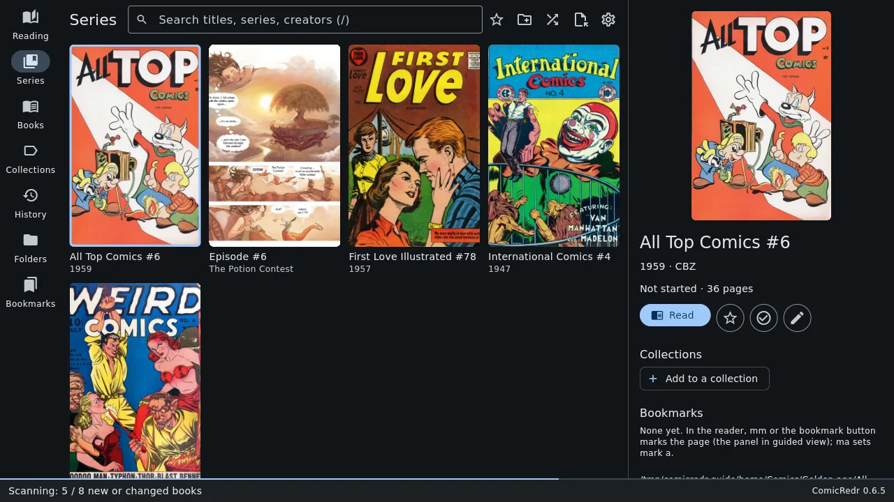

## Moving around

- The arrow keys (or `h` `j` `k` `l`) move from cover to cover; `PageUp`
  and `PageDown` move a screenful, `Home` and `End` go to the first and
  last cover.
- `Enter` opens the selected book, series or folder. With the mouse, one
  click opens a series or folder; on a book it selects the cover, and a
  second click opens it.
- In a narrower window (a phone, a tablet held upright, a small laptop
  window) there is no room for details beside the covers, so one click or
  tap on a book shows its details on a page of their own, with a **Read**
  button.
- `Tab` and `Shift+Tab` go to the next and previous tab.
- `Esc` backs out one step: out of a series, a folder or a search.

On a wide window the selected book's details sit beside the covers: its
cover, how far you are, a **Read** (or **Continue reading**, or **Read
again**) button, a star for [Favourites](#favourites), a tick for
[completed](#completed-comics), a pencil to [fix its title or series](07-managing-comics.md#fix-a-title-or-series), its
[collections](#collections), its [bookmarks](06-bookmarks.md), the
file's path, and buttons to [see its details, reset it or delete
it](07-managing-comics.md) and to [mark it](#several-comics-at-once).
A selected series shows a button to read its next book, and on the
Series tab **Rename**.

On the phone the tabs sit along the bottom, and a tap on a cover opens a
page with the same details:

| | |
|---|---|
| 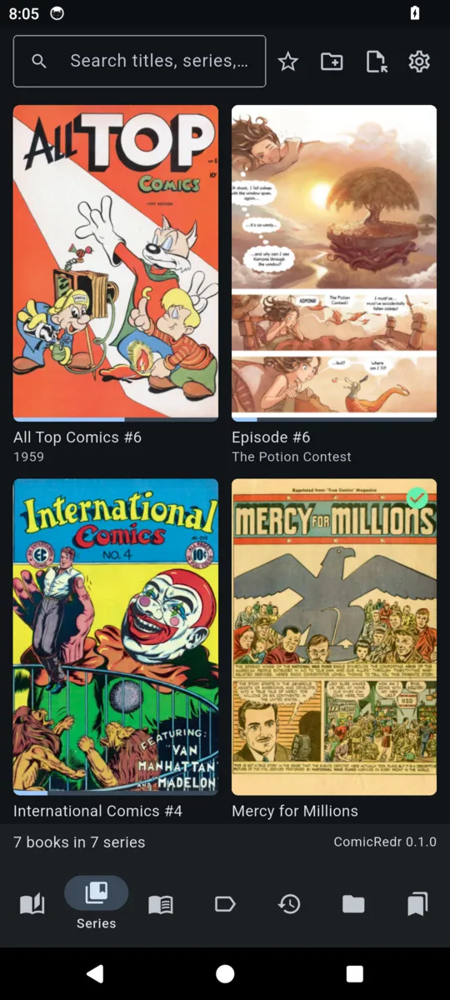 | 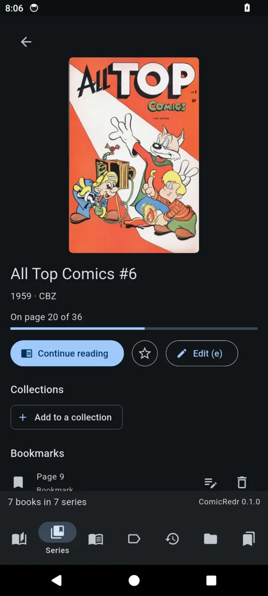 |
| The library on the phone | A tap on a cover shows its details |

Small marks on the covers tell you where you are:

- a **thin bar** along the bottom: you are part way through it;
- a **green check**: it is [completed](#completed-comics), read to the end;
- an **amber star**: it is one of your favourites;
- a **number** on a series or folder: how many comics are in it;
- a **tick**: it is [marked](#several-comics-at-once);
- a **cloud**: it is [on S3](13-s3-sync.md#the-cloud-on-a-cover).

## Bigger and smaller covers

`+` makes the covers bigger and `-` makes them smaller, a column fewer
or more with each press; `=` puts them back to the usual size. `Ctrl`
and the mouse wheel do the same, and so does a pinch on a touchpad or a
touchscreen: spread two fingers for bigger covers, pinch them together
for smaller ones.

Without a keyboard, and when a pinch is not for you, [Settings](12-settings.md)
has the same steps as buttons: open it with the gear while the covers
show, and under **Library → Cover size** tap the magnifier with the
plus or the minus. The covers behind the dialog change with each tap,
the line says how many there are in a row, and **Usual size** puts them
back.

Say a folder holds two hundred comics and you want to see more of them
at once: press `-` a few times until the covers are small. To look at
the covers properly, press `+` until they are big. The smallest covers
are just wide enough for the start of a title; the biggest are up to
three times the usual width (one cover a row on a phone).

Big covers are not always sharp. ComicRedr keeps each cover as a
picture 512 pixels wide. On a laptop screen that stays sharp all the
way up. A phone or a high-resolution screen packs two or three pixels
into each point, so a big cover there needs more pixels than the
picture has: it is the same picture stretched, and looks a little soft
at the biggest sizes. The pages [shuffle](#shuffle) shows are at most
512 pixels wide too, so the same holds for them. Open the comic to see
the page as it is.

Covers at the usual size look as they always did and take the same
memory. Small covers each take less, since many more of them fit on a
screen. You get back to the usual size with `=`, and also by stepping
back to it: after `+`, a `-` is the usual size again, exactly as if you
had never changed it.

The cover you selected stays in view while the size changes. The size
is the same on every tab of covers (Reading, Series, Books, Collections
and Folders) and is remembered across restarts. The History and
Bookmarks tabs are lists and have no size to change, and neither `+`
nor `-` does anything while a cover's details fill the screen on a
phone. While the cursor is in the search box, `+` and `-` are typed
into it like any other character.

## The tabs

| Tab | What it shows |
|---|---|
| **Reading** | The books you have started, unfinished ones first, most recent first. ComicRedr opens on this tab while a book is part way read, otherwise on Series. |
| **Series** | One cover per series. A series with more than one book opens to show its books. |
| **Books** | Every book, series by series, in issue order. |
| **Collections** | Your own groups of books, including [Favourites](#favourites). |
| **History** | What you read, day by day. |
| **Folders** | Your comics as they are on disk, folder by folder. |
| **Bookmarks** | Every bookmark in every book. See [Bookmarks and marks](06-bookmarks.md#the-bookmarks-tab). |

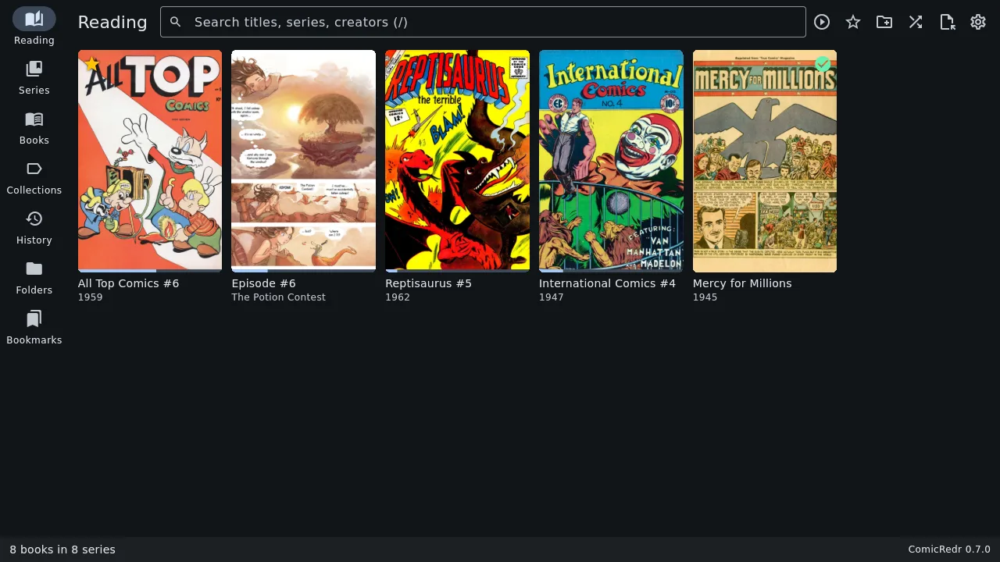

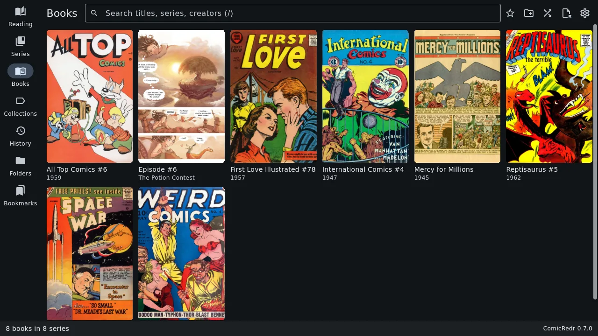

### Series

ComicRedr reads the series, issue number, title, year and creators from
the comic's own `ComicInfo.xml` when it has one, and from the file name
otherwise: `All Top Comics 6 (1959).cbz` becomes issue 6 of *All Top
Comics*, from 1959. Books in a series are sorted by volume and issue, so
issue 10 comes after issue 9, and specials like *Annual* go last.

When the name is wrong, [fix it in the app](07-managing-comics.md#fix-a-title-or-series).

### Folders

The Folders tab shows your library folders, and inside them their
subfolders and comics, as they are on disk.

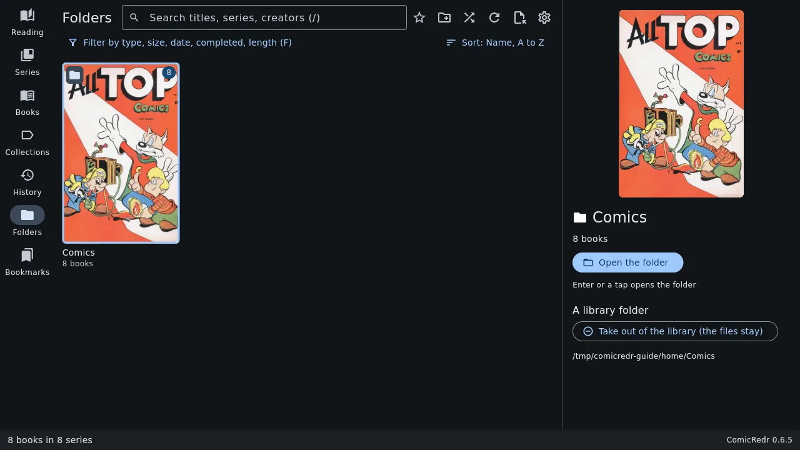

- `Enter` goes into a folder; `Backspace` goes up one level.
- The path at the top shows where you are; click any part of it to go
  there.
- Choosing the Folders tab again takes you back to the top.
- Add, move or delete comics in your file manager and the tab follows
  along while it is open.
- The same comic in two folders (say `xman/Nancy.cbr` and a copy in
  `Unread/xman/`) shows in both. It is one comic to the library, so your
  place and bookmarks are shared, and the other tabs show it once; open,
  move or delete it from a folder and that folder's copy is the one used.

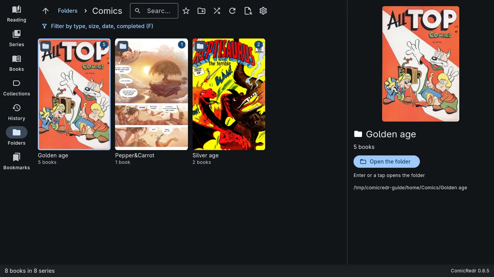

#### Filter by type, size, date and completed

Press `F` on the Folders tab, or tap **Filter by type, size, date,
completed** under the search box, to show only some of your comics:

- **Type**: CBZ, CBT, PDF, EPUB, image folder or single image. Only the
  types your library has are offered. Pick one or several; none picked
  means every type.
- **Size**: under 10 MB, 10 to 50 MB, 50 to 200 MB or over 200 MB. A
  folder of page images counts all its pages together.
- **Modified**: the file's own date, as your file manager shows it: the
  last 24 hours, 7 days, 30 days or 12 months, or over a year ago.
- **Completed**: **Completed or not** shows them all, **Completed only**
  the comics you have [read to the end](#completed-comics), and **Not
  completed** hides those, which leaves what is still to read.

The covers behind the window update as you pick. From the keyboard,
`Tab` moves between the choices and `Space` picks one; `Alt+C` is
**Clear all**, and `Esc`, `Alt+D` or **Done** closes the window. The
four combine, and they combine with the search too: PDFs from the last
week with "love" in the title is `F`, PDF, Last 7 days, then `/` and
`love`. To see only what you have not read yet: `F`, `Tab` to **Not
completed**, `Space`, `Esc`. A comic you then mark completed leaves the
tab at once and the cover next to it is selected, so `gC`, `gC`, `gC`
ticks off one after the other, and `Enter` opens what comes next. (After
**Undo** the comic is back and the selection stays where it is.)

A subfolder with nothing that passes is hidden, and a folder's count is
of the comics that pass. While a filter is on, the line under the search
box says what it lets through: tap a part to change it, its x to take it
off, or **Clear filter** for all of it. **Clear all** in the window does
the same. The filter stays until you clear
it, across restarts, and only the Folders tab is filtered.

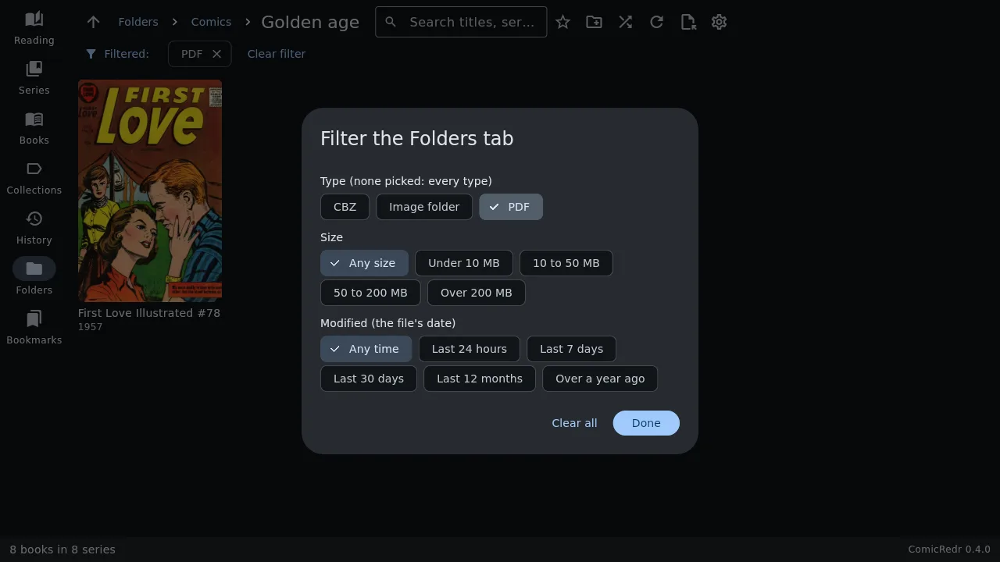

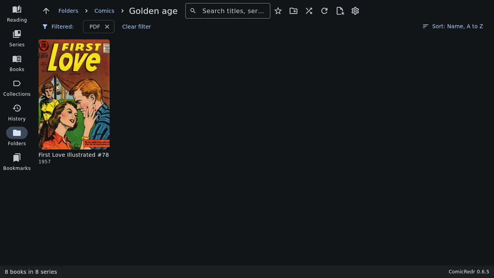

### History

The History tab lists every time you sat down with a comic, grouped by
day: when you started, how long you read and how many pages you saw.
Coming back to the same book within two minutes counts as the same
sitting, and a quick glance (one page for a few seconds) is not
listed. Click a row to open the book where you left off.

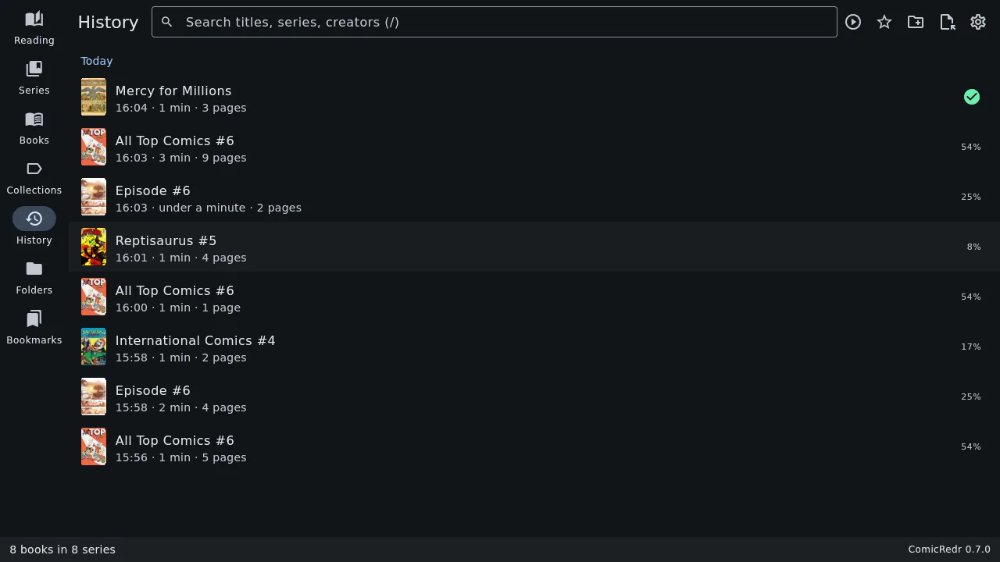

Settings → **Clear reading history** empties it. Your positions,
bookmarks and collections stay.

## Search

Press `/` (or click the search box) and type. The covers narrow down as
you type. Every word has to match somewhere in the title, series, issue,
year, writers, artists or file name, ignoring case, so `top 1959`
finds *All Top Comics 6*. A series or folder stays when its name or any
book in it matches. On the Bookmarks tab the search looks in your notes too.

`Enter` jumps to the first match; `Esc` clears the search.

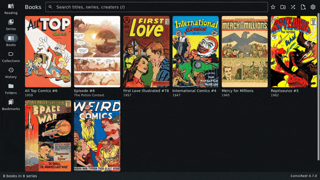

## Shuffle

Press `S` on any tab of covers (or the shuffle button at the top) and
each comic shows a random page from inside it instead of its cover, and
each series or folder a random page of a random comic in it. It is a
nice way to rediscover what you have. `gs` (or the dice button beside
it) picks other pages, and `S` again brings the covers back. On a phone,
where there is no room for the dice, press shuffle twice. Opening a book
still starts where you left off, and shuffle stays on until you turn it
off, across restarts and on every tab.

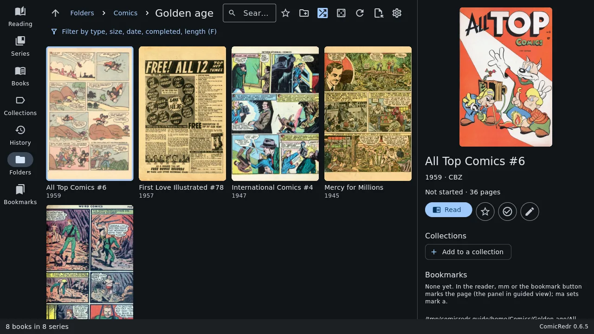

## Favourites

Press `*` on a cover (or in a comic you are reading) to add it to your
Favourites; press it again to take it out. The star in a book's details
does the same. In a comic `*` is always about the comic you have open,
also while its [page grid](04-reading.md#see-every-page-at-once) (`p`) or
[bookmark list](06-bookmarks.md#jump-between-bookmarks) (`M`) is up, and
the line at the bottom says which way it went.

`gf`, or the star at the top of the library, shows your Favourites (from
inside a comic, `gf` closes it first). There
`x` takes the selected comic out again, with an **Undo** in case it was a
slip: click it, or press `u` while the notice shows. The notice goes by
itself after about ten seconds, or as soon as another notice comes; from
then on `*` on the comic is the way back. (A notice that something went
wrong is the one kind that is never cut short: it stays its few seconds
and the next notice shows after it; when many go wrong at once, the
first two show and a third says how many more there were. `u` undoes what the notice on screen
offers, so it waits for the Undo to show.)

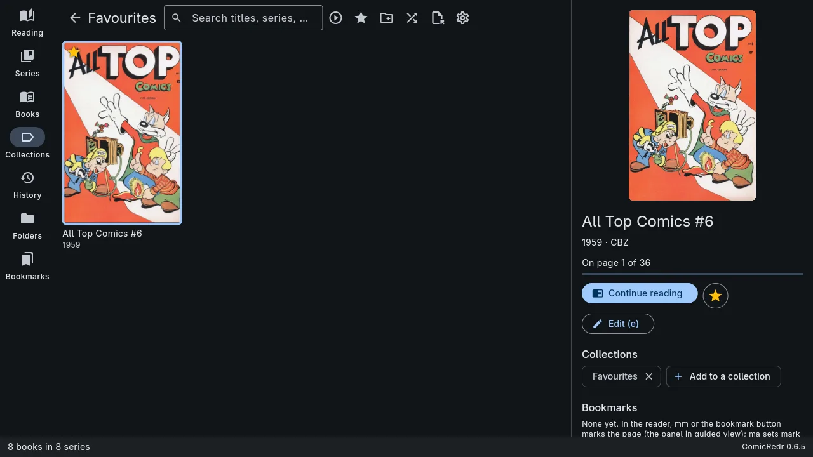

## Completed comics

A comic you have read to the end is *completed*: its cover gets a green
check, its details say **Completed**, a series and a folder count it as
read, and the [Folders tab's
filter](#filter-by-type-size-date-and-completed) can show only the
completed ones or hide them.

- **Reading does it.** Read on to the last page of a comic (a key, a tap
  or a swipe that turns onto it; in two-page mode onto the last pair) and
  it is marked completed; the line at the bottom says so, unless it has
  something else to tell you just then. It stays completed when you read
  it again from the start. Several steps at once count as reading on too
  (`3l`, or `3` and `PageDown`, landing on the last page). Only reading
  on does it: jumping to the end to have a look (`G`, `G` and a page
  number, the page grid, the bar along the bottom, a bookmark, or taking
  up the place another device left the comic at) marks nothing.
- **`gC` does it by hand.** On a cover, or in a comic you are reading,
  `gC` marks the comic completed, and pressed again marks it not
  completed. Use it for a comic you read somewhere else, or to take the
  mark off one you only leafed through to the end. The tick in a book's
  details does the same. In a comic `gC` is about the comic you have
  open, also over its page grid (`p`) or bookmark list (`M`).
- In the library the notice has an **Undo** (`u`), both ways.
- With comics [marked](#several-comics-at-once), `gC` or **Completed** in
  the bar marks them all completed; when they all are, it marks them all
  not completed.
- A comic that is [only on S3](13-s3-sync.md) is left out, and the
  notice says so ("…; 2 are only on S3", or "Only on S3: download it
  first"): download it, then mark it.

For example, to tick off a run of issues you read on paper: on the
Folders tab go into their folder, press `Shift+End` to mark them all,
then `gC`.

Opening a comic that is already on its last page does not mark it, so a
mark you took off stays off until you read on to the last page again;
then it is completed again.

**Without a mark, the page decides.** A comic nobody marked either way
counts as completed while it is left on its last page: that is how the
comics you had finished before ComicRedr knew of this got their check,
and how a comic you jumped to the end of and left there gets one. Go
back a page and it no longer counts. **A comic of a single page** is on
its last page from the moment it is opened, so it counts as completed
once you have opened it; `gC` on it marks it not completed, and that
stays.

**Completed part-way.** A comic you mark completed in the middle is done
with: its cover loses the progress line, **Continue reading** in its
details becomes **Read again**, the Reading tab puts it after the comics
still being read, and it is not what a series goes on with. It still
opens on the page you left it at.

The mark is kept [with the comic](11-your-data.md), so it follows it to
your other devices; when two devices disagree, the later change wins,
taking the mark off included.
[Reset everything](07-managing-comics.md#reset-a-comic) forgets it.

## Collections

A collection is a named group of books you make yourself: *To read
next*, *Lent to Sam*, *Space stories*. A book can be in any number of
them.

- In a book's details, click **Add to a collection**, then type a new
  name and click **Add** (or press `Enter`), or click one you already
  have.
- `gc` on a selected cover does the same without opening its details,
  and with [comics marked](#several-comics-at-once) it puts all of them
  in.
- `gc` in a comic you are reading asks the same question about that
  comic, so there is no need to go back to the library: halfway through
  an issue, press `gc`, type `To read next` and press `Enter`, and the
  line at the bottom says *Added to To read next*. `Tab` reaches the
  collections you already have, `Esc` leaves the comic where it was. It
  works the same with the [page grid](04-reading.md#see-every-page-at-once)
  (`p`) or the bookmark list (`M`) up, which stay open, and for a comic
  opened with `o` that is in none of your library folders.
- Wherever you ask, on a cover or in a comic, there is no need to wait
  for the question to show before typing the name: `gc`, `Lent to Sam`,
  `Enter` in one go works, and none of those letters does anything else.
  Only an accent made of two key presses (a dead key such as `´` then
  `e`) needs the question on screen first; typed sooner it comes out
  plain.
- Every collection you have is offered, also one that so far only holds
  comics from outside your library folders, except those the comic (or
  every marked comic) is in already.
- A collection the comic is in already is left as it is, and you are
  told *Already in To read next*. With several comics marked, the ones
  not yet in it are added and the line says how many: *2 comics added to
  Space stories; 1 was already in it*.
- Because that changes nothing, it also does not count as adding the
  comic anew when the comic's
  [sidecar](11-your-data.md#the-sidecar-beside-each-comic) travels: if you
  took it out of the collection on another device in the meantime, it
  goes out here too once that device's sidecar arrives. To keep it in,
  take it out here and add it again.
- Should the library be unable to save it, the line says so, and with
  several comics marked how many were added before it went wrong and how
  many were not (*1 comic added to Space stories; 2 not added: the
  library could not be updated*); the marks stay, so you can try again.
- If you close the comic, or open another, while the question is up, the
  name is not given to the wrong comic: nothing is added, and a line says
  so.
- The **x** on a collection's chip in the book's details takes the book
  out. So does `x` on the comic inside the open collection on the
  Collections tab, with an **Undo** (`u`) as in the Favourites; with
  comics marked there, `x` takes all of them out, and says so when none
  of the marked ones is in that collection.
- The Collections tab shows each collection as a cover; open one to see
  its books.

Favourites is simply a collection called *Favourites*. Collections are
kept in each comic's [sidecar file](11-your-data.md) (a small hidden file
beside the comic that also holds your place and bookmarks), so they
follow the comic to your phone.

## Several comics at once

Hold `Shift` and move with the arrow keys to mark a run of comics, the way
a file manager does: every comic from where you started to the cover you
are on is marked, and going back the other way unmarks again.
`Shift+Home` and `Shift+End` mark to the first and the last cover. It
works on every tab of covers, and it is made for the Folders tab: walk
into a folder, press `Shift+End`, and every comic in it is marked.

- `Ctrl+A` marks every comic shown, so with a search or a
  [filter](#filter-by-type-size-date-and-completed) only those that match; press it
  again to unmark them all.
- `V` marks or unmarks the selected cover and moves on, so you can pick
  comics that are not next to each other. A plain arrow key moves
  without touching the marks; a new `Shift` run adds to them.
- With the mouse, `Ctrl`+click marks or unmarks one cover and
  `Shift`+click marks everything from the selected cover to the one you
  click.
- On a phone, the button with a ticked list at the top turns taps into
  marking until you press it again. On any screen, **Mark to act on
  several** in a comic's details marks it and does the same, so a
  touchscreen needs no keyboard.

Only comics get marked; folders and series in between are skipped.
Marked covers show a tick, and a bar over the covers says how many are
marked, with what you can do to all of them at once:

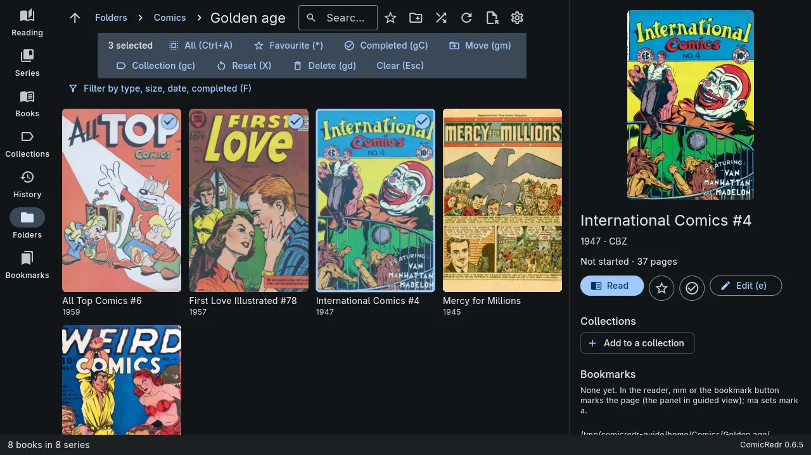

| Button | Key | Does |
|---|---|---|
| **All** | `Ctrl+A` | Mark every comic shown, or unmark them |
| **Favourite** | `*` | Put them all in your [Favourites](#favourites); **Unfavourite** when they all are |
| **Completed** | `gC` | Mark them all [completed](#completed-comics); **Not completed** when they all are |
| **Move** | `gm` | [Move them to another folder](#move-comics-to-another-folder) |
| **Collection** | `gc` | Put them all in a [collection](#collections), new or one you have |
| **Reset** | `X` | [Reset](07-managing-comics.md#reset-a-comic) them all: redo panels, or everything |
| **Delete** | `gd` `Shift+Delete` | [Delete](07-managing-comics.md#delete-a-comic) them all, after asking once |
| **Upload to S3** | `gu` | [Upload](13-s3-sync.md#uploading-comics) the ones not on S3 yet |
| **Download** | | Download the ones only on S3 |
| **Remove from S3** | `gU` | [Take them off S3](13-s3-sync.md), keeping them here |
| **Clear** | `Esc` | Unmark them all |

The S3 buttons only show once [S3 sync](13-s3-sync.md) is set up.
Each action asks once for the whole lot, not once per comic.
The marks go once it is done; if you cancel, they stay.

For example, to clear out a folder of comics you have finished: open it
on the Folders tab, press `Shift+End`, then `gd`. The dialog lists them,
with how much space they take together, and **Cancel** is selected, so
check the list and click **Delete 7 for good**.

`gm` and `gc` also work with nothing marked: they act on the selected
cover.

### Move comics to another folder

`gm`, or **Move** in the bar, moves the marked comics (or the selected
one) to another folder of your library. A list of every folder in the
library opens, empty ones too, with the folder you are in picked:

- Type part of a folder's name to shorten the list, `↑` `↓` to pick
  one, and `Enter` moves them there. Words can come in any order:
  `marvel 80` finds *Comics/Marvel/1980s*. You can also click a folder,
  then **Move to …**.
- **New folder** (`Ctrl+N`) makes a folder inside the picked one, asks
  for its name, and moves the comics into it.
- `Esc` or **Cancel** moves nothing, and the comics stay marked.

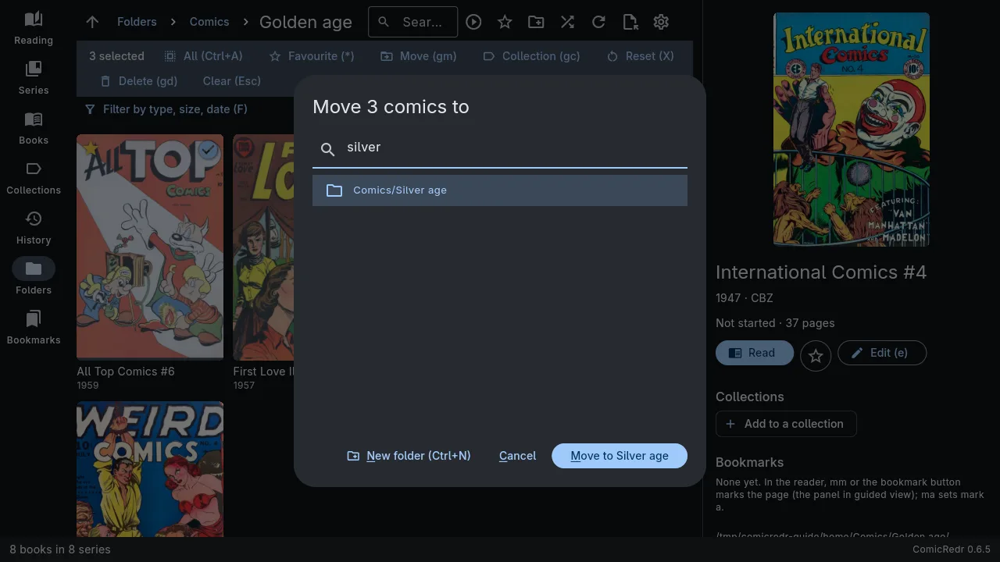

Each comic takes its sidecar with it, so your place, bookmarks, panels,
collections and S3 sync stay as they were. A comic that is a folder of
pages moves as one folder. If a comic of the same name is in the folder
already, ComicRedr asks once for all of them, with **Cancel** selected:
**Skip those** leaves them where they are and moves the rest,
**Replace** deletes the ones in the folder for good and moves yours in.

For example, to file the comics you have read: walk into the folder on
the Folders tab, mark them with `Shift` and the arrows, press `gm`, type
`read`, and press `Enter`.

## Adding, rescanning and taking out folders

- `A`, or the folder button at the top, adds another folder.
- `R`, or the rescan button at the top of the Folders tab, rescans the
  library folders. You rarely need it: ComicRedr notices new, changed and
  deleted comics by itself.
- To take a folder out of the library, select it at the top of the
  Folders tab (on a phone, hold your finger on it) and press `gA`, or
  click **Take out of the library (the files stay)** in its details.
  Your comics are not touched, and the notice that says so has an
  **Undo** (`u`): the folder is in the library again and its comics are
  found as before, with their positions, bookmarks and collections.
- Comics kept elsewhere, on a NAS or another disk, can be linked in: a
  link (a symlink, made in your file manager or with `ln -s`) to a comic
  or to a folder of comics inside a library folder is listed like the
  real thing.

The first scan reads each comic once, about a third of a second a book.
After that, starting the app only checks what changed. The line at the
bottom shows the scan's progress. When a file can't be read (a broken
download, a text-only ebook), it says how many; click that, or press
`g!`, to see each file and why. Panels are only looked for in the
comic you have open, never across the whole library (see
[how panels are found](05-guided-view.md#how-panels-are-found)).

[Contents](README.md) · Previous: [Getting started](02-getting-started.md) · Next: [Reading a comic](04-reading.md)
