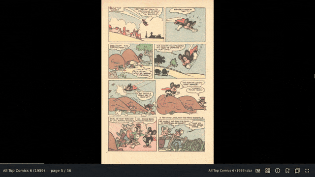
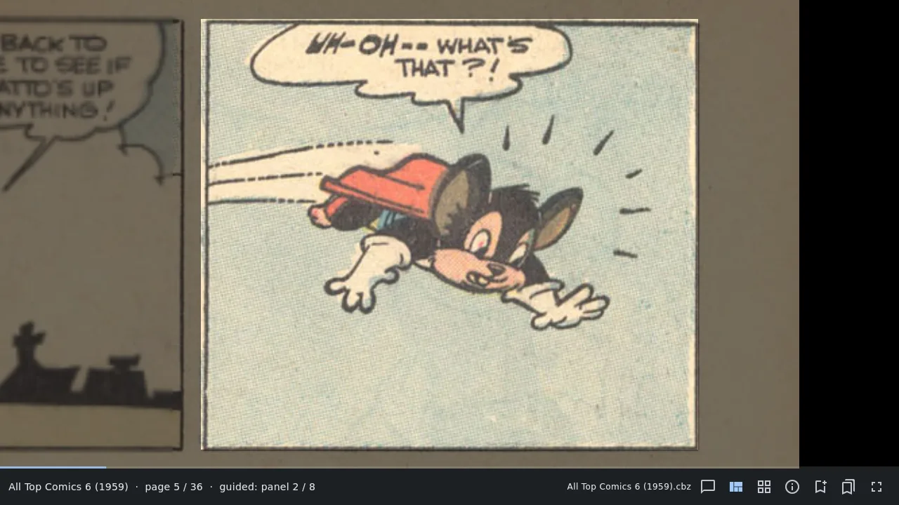
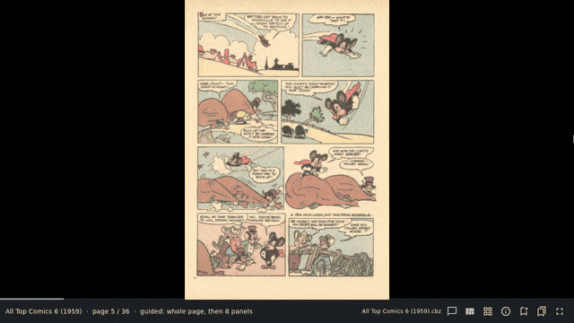
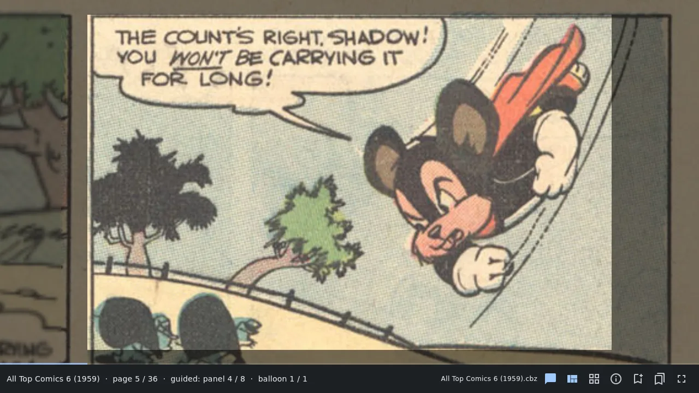
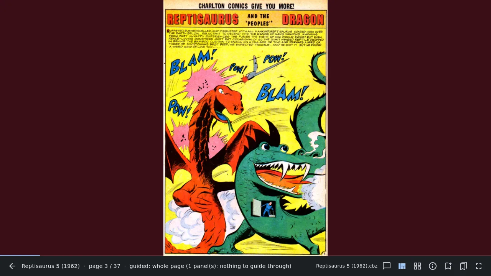
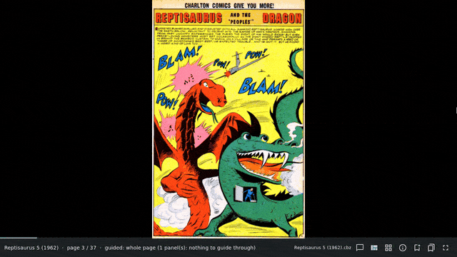

# 4. Guided view

[Contents](README.md) · Previous: [Reading a comic](03-reading.md) · Next: [Bookmarks and marks](05-bookmarks.md)

Guided view is the reason ComicRedr exists. Instead of shrinking a whole
page onto your screen, it moves from panel to panel, each one as large as
the screen allows, in reading order. The rest of the page stays visible
but dimmed, so you never lose your place.

## Panel by panel

1. Open a comic and press `v` (or the guided view button on the status
   line).
2. The page shows whole first, so you can take it in.
3. Each `→` (or `Space`, or a tap on the right edge) glides to the next
   panel. `←` goes back.
4. After the last panel the page shows whole once more, then the next
   page begins.
5. `v` again, or `Esc`, leaves guided view on the page you are on.

The status line says where you are: `guided: panel 2 / 6`.

On the phone a panel fills the width of the screen. The panels of this
comic were found on the laptop and came along in its
[sidecar file](10-your-data.md), so guided view was ready on the phone
straight away:

Don't want the whole page before and after its panels? Press `w` to go
straight from the last panel of one page to the first panel of the next.
`w` again brings it back; Settings has the same switch.

Other keys that help in guided view:

- `zz` or `=` centres the current panel again after you zoomed or moved.
- `PageDown` and `PageUp` skip to the next or previous page at once.
- `Tab` also cycles through single page, two pages and guided view.

Panels that aren't rectangles (slanted, round or cut at an angle) are
followed along their real edges, so the dimming hugs the panel's shape.

## Balloon by balloon

Press `b` in guided view (or the speech-bubble button on the status line)
and each step stops on the next speech or thought balloon inside the
panel, in reading order, before moving on to the next panel. It is
wonderful on small screens and dense golden-age pages. `b` again goes back
to whole panels. Pressed outside guided view, `b` turns guided view on
with balloons.

Narration boxes (captions) are not balloons, so balloon mode doesn't stop
on them; they are read as part of the panel.

The status line counts the balloons too: `guided: panel 2 / 6 · balloon
1 / 3`.

## Pages shown whole

Not every page can be guided. A splash page, a cover, an advert or a page
of text has no panels to step through, and on some old scans the panel
finder isn't sure enough. Rather than move the camera somewhere wrong,
ComicRedr then shows the page whole and says why on the status line, for
example `guided: whole page (1 panel(s): nothing to guide through)`.

### The first press stays

When you are pressing `→` panel after panel, it is easy to skip past a
splash page without really looking at it. So on such a page the first
`→` stays, and the background turns a dark wine red to tell you
this is a whole page. The next `→` turns the page.

- `gw` switches the cue: instead of the wine-red background, the page
  zooms out a little and back. With reduced motion turned on in your
  desktop settings, the colour is used either way.
- `W` turns the pause off, so such pages turn at once. Settings has the
  same choice.

## How panels are found

ComicRedr finds panels and balloons with a small detector model that is
built into the app and runs on your own computer's processor, about a
fifth of a second a page. Nothing leaves your machine.

- Panels are found in the background, starting with the page you are on,
  so guided view is usually ready before you get there.
- While you are not reading, ComicRedr works through the whole library at
  low priority. The line at the bottom of the library shows its progress,
  with a pause button. Settings can turn this off; on the phone it is off
  unless you turn it on.
- The results are saved in the comic's [sidecar file](10-your-data.md),
  so a comic copied to your phone doesn't need finding again.
- The [details view](06-managing-comics.md#details-of-a-comic) (`I`)
  shows, page by page, how many panels and balloons were found and why a
  page is shown whole.

If a comic's panels look wrong after an update, `X` → **Redo panels**
finds them again (see
[Reset a comic](06-managing-comics.md#reset-a-comic)).

[Contents](README.md) · Previous: [Reading a comic](03-reading.md) · Next: [Bookmarks and marks](05-bookmarks.md)
