# 4. Reading a comic

[Contents](README.md) · Previous: [The library](03-library.md) · Next: [Guided view](05-guided-view.md)

Open a comic from the library with `Enter` and it fills the window, with
a thin status line along the bottom.

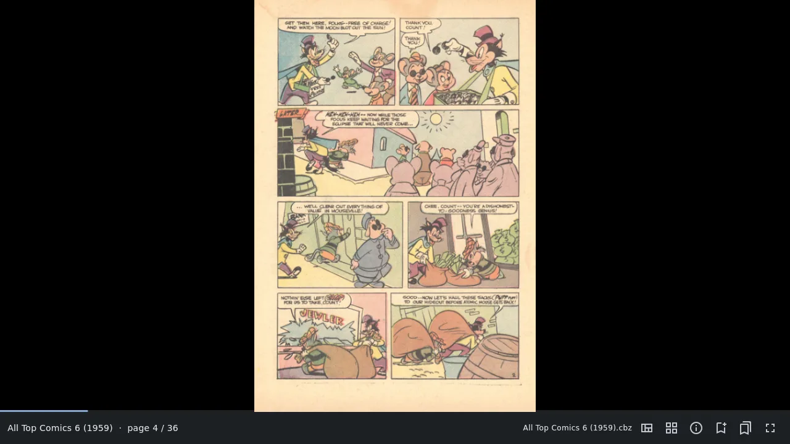

On the phone the status line keeps just the page number and the buttons.
Here the page has a bookmark: the ribbon at the top, and amber notches on
the progress bar for each bookmark in the book.

The status line shows the book, the page you are on, and what mode you
are in. Its buttons on the right switch [guided view](05-guided-view.md),
open the [page grid](#see-every-page-at-once), the
[details](07-managing-comics.md#details-of-a-comic), set a
[bookmark](06-bookmarks.md), list the bookmarks, and go
[fullscreen](#fullscreen). Hover over a button to see its key.

## Turning pages

| Key | What it does |
|---|---|
| `→` `Space` `l` | Next page (next panel in guided view) |
| `←` `Shift+Space` `h` | Previous page |
| `PageDown` `PageUp` | Next or previous page, even in guided view |
| `Home` `End` | First or last page |
| `12G` | Page 12: type the number, then `G` |
| `]` `[` | Next or previous book in the series (or in the same folder) |
| `Esc` | Back to the library |

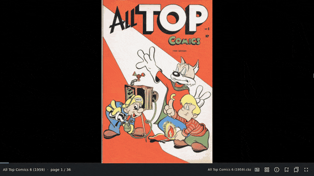

ComicRedr remembers where you are in every comic: the page, the panel in
guided view, and how far you had zoomed in. Open the comic again, even
after renaming or copying the file, and you are right back there.

## Jump around with the progress bar

The thin bar at the bottom shows how far through the book you are. Move
the mouse over it (or drag along it with a finger) and a small picture of
the page under the pointer appears. Click or let go to jump there.

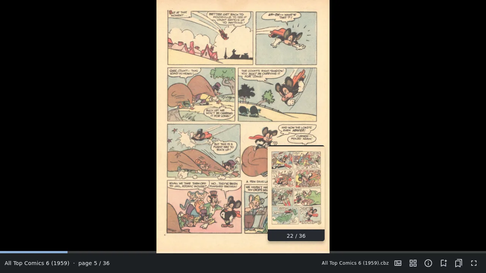

Jumped too far? `''` (two single quotes) takes you back to where you
were before the jump.

## See every page at once

Press `p` (or the grid button) for a grid of every page. Pick one with
the arrow keys and `Enter`, or click it. `+` and `-` (or `Ctrl` and the
mouse wheel, or a pinch on a touchpad) make the pages bigger or smaller,
and the grid remembers the size. `Esc` or `p` closes it.

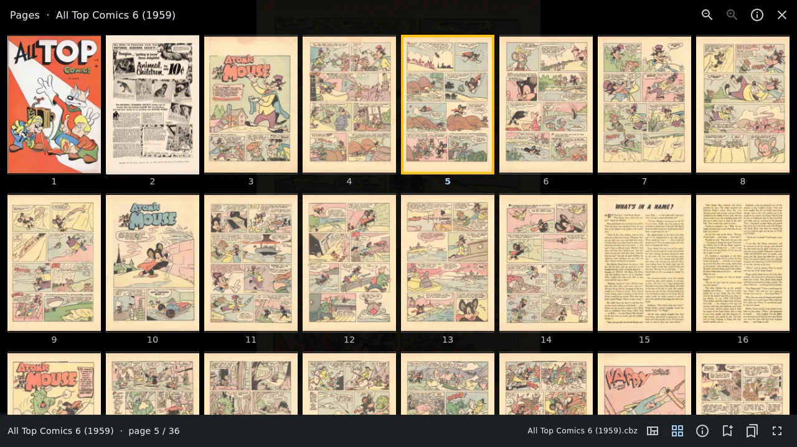

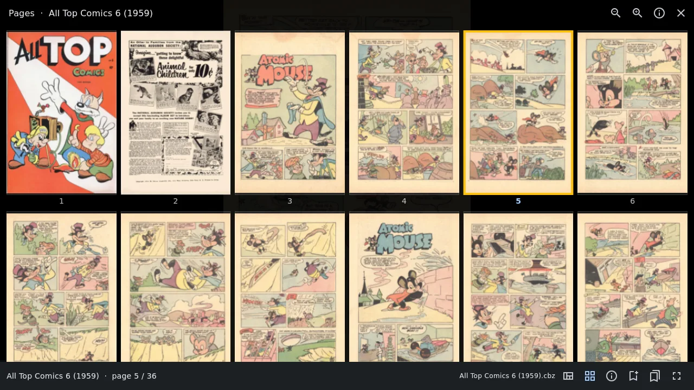

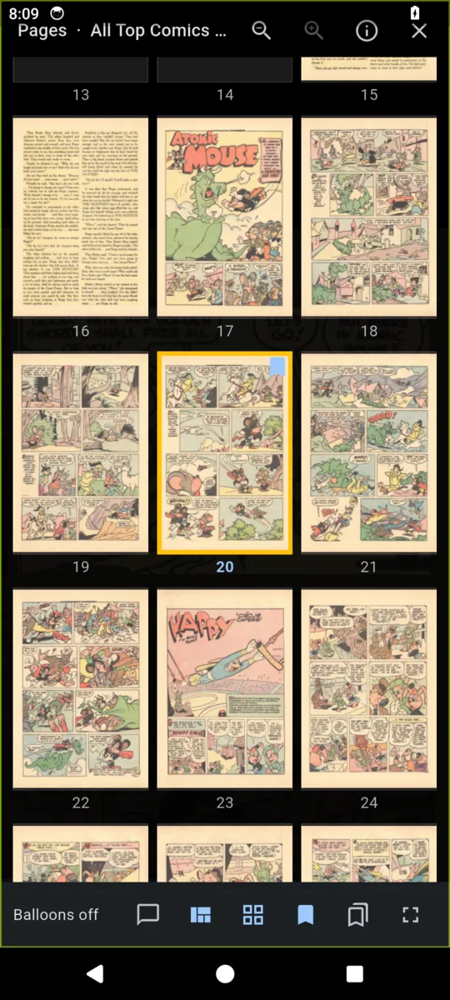

## Two pages side by side

Press `d` to see two pages side by side, like an open comic. `d` again
goes back to one page.

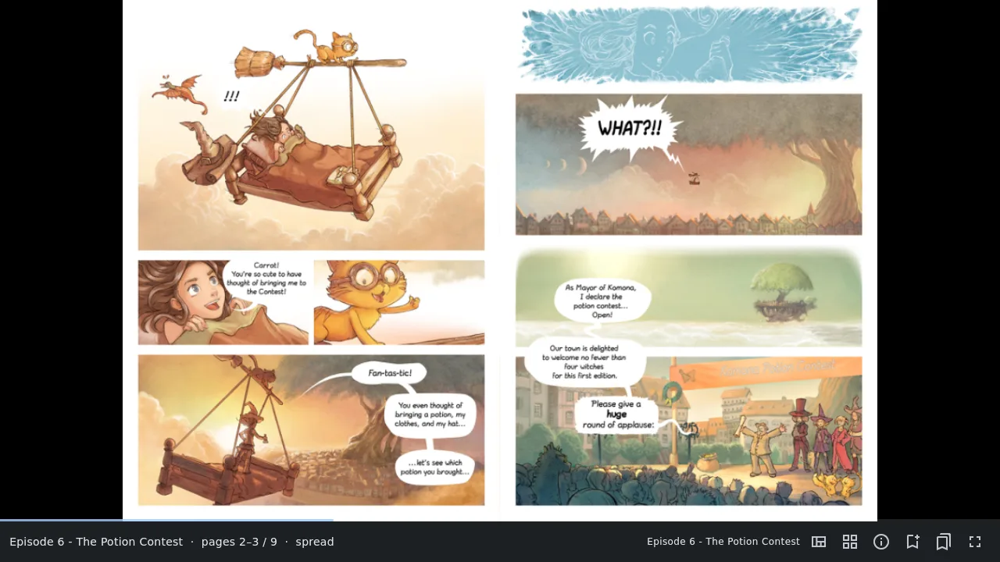

- The cover stays on its own, so the pages after it pair up the way the
  printed comic does. If a book pairs them the wrong way round, `D`
  shifts the pairing by one page.
- A scanned double-page spread (a page wider than it is tall) is shown
  alone, and the pairing carries on correctly after it.
- `r` switches the reading direction to right to left and back. This is
  remembered for each book.

`Tab` cycles through single pages, two-page spreads and guided view.

## Zoom

| Key | What it does |
|---|---|
| `+` `-` | Zoom in and out |
| `=` | Back to the whole page |
| `Z` | Zoom in on the middle of the screen, or back out |
| `zw` `zh` `zz` | Fit the width, the height, or the whole page |
| `j` `k` (or `↓` `↑`) | Move down and up a zoomed page |

With the mouse, drag a zoomed page to move around. On a touchscreen,
pinch to zoom, drag to move, and double-tap the middle to zoom in on that
spot. A zoomed page stays sharp: ComicRedr decodes the part you look at
again at the higher size.

To enlarge just part of a page, see [Parts of a page](#parts-of-a-page).

## Parts of a page

On a big, busy page you can zoom straight to a half, a third or a quarter
of it by key:

| Keys | Part of the page |
|---|---|
| `H1` `H2` | The upper and lower half |
| `B1` `B2` `B3` | The upper, middle and lower third |
| `Q1` `Q2` `Q3` `Q4` | The quarters: top left, top right, bottom left, bottom right |

Once you are on a part, `→` steps to the next part in reading order and,
after the last one, on to the whole next page. `Esc` (or the same key
again) shows the whole page. It works in guided view too, which is handy
on a page the panel finder couldn't split up.

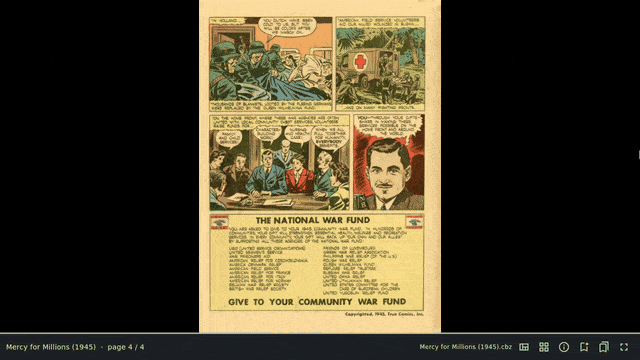

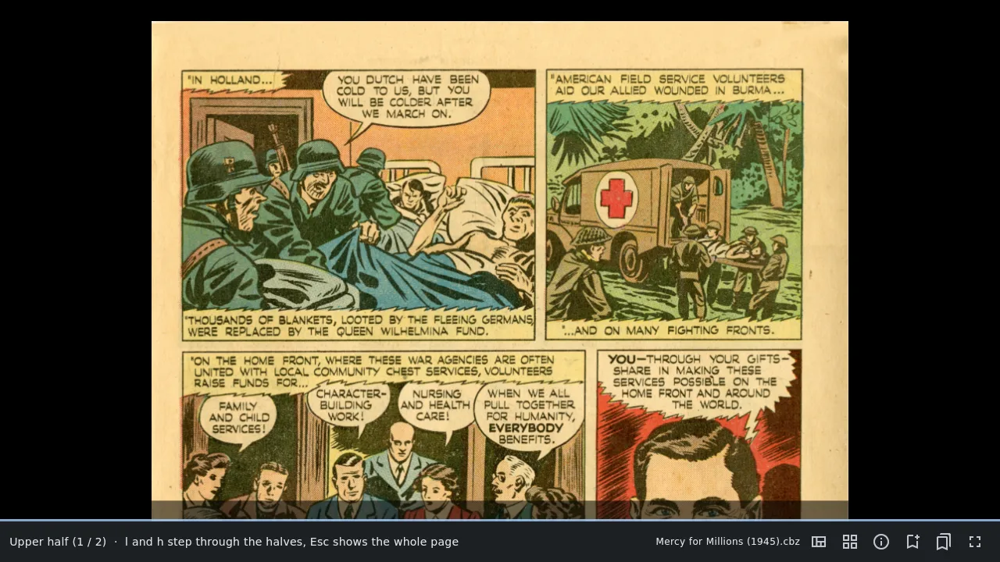

## Turn the comic

Some scans are sideways. `>` turns the comic a quarter turn clockwise,
`<` a quarter turn the other way, and `gr` puts it back upright. `2>`
turns it upside down.

The turn is remembered for that comic, and everything keeps working in
the turned view: guided view, zoom, two pages and the parts of a page.
The arrow keys still move the way they point on the screen.

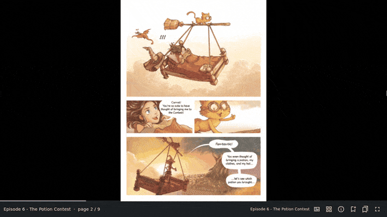

## Old scans: clean-up, trim and the night filter

**Clean-up** (`c`) is for old, yellowed scans. It whitens the paper,
darkens faded ink, and enlarges and sharpens pages that have fewer pixels
than your screen. The comic file itself is never changed. Settings can
turn it on for every comic.

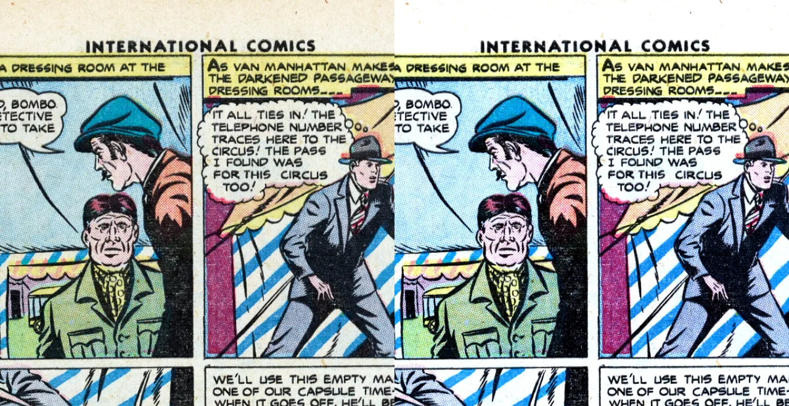

**Trim** (`t`) cuts off the blank margins around a scanned page, so the
page itself fills the screen.

The **night filter** (`i`) dims the page and warms its colours, for
reading in the dark without the white paper glaring at you.

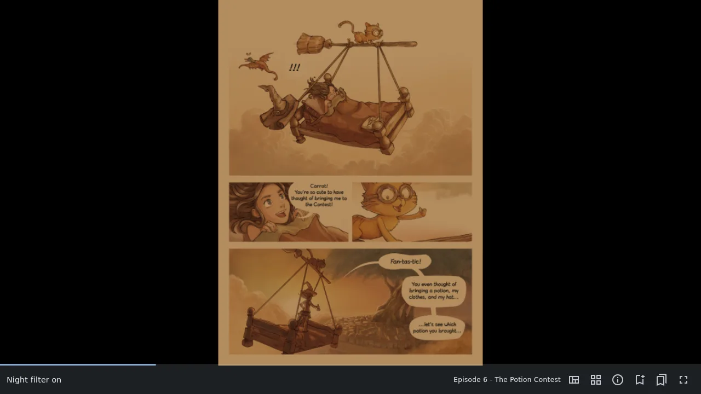

## Fullscreen

Press `f` (or `F11`, or tap the middle of the page) for fullscreen: no
title bar, no border, nothing but the comic. Move the mouse to the bottom
edge to see the status line and progress bar; the mouse pointer hides
when you stop moving it. `f` again leaves fullscreen. The library can be
fullscreen too, and ComicRedr starts in fullscreen if you left it that
way.

## What time is it?

In fullscreen there is no clock. Press `T` (or hold a finger on the
middle of the screen) and the time appears, large, for two seconds, then
fades away.

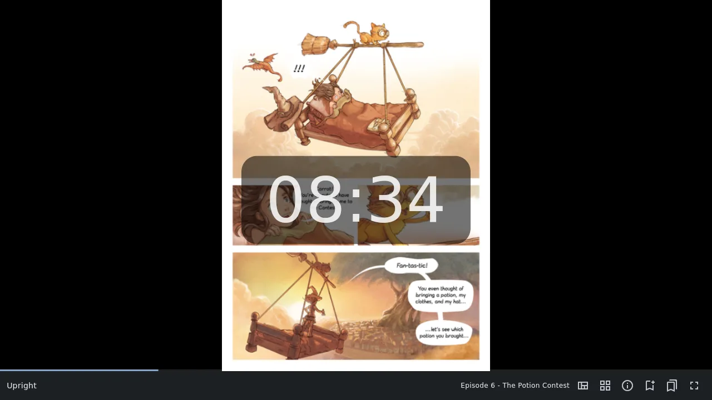

[Contents](README.md) · Previous: [The library](03-library.md) · Next: [Guided view](05-guided-view.md)
