# 4. Reading a comic

[Contents](README.md) · Previous: [The library](03-library.md) · Next: [Guided view](05-guided-view.md)

Open a comic from the library with `Enter` and it fills the window, with
a thin status line along the bottom.

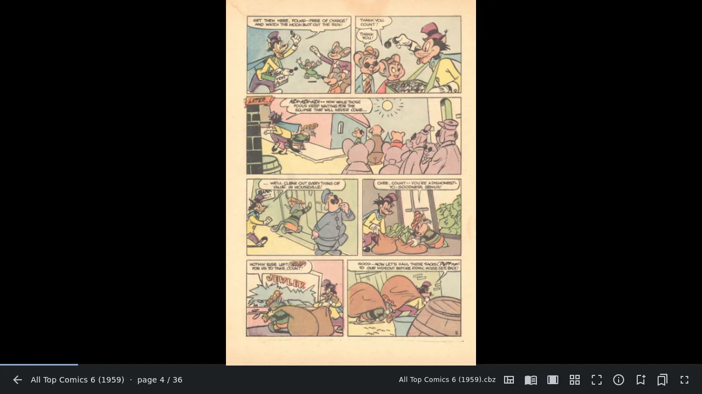

On the phone the status line keeps just the page number and the buttons;
on a tablet it has room for the book's title too.
Here the page has a bookmark: the ribbon at the top, and amber notches on
the progress bar for each bookmark in the book.

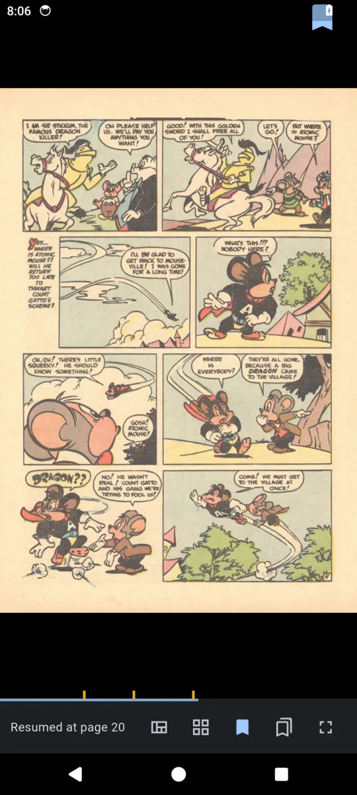

The status line shows the book, the page you are on, and what mode you
are in. Its buttons on the right switch [guided view](05-guided-view.md),
open the [page grid](#see-every-page-at-once), the
[details](07-managing-comics.md#details-of-a-comic), set a
[bookmark](06-bookmarks.md), list the bookmarks, and go
[fullscreen](#fullscreen). Where the screen is wide enough (the laptop, a
tablet) one more button shows
[two pages side by side](#two-pages-side-by-side). Hover over a button to see its key. The
arrow on the left does what `Esc` does: out of guided view, then back to
the library (on the phone, the back gesture does that).

## Turning pages

| Key | What it does |
|---|---|
| `→` `Space` `l` | Next page (next panel in guided view) |
| `←` `Shift+Space` `h` | Previous page |
| `PageDown` `PageUp` | Next or previous page, even in guided view |
| `Home` `End` | First or last page |
| `12G` | Page 12: type the number, then `G` |
| `]` `[` | Next or previous book in the series (or in the same folder) |
| `Esc` | Back to the library |

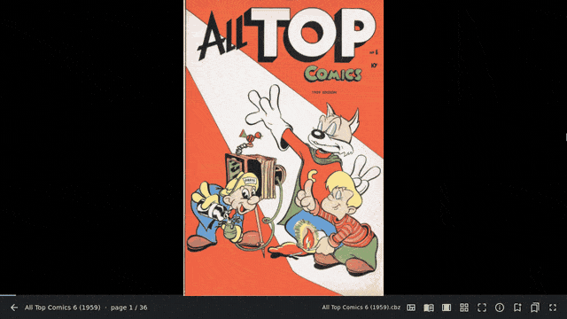

ComicRedr remembers where you are in every comic: the page, the panel in
guided view, and how far you had zoomed in. Open the comic again, even
after renaming or copying the file, and you are right back there.

## Jump around with the progress bar

The thin bar at the bottom shows how far through the book you are. Move
the mouse over it (or drag along it with a finger) and a small picture of
the page under the pointer appears. Click or let go to jump there.

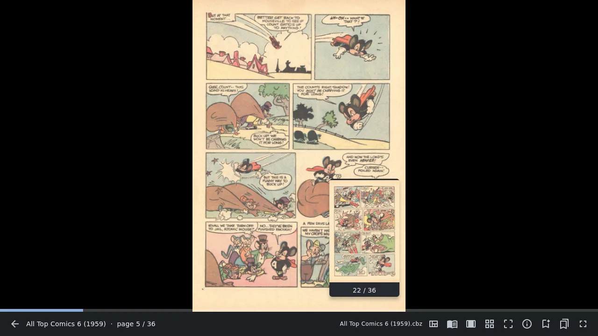

Jumped too far? `''` (two single quotes) takes you back to where you
were before the jump.

## See every page at once

Press `p` (or the grid button) for a grid of every page. Pick one with
the arrow keys and `Enter`, or click it. `+` and `-` (or `Ctrl` and the
mouse wheel, or a pinch on a touchpad) make the pages bigger or smaller,
and the grid remembers the size. `Esc` or `p` closes it.

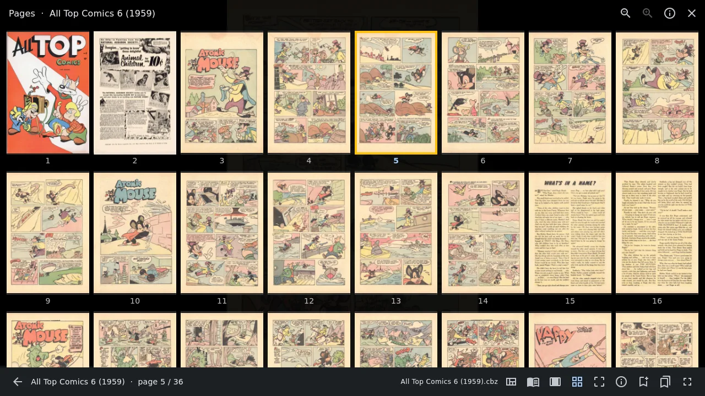

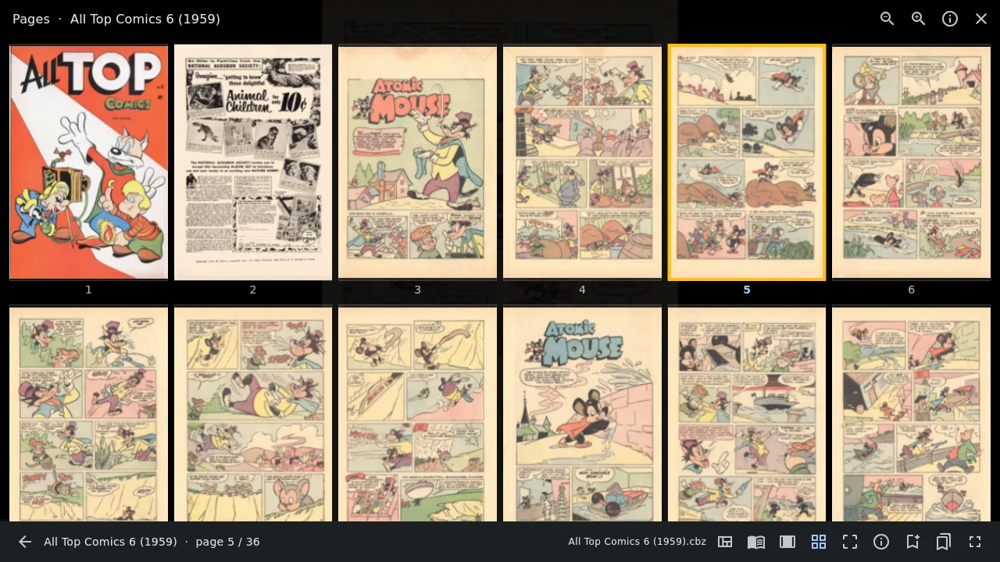

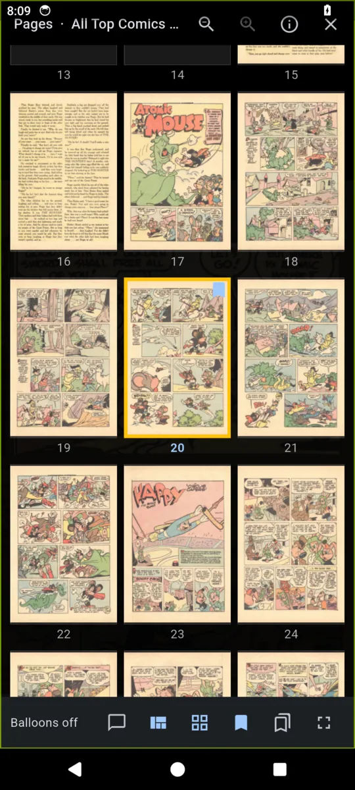

## Two pages side by side

Press `d` to see two pages side by side, like an open comic. `d` again
goes back to one page. Without a keyboard, the open-book button on the
status line does the same; it is there wherever the screen is wide
enough, which on a tablet held sideways makes the most of the screen.

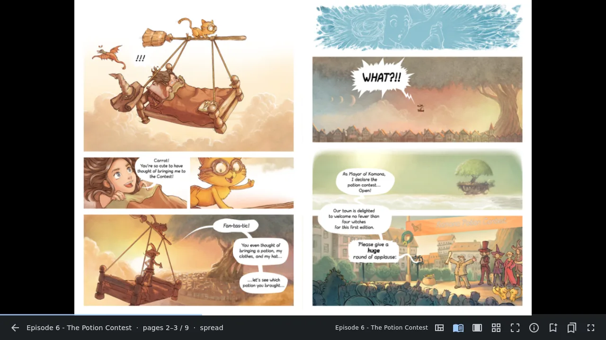

- The cover stays on its own, so the pages after it pair up the way the
  printed comic does. If a book pairs them the wrong way round, `D`
  shifts the pairing by one page.
- A scanned double-page spread (a page wider than it is tall) is shown
  alone, and the pairing carries on correctly after it.
- `r` switches the reading direction to right to left and back. This is
  remembered for each book.

`Tab` cycles through single pages, two-page spreads and guided view.

## Zoom

| Key | What it does |
|---|---|
| `+` `-` | Zoom in and out |
| `=` | Back to the whole page |
| `Z` | Zoom in on the middle of the screen, or back out |
| `zw` `zh` `zz` | Fit the width, the height, or the whole page |
| `j` `k` (or `↓` `↑`) | Move down and up a zoomed page |
| `←` `→` | Move left and right across a zoomed page, then turn the page from its edge |

With the mouse, drag a zoomed page to move around. On a touchscreen,
pinch to zoom, drag to move, and double-tap the middle to zoom in on that
spot. A zoomed page stays sharp: ComicRedr decodes the part you look at
again at the higher size.

### Smooth scrolling

On a zoomed page the arrow keys (and `j` `k`) glide rather than jump:
each press slides the page about a seventh of the screen, easing into
the move and out of it again, and holding a key down keeps it sliding at an even speed until you
let go. The page stops at its own edge, not in the dark margin beside it.

`←` and `→` move across the page while there is more of it to see that
way. At the edge, a held key stays there; press it again to turn the
page. On a page that isn't zoomed, or that already fits the width of the
screen, they turn the page at once as always. In guided view and on a
[part of a page](#parts-of-a-page) they keep stepping through the panels
or parts.

Say you zoom in on a dense golden-age page with `+` a few times. Hold
`→` to read along a row of panels; it stops at the page's right edge.
`↓` and a held `←` bring you to the start of the next row, and at the
bottom right a fresh press of `→` turns the page. With reduced motion
turned on in your system settings, each press jumps straight there.

#### How fast

`g+` makes smooth scrolling a notch faster and `g-` a notch slower; the
status line says which of the five speeds you are on, from **Slowest**
to **Fastest**. A faster speed moves further with each press, so a held
key covers the page quicker too: at **Fastest** a press goes about a
quarter of the screen, at **Slowest** about a twelfth. The speed is kept for every comic and across restarts, and
[Settings](12-settings.md) has the same choice as a slider under
**Pages**.

For example, on a phone-sized window where a press feels too timid,
press `g+` twice; to read a dense page line by line, `g-` once or
twice.

#### How smooth

`g>` makes the glide a notch smoother and `g<` a notch crisper, again
five steps: **Crisp**, **Light**, **Smooth**, **Smoother** and
**Smoothest**. A smoother glide starts and stops more softly and takes a
little longer to arrive; a crisper one is there almost at once. It
doesn't change how far a press goes or how fast a held key scrolls, so
speed and smoothness can be set apart. **Smooth**, the middle step, is
the default: a press takes about a third of a second. It is kept like the
speed, and Settings has it as a second slider under **Pages**.

For example, if the page seems to lag behind your key presses, press
`g<` once or twice; if the start of each glide feels abrupt, `g>`.

To enlarge just part of a page, see [Parts of a page](#parts-of-a-page).

## Parts of a page

On a big, busy page you can zoom straight to a half, a third or a quarter
of it by key:

| Keys | Or quickly | Part of the page |
|---|---|---|
| `H1` `H2` | `11` `12` | The upper and lower half |
| `B1` `B2` `B3` | `21` `22` `23` | The upper, middle and lower third |
| `Q1` `Q2` `Q3` `Q4` | `31` `32` `33` `34` | The quarters: top left, top right, bottom left, bottom right |

There are two ways to type each part, and both do the same:

- **Letter and number:** `H` for halves, `B` for thirds (bands), `Q` for
  quarters, then the part's number, counted top to bottom, left to right.
  `B2` is the middle third, `Q3` the bottom-left quarter. Take as long as
  you like between the two keys.
- **Two digits:** the first says the split (1 halves, 2 thirds, 3
  quarters), the second the part, the same numbering. `22` is the middle
  third, `33` the bottom-left quarter. Press the second digit within half
  a second of the first; the part shows a moment later, once no other key
  follows. Typed slowly, or with a key after them, digits are a
  [count](09-keyboard.md#sequences-and-counts) as always: `12G` still goes
  to page 12.

For example, on a tall splash page press `21` (or `B1`) for the top
third, then `→` twice for the middle and bottom thirds.

Once you are on a part, the usual keys read the comic in that split, page
by page: `→` (or `l`, Space, a tap on the right) goes to the next part,
and after the last one the next page shows whole first; `→` again goes to
its first part. `←` goes back the same way: the page before shows whole,
then its last part. So `H1` and then `→` over and over reads a comic half
by half, and you never have to pick the part again.

If you started from guided view (say on a splash page the panel finder
couldn't split up), a page with panels takes you back to guided view: it
shows whole, and `→` goes on panel by panel. `Esc` (or the same part key
again) shows the whole page and goes back to the usual steps; a page key,
`gg`, a switch into or out of guided view or two-page mode do too.

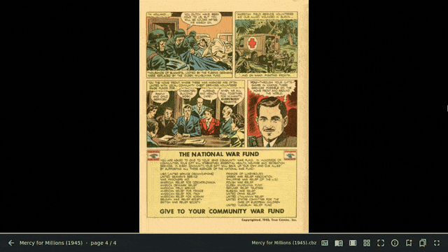

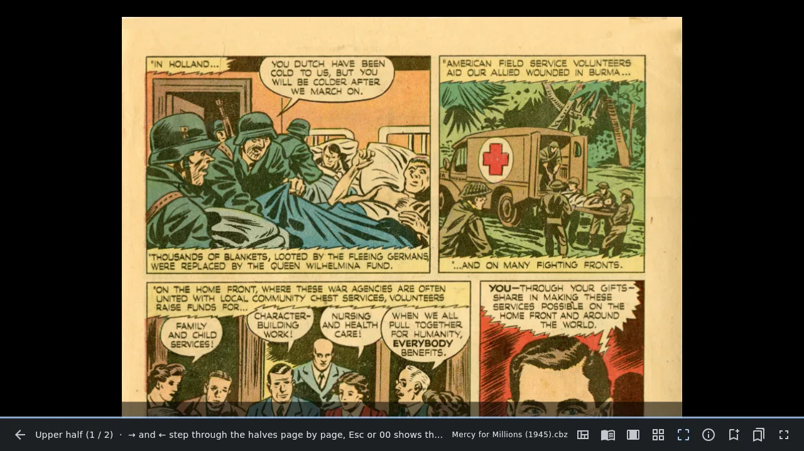

## Turn the comic

Some scans are sideways. `>` turns the comic a quarter turn clockwise,
`<` a quarter turn the other way, and `gr` puts it back upright. `2>`
turns it upside down.

The turn is remembered for that comic, and everything keeps working in
the turned view: guided view, zoom, two pages and the parts of a page.
The arrow keys still move the way they point on the screen.

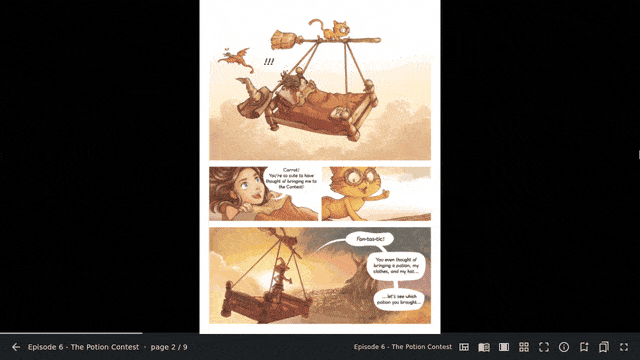

## Old scans: clean-up, trim and the night filter

**Clean-up** (`c`) is for old, yellowed scans. It whitens the paper,
darkens faded ink, and enlarges and sharpens pages that have fewer pixels
than your screen. The comic file itself is never changed. Settings can
turn it on for every comic.

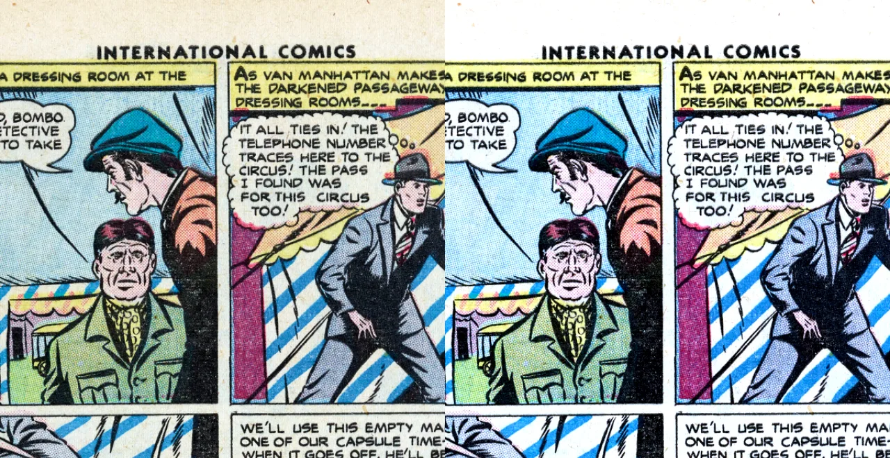

**Trim** (`t`) cuts off the blank margins around a scanned page, so the
page itself fills the screen.

The **night filter** (`i`) dims the page and warms its colours, for
reading in the dark without the white paper glaring at you.

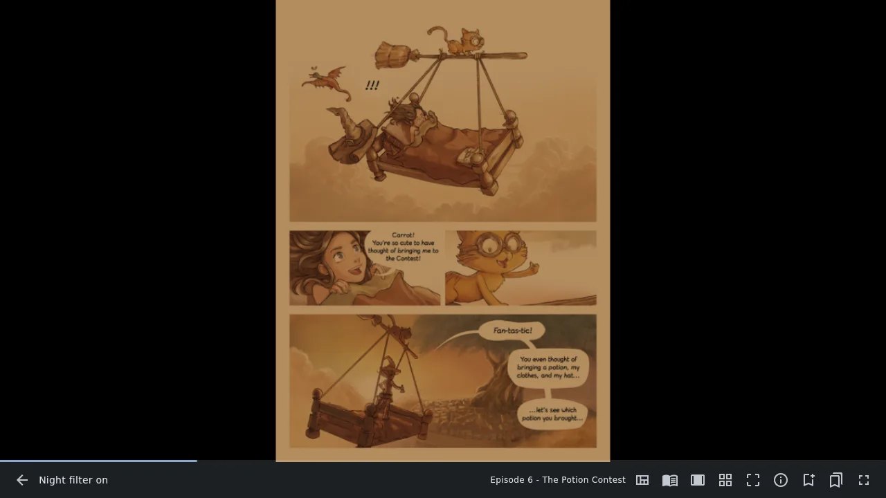

## Fullscreen

Press `f` (or `F11`, or tap the middle of the page) for fullscreen: no
title bar, no border, nothing but the comic. Move the mouse to the bottom
edge to see the status line and progress bar; the mouse pointer hides
when you stop moving it. `f` again leaves fullscreen. The library can be
fullscreen too, and ComicRedr starts in fullscreen if you left it that
way.

## What time is it?

In fullscreen there is no clock. Press `T` (or hold a finger on the
middle of the screen) and the time appears, large, for two seconds, then
fades away.

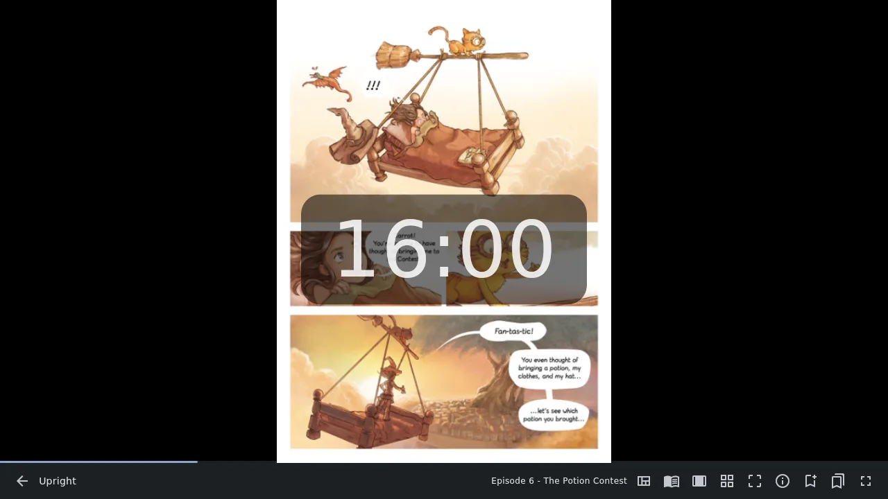

[Contents](README.md) · Previous: [The library](03-library.md) · Next: [Guided view](05-guided-view.md)
