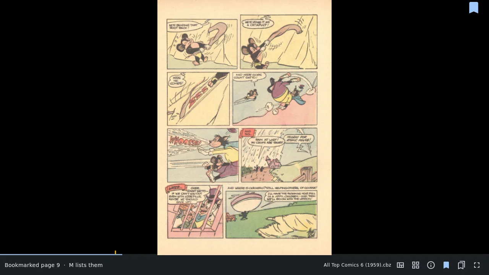
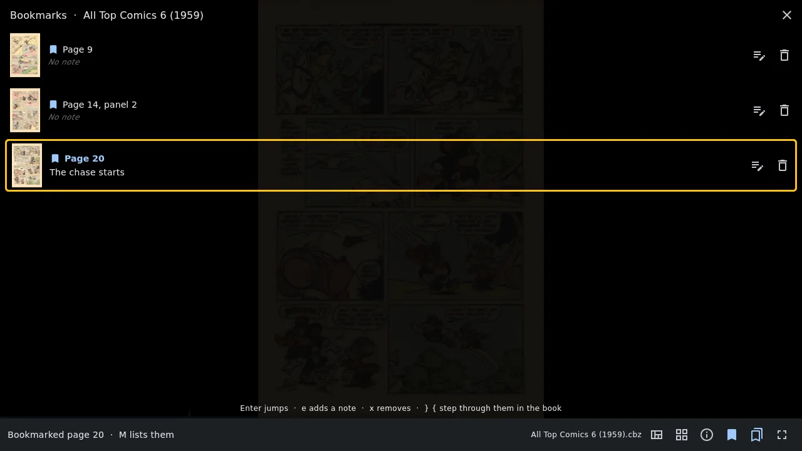
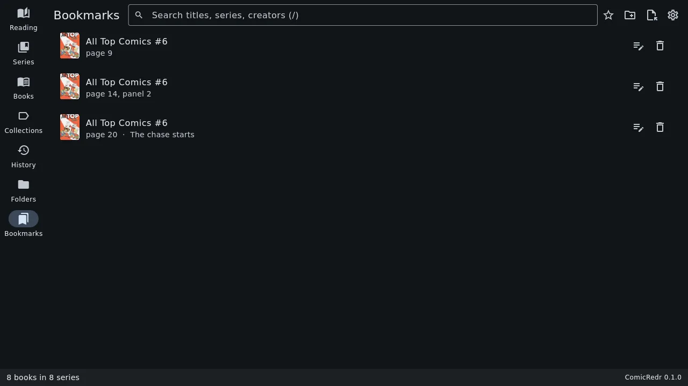

# 5. Bookmarks and marks

[Contents](README.md) · Previous: [Guided view](04-guided-view.md) · Next: [Managing your comics](06-managing-comics.md)

ComicRedr always remembers where you stopped, so you don't need a bookmark
for that. Bookmarks are for the places you want to come back to: a
favourite splash page, the start of a story inside an anthology, the
panel with the joke you want to show someone.

## Set a bookmark

Press `mm` (or the bookmark button on the status line) to bookmark the
page you are on. In [guided view](04-guided-view.md) the bookmark
remembers the panel too, so it takes you back to exactly that panel.

A bookmarked page shows a ribbon in its top right corner, and a small
amber notch on the progress bar marks where each bookmark is. Press `mm`
again on a bookmarked page to take the bookmark off.

## Jump between bookmarks

- `}` goes to the next bookmark in the book, `{` to the previous one.
- `M` (or the bookmarks button) lists them, each with a small picture of
  its page.

In the list, the arrow keys pick a bookmark and `Enter` jumps to it.
`e` adds a short note ("the chase starts", "Sam should see this"),
and `x` removes the bookmark. A click or tap on a row jumps there too.

## The Bookmarks tab

The library's Bookmarks tab (or `M` in the library) gathers the bookmarks
of every book in one list, book by book. Click one to open the book right
there. The library search on this tab also looks in your notes, so a
note is a good way to find a page again.

A book's own bookmarks are also listed in its details in the library.

## Marks, for vi users

If you know vi, marks work as you would expect:

| Keys | What they do |
|---|---|
| `ma` | Set mark `a` here (any letter from `a` to `z`) |
| `'a` | Jump to mark `a` |
| `''` | Jump back to where you were before the last jump |

Marks are listed with the bookmarks, with their letter.

## They travel with the comic

Bookmarks, notes and marks are saved in the comic's
[sidecar file](10-your-data.md). Copy the comic and its sidecar to your
phone and the bookmarks are there too. Take a bookmark off on one
device and it stays off when the sidecar comes back from another.

[Contents](README.md) · Previous: [Guided view](04-guided-view.md) · Next: [Managing your comics](06-managing-comics.md)
