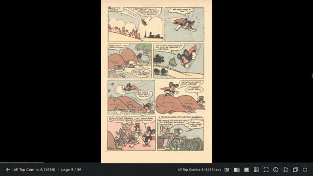
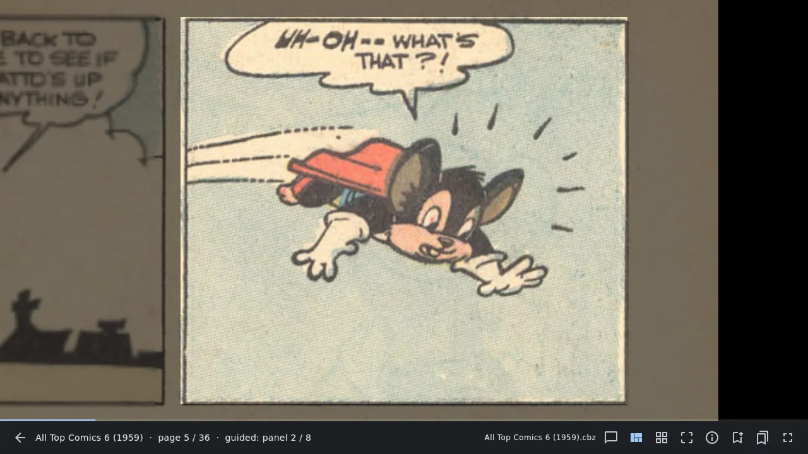
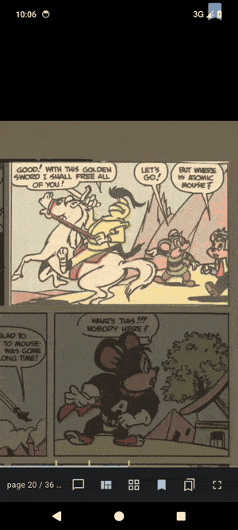
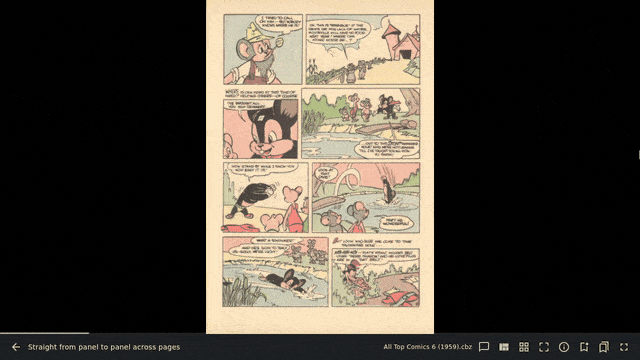
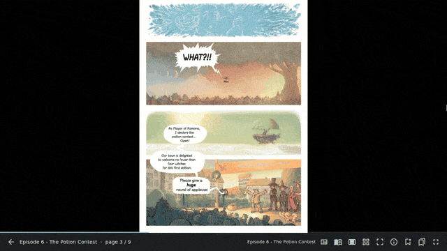
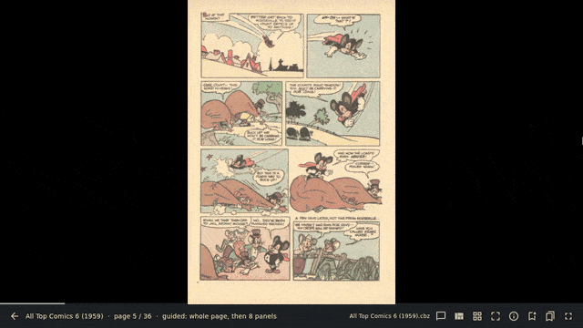
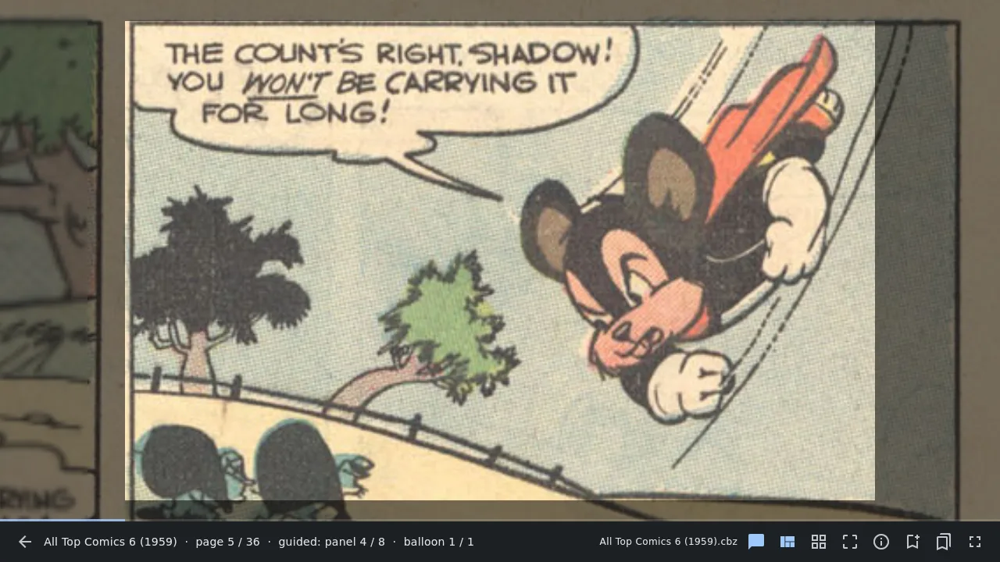
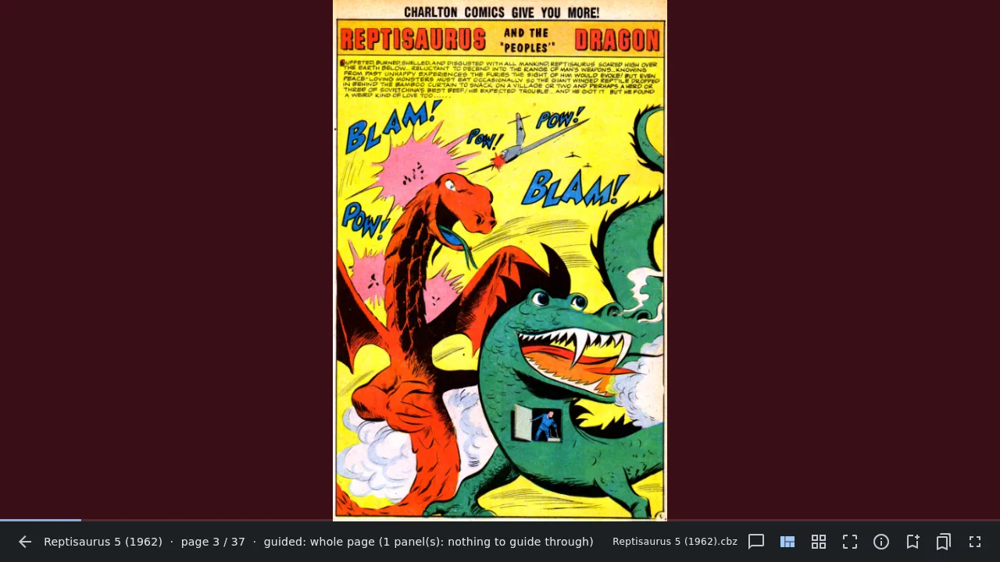

# 5. Guided view

[Contents](README.md) · Previous: [Reading a comic](04-reading.md) · Next: [Bookmarks and marks](06-bookmarks.md)

Guided view is the reason ComicRedr exists. Instead of shrinking a whole
page onto your screen, it moves from panel to panel, each one as large as
the screen allows, in reading order. The rest of the page stays visible
but dimmed, so you never lose your place.



This chapter has six short animations. If one doesn't move, click it to
play it.

## Panel by panel

1. Open a comic and press `v` (or the guided view button on the status
   line).
2. The page shows whole first, so you can take it in.
3. Each `→` (or `Space`, or a tap on the right edge) glides to the next
   panel. `←` goes back.
4. After the last panel the page shows whole once more, then the next
   page begins.
5. `v` again, or `Esc`, leaves guided view on the page you are on.

The status line says where you are: `guided: panel 2 / 6`.



On the phone a panel fills the width of the screen. The panels of this
comic were found on the laptop and came along in its
[sidecar file](11-your-data.md), so guided view was ready on the phone
straight away. Each tap on the right edge goes to the next panel:



Don't want the whole page before and after its panels? Press `w` to go
straight from the last panel of one page to the first panel of the next.
`w` again brings it back; Settings has the same switch.



Other keys that help in guided view:

- `↓` `↑` (or `j` `k`) look below and above the panel. What comes on
  screen is shown bright rather than dimmed; the next panel is framed
  and dimmed around as usual.
- On a touchscreen, drag with one finger to look around the panel, and
  pinch with two to zoom. A quick flick to the left or right steps to the
  next or previous panel; a slower drag only moves the page.
- `zz` or `=` centres the current panel again after you zoomed or moved.
- `PageDown` and `PageUp` skip to the next or previous page at once.
- `Tab` also cycles through single page, two pages and guided view.

Panels that aren't rectangles (slanted, round or cut at an angle) are
followed along their real edges, so the dimming hugs the panel's shape.

It works on modern art as well as on old scans. Here it steps through a
painted page of Pepper&Carrot whose panels have no gutters between them,
then shows the page whole before moving on:



## Balloon by balloon

Press `b` in guided view (or the speech-bubble button on the status line)
and each step stops on the next speech or thought balloon inside the
panel, in reading order, before moving on to the next panel. It is
wonderful on small screens and dense golden-age pages. `b` again goes back
to whole panels. Pressed outside guided view, `b` turns guided view on
with balloons.

Narration boxes (captions) are not balloons, and balloon mode is meant to
skip them and read them as part of the panel; it mostly does, but now and
then it stops on one.





The status line counts the balloons too: `guided: panel 2 / 6 · balloon
1 / 3`.

## Pages shown whole

Not every page can be guided. A splash page, a cover, an advert or a page
of text has no panels to step through, and on some old scans the panel
finder isn't sure enough. Rather than move the camera somewhere wrong,
ComicRedr then shows the page whole and says why on the status line, for
example `guided: whole page (1 panel(s): nothing to guide through)`,
which means only one panel was found. On a page like that you can still
[enlarge a part by hand](04-reading.md#parts-of-a-page) (`21` for the
upper half, `31` for the top third, and so on).



### A quick press stays

When you are pressing `→` panel after panel, it is easy to skip past a
splash page without really looking at it. So as soon as guided view
has to show a page whole because it has no panels it trusts enough to
step through, the
background turns a dark wine red to tell you.

- Press `→` within 2 seconds of arriving and the page stays: it zooms
  out a little and back, to say you are still on it. The next `→` turns
  the page, however soon.
- Press `→` after 2 seconds and the page turns straight away: you have
  had time to look.

For example, on a splash page reached with a quick run of `→`, the next
`→` zooms the splash instead of skipping it; a second `→` moves on. Wait
a few seconds on it and one `→` is enough.


- Going back works the same way with `←`, and a tap or swipe does what
  the key does, on the laptop and on the phone.
- With reduced motion turned on in your desktop or phone settings, the
  page doesn't zoom; the status line says to press again instead.
- The 2 seconds can be changed in Settings, under the switch: 1, 2, 3,
  5 or 10 seconds. With 5, for example, you have five seconds on a
  splash page before one `→` moves on.
- `W` turns all of this off: no wine red, and such pages turn at once.
  Settings has the same switch.

## How panels are found

ComicRedr finds panels and balloons with a small detector (a trained
model, a kind of image recogniser) that is built into the app and runs
on your own computer or phone, about a fifth of a second a page on a
laptop. Nothing leaves your machine.

- Panels are found in the background for the comic you have open, with
  guided view on or off: first the page you are on, the two after it and
  the one before, then the rest of the comic ahead of you, a little at a
  time. So guided view
  is usually ready before you get there. Other comics are left alone
  until you open them, and closing a comic stops the work.
- The results are saved in the comic's [sidecar file](11-your-data.md),
  so a comic copied to your phone doesn't need finding again.
- The [details view](07-managing-comics.md#details-of-a-comic) (`I`)
  shows, page by page, how many panels and balloons were found and why a
  page is shown whole.

If a comic's panels look wrong after an update, `X` → **Redo panels**
finds them again (see
[Reset a comic](07-managing-comics.md#reset-a-comic)).

## Panels from a large AI model

The built-in detector is small so that it can run on a phone, and some
pages beat it: slanted panels, old scans, panels on black. For a comic
you care about you can have a large AI model that sees pictures, such
as Claude (in Claude Code) or Codex, mark up its panels and balloons
once, and put the result in the comic's
[sidecar](11-your-data.md). Guided view then uses those panels on the
pages they cover, on every device the sidecar travels to, and the
built-in detector carries on as before for every other comic and page.
This is optional; nothing in the app changes until you do it.

How well it works: on 40 hard pages from the test comics, 32 of which
the built-in detector gets wrong or shows whole, guided view moved
right on 31 pages with Claude's panels and on 8 with the detector's.
On slanted pages Claude got all 12 right. It found balloons better on
modern and slanted pages, and it keeps narration boxes apart, which
balloon mode then skips. It takes Claude about half a minute a page; on a paid API plan
that is roughly 3 to 5 cents a page, a dollar or so for a 30-page
comic. On a subscription it comes out of your usage instead.

You need a copy of the ComicRedr source (the tool is
`tool/llm_panels.py`), Python 3 with Pillow (`pip install pillow`,
and `pypdfium2` for PDFs), and Claude Code or Codex. Do it on a
computer; the sidecar takes the panels to your phone. CBZ, CBT, PDF,
folders of pages and single images work; EPUB does not.

1. Make the pages and the prompt. This writes each page as a picture
   with a grid of percent lines over it, so the model can read
   positions off it, and the instructions as `PROMPT.md`:

   ```sh
   python3 tool/llm_panels.py pages ~/Comics/Latuda.cbz /tmp/latuda
   ```

2. Run the model in that folder with the prompt. With Claude Code:

   ```sh
   cd /tmp/latuda && claude "$(cat PROMPT.md)"
   ```

   With Codex, `codex "$(cat PROMPT.md)"` in the same folder the same
   way (only Claude was tried). The model looks at every page, writes
   `panels.json`, draws it on the pages with the tool's `check`
   command and fixes what is off. Allow it to write files and run the
   tool when it asks.

3. Look for yourself: `check/page-001.jpg` and on show the panels in
   green with their number in reading order, balloons in magenta and
   narration boxes in blue. Ask the model to fix a page, or edit
   `panels.json` by hand, and run the check again:

   ```sh
   python3 tool/llm_panels.py check ~/Comics/Latuda.cbz /tmp/latuda
   ```

4. Put it in the comic's sidecar:

   ```sh
   python3 tool/llm_panels.py import ~/Comics/Latuda.cbz /tmp/latuda/panels.json
   ```

   If you keep sidecars in one folder (Settings → Sidecars), name that
   comic's sidecar with `--sidecar`.

5. Open the comic. Guided view follows the imported panels in the
   model's order; a page given no panels is shown whole. The details
   view (`I`) names them as imported.

The prompt the tool writes, word for word but for the last paragraph's
paths:

```
You are marking up the pages of a comic for a reader app's guided view.
In this folder, page-001.jpg, page-002.jpg, ... are the pages in order, each
with a grid drawn over it: a line every 5% of the page's width and height,
labelled every 10%.

For every page, look at the image and write down:
- panels: every panel, in the order a reader reads them (left to right, top
  to bottom; a tall panel beside a stack is read first), as
  [x0, y0, x1, y1]: its left, top, right and bottom edges in percent of the
  page. A slanted or cut panel may be {"outline": [[x, y], ...]} instead,
  its corners in percent, going round from the top left one. Borderless art
  counts as a panel when it is a stop of its own. Panels should not overlap;
  where art spills over a border, give the border. A cover, a pin-up or a
  page of text gets "panels": [].
- balloons: speech and thought balloons, and speech written without a
  balloon, as [x0, y0, x1, y1] in percent.
- captions: narration boxes, kept apart from balloons.
Leave out sound effects and signs.

Write it all to panels.json in this folder:
{"pages": {"1": {"panels": [...], "balloons": [...], "captions": [...]}, "2": ...}}

Then run `python3 tool/llm_panels.py check 'Latuda.cbz' .` and look at
check/page-NNN.jpg: green boxes are panels with their number, magenta
balloons, blue captions. Fix any box that does not sit on its edge, and run
check again until they all do.
```

A `panels.json` for a page of two panels side by side above a slanted
pair, with one balloon and one narration box:

```json
{"pages": {"3": {
  "panels": [[2, 2, 49, 48], [51, 2, 98, 48],
             {"outline": [[2, 52], [55, 52], [35, 98], [2, 98]]},
             {"outline": [[57, 52], [98, 52], [98, 98], [37, 98]]}],
  "balloons": [[60, 5, 80, 15]],
  "captions": [[3, 3, 30, 8]]}}}
```

Pages left out of the file keep the detector's panels, so you can do
just the pages that need it. To go back to the detector for the whole
comic, `X` → **Redo panels** drops the imported panels.

[Contents](README.md) · Previous: [Reading a comic](04-reading.md) · Next: [Bookmarks and marks](06-bookmarks.md)
