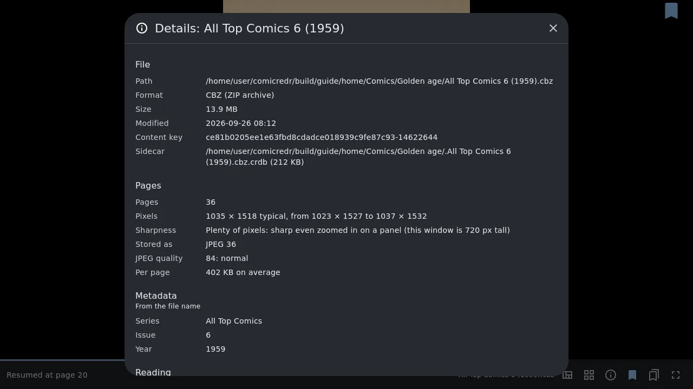
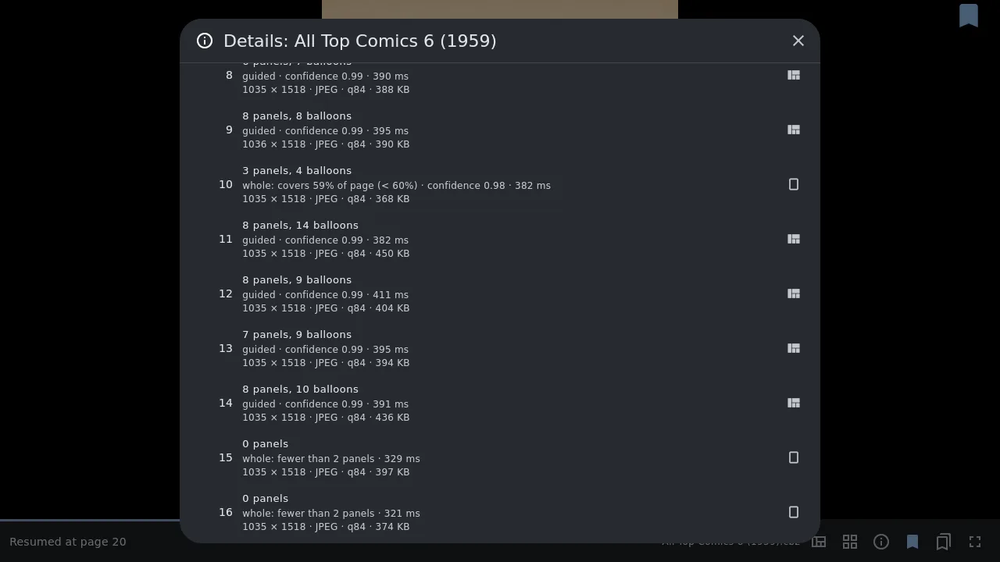
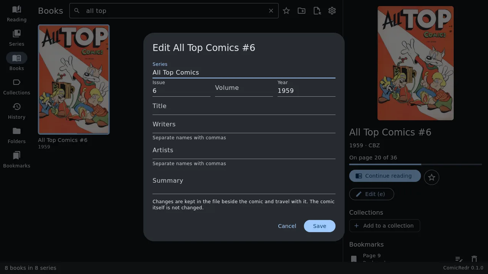
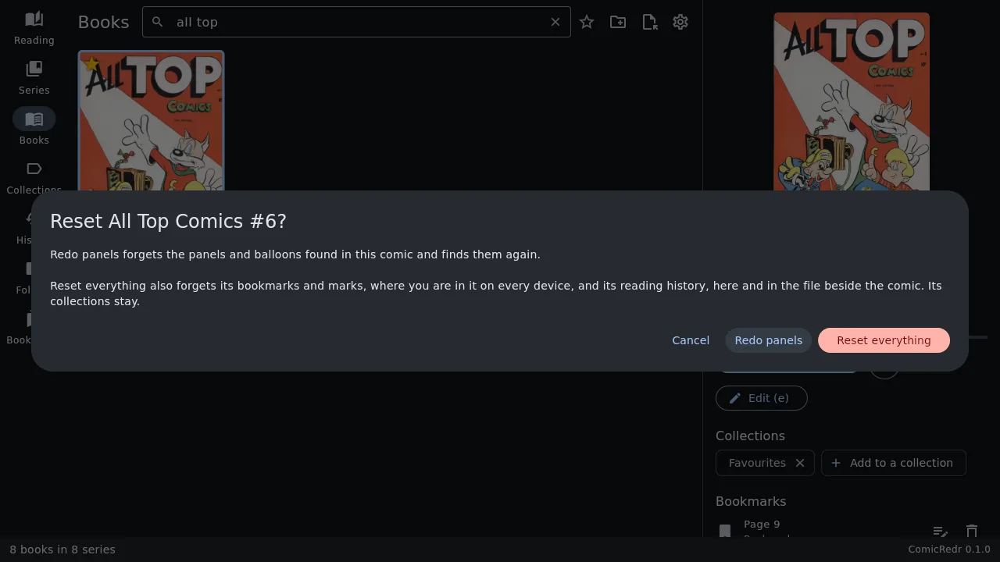
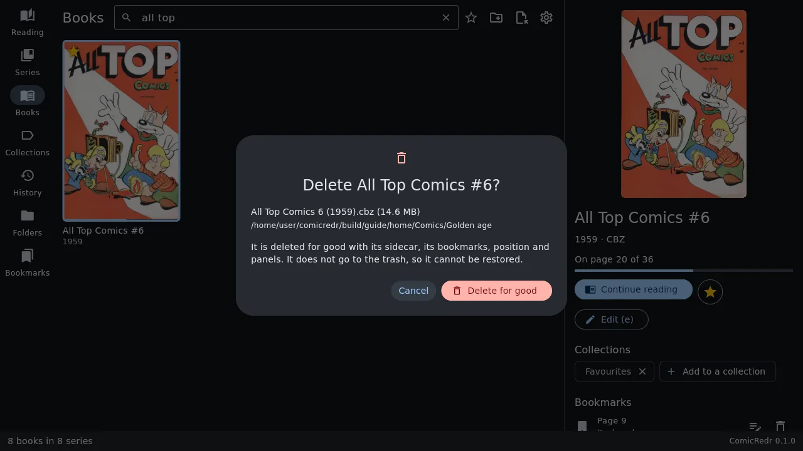

# 7. Managing your comics

[Contents](README.md) · Previous: [Bookmarks and marks](06-bookmarks.md) · Next: [Touch](08-touch.md)

This chapter covers everything you can do *to* a comic rather than with
it: look at its details, fix its title, start it afresh, or delete it.

## Details of a comic

Press `I` in a comic, or on a selected cover in the library, for
everything ComicRedr knows about it:

- **File**: where it is, its format and size, and where its
  [sidecar](11-your-data.md) is.
- **Pages**: how many, their size in pixels, how the images are stored,
  their JPEG quality, and a plain verdict on how sharp the scans will look
  on your screen ("Plenty of pixels", "A little soft on this screen"). For
  a PDF it lists the images inside it.
- **Metadata**: series, issue, title, year, writers, artists and summary,
  and where they came from.
- **Reading**: how far you are, when you last read it, how long you have
  spent on it and in how many sittings, its bookmarks and collections.
- **Panels and balloons**: how many pages guided view steps through panel
  by panel, which are shown whole and why, and how sure the detector was.
- **Page by page**: one line per page with all of the above. Click a page
  to go there.

`j` `k`, the arrow keys and `PageDown` `PageUp` scroll; `Esc` or `I`
closes it.

## Fix a title or series

When a comic's name or series is wrong, select it in the library and
press `e` (or **Edit** in its details). You can change the series, issue,
volume, year, title, writers, artists and summary.

- The comic file itself is never changed. Your edits are kept in its
  [sidecar](11-your-data.md), so they travel with it.
- A field you changed has an undo button that puts back what the comic
  says.
- To rename a whole series, select the series on the Series tab and press
  `e`. Giving it the name of another series puts the two together.

## Reset a comic

Press `X` in a comic (or **Reset this comic** in its details) to start
over. You get two choices:

- **Redo panels** forgets the panels and balloons found in this comic and
  finds them again. Useful if guided view goes wrong on a book.
- **Reset everything** also forgets its bookmarks and marks, where you
  are in it (on every device), your edits and its reading history. Its
  collections stay.

## Delete a comic

Done with a comic for good? `Shift+Delete` or `gd` (or **Delete this
comic** in its details) deletes it, after asking.

- **Cancel** is selected, so a stray `Enter` or `Esc` deletes nothing.
- The comic and its sidecar are deleted for good. They do **not** go to
  the trash, so they can't be restored.
- If you were reading it, you are back in the library with the next cover
  selected.

[Contents](README.md) · Previous: [Bookmarks and marks](06-bookmarks.md) · Next: [Touch](08-touch.md)
