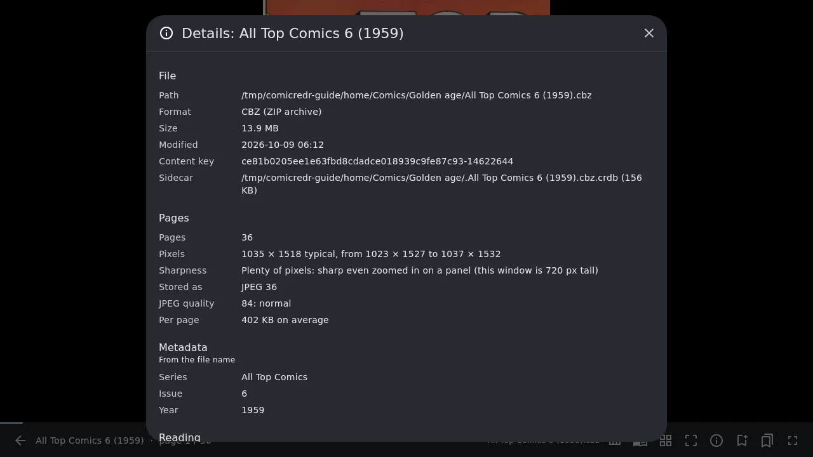
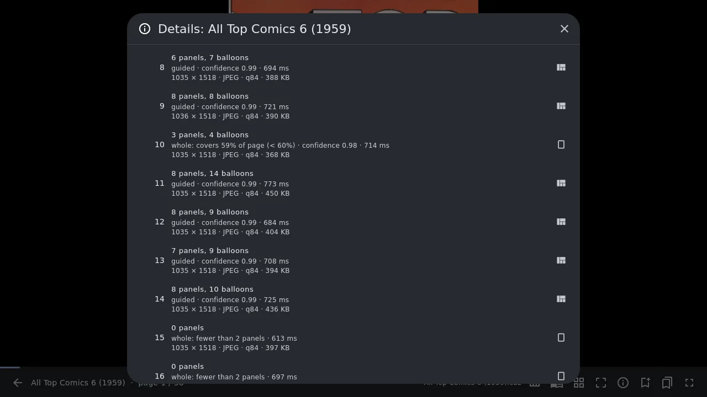
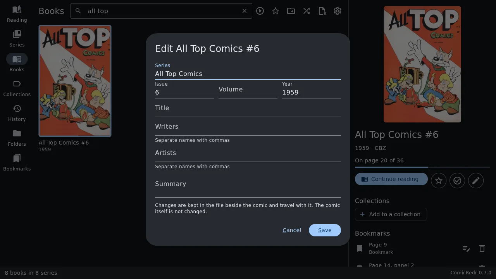
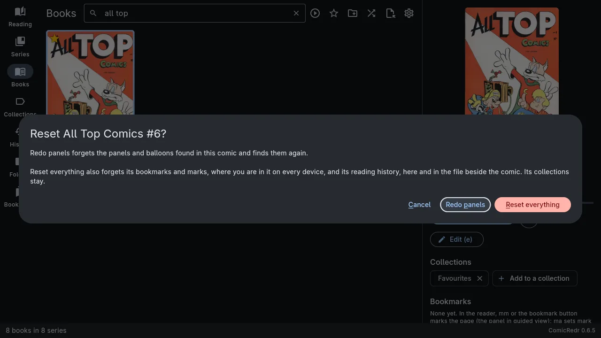
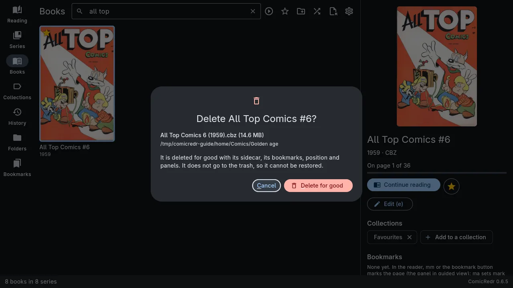

# 7. Managing your comics

[Contents](README.md) · Previous: [Bookmarks and marks](06-bookmarks.md) · Next: [Touch](08-touch.md)

This chapter covers everything you can do *to* a comic rather than with
it: look at its details, fix its title, start it afresh, or delete it.

## Details of a comic

Press `I` in a comic, or on a selected cover in the library, for
everything ComicRedr knows about it:

- **File**: where it is, its format, size and date, and where its
  [sidecar](11-your-data.md) is (the small hidden file beside the comic
  that holds your place, bookmarks, panels and edits). The *content key*
  is the comic's fingerprint, which lets ComicRedr recognise it after a
  rename or a move.
- **Pages**: how many, their size in pixels, how the images are stored,
  their JPEG quality, and a plain verdict on how sharp the scans will look
  on your screen ("Plenty of pixels", "A little soft on this screen"). For
  a PDF it lists the images inside it.
- **Metadata**: series, issue, title, year, writers, artists and summary,
  and where they came from.
- **Reading**: how far you are, whether it is
  [completed](03-library.md#completed-comics) and why, when you last read it, how long you have
  spent on it and in how many sittings, its bookmarks and collections.
- **Panels and balloons**: how many pages guided view steps through panel
  by panel, which are shown whole and why, and how sure the detector was,
  with a **Redo panels** button (`Alt+P`, wherever the list is scrolled
  to).
- **Page by page**: one line per page with all of the above. Click a page
  to go there (when you opened the details from inside the comic).

`j` `k`, the arrow keys, `Space`, `PageDown` `PageUp` and `Home` `End`
(or `G` for the end) scroll; `Esc` or `I` closes it.

## Fix a title or series

When a comic's name or series is wrong, select it in the library and
press `e` (or the pencil in its details). You can change the series, issue,
volume, year, title, writers, artists and summary.

- The comic file itself is never changed. Your edits are kept in its
  [sidecar](11-your-data.md), so they travel with it.
- A field you edited earlier shows an undo
  arrow that puts back what the comic itself says.
- To rename a whole series, select the series on the Series tab and press
  `e` (or **Rename** in its details). Giving it the name of another series puts the two together.

## Reset a comic

Press `X` in a comic or on a selected cover (or **Reset this comic** in
its details) to start over. You get two choices:

- **Redo panels** forgets the panels and balloons found in this comic and
  finds them again. Useful if guided view goes wrong on a book.
- **Reset everything** also forgets its bookmarks and marks, where you
  are in it (on every device), whether it is
  [completed](03-library.md#completed-comics), your edits and its reading
  history. Its collections stay.

With comics [marked in the library](03-library.md#several-comics-at-once),
`X` (or **Reset** in the bar over the covers) asks once and resets every
one of them the same way.

**Redo panels** has the ring, so `Enter` takes it; `Alt+P` does too,
`Alt+R` is **Reset everything** and `Alt+C` or `Esc` leaves the comic as
it is.

## Delete a comic

Done with a comic for good? `Shift+Delete` or `gd` (or **Delete this
comic** in its details) deletes it, after asking.

- **Cancel** is selected, so a stray `Enter` or `Esc` deletes nothing.
  From the keyboard, `Alt+D` is the delete button and `Alt+C` is
  **Cancel**: `Alt` with the underlined letter, as in
  [every dialog](09-keyboard.md#a-key-for-every-button).
- The comic and its sidecar are deleted for good. They do **not** go to
  the trash, so they can't be restored.
- A comic that is a link (symlink) loses only the link (the button says
  **Delete the link**); the comic it points to stays where it is.
- A comic that is also [on S3](13-s3-sync.md#taking-a-comic-off-s3)
  offers **Delete only here** and **Delete here and from S3**. On a comic
  that is only on S3, `gd` offers to take it off S3.
- If you were reading it, you are back in the library with the next cover
  selected.

To delete several, [mark them in the library](03-library.md#several-comics-at-once)
(`Shift` and the arrow keys, `Ctrl+A`, `V`) and press `gd`, or
**Delete** in the bar over the covers. One dialog lists them all, with
their size together, and **Cancel** is selected there too. When some are
on S3 it offers **Delete only here** and **Delete here and from S3** for
the lot. Comics that are only on S3 are removed only with **Delete here
and from S3**.

[Contents](README.md) · Previous: [Bookmarks and marks](06-bookmarks.md) · Next: [Touch](08-touch.md)
