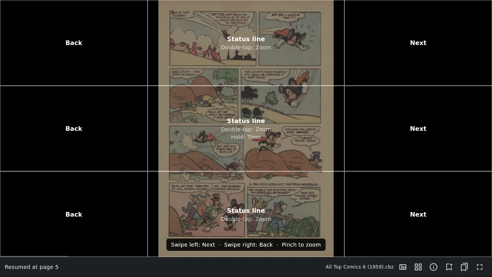
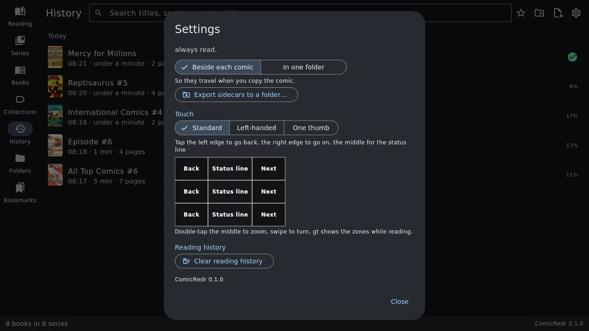
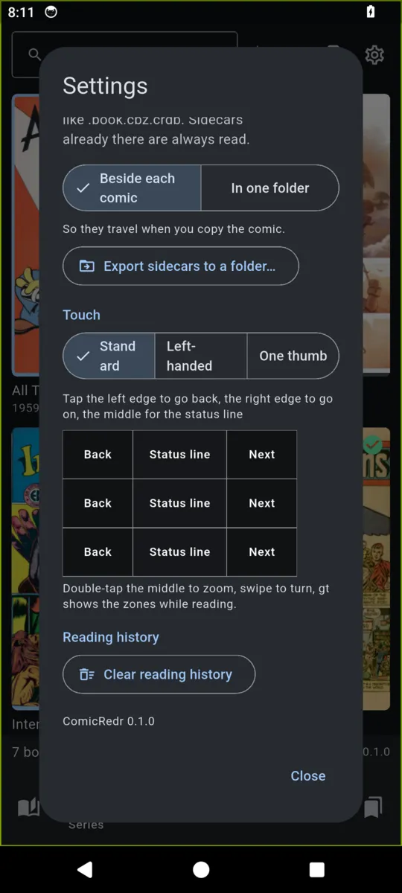

# 8. Touch

[Contents](README.md) · Previous: [Managing your comics](07-managing-comics.md) · Next: [The keyboard](09-keyboard.md)

Everything in ComicRedr works by touch, on the phone and on a Linux
laptop's touchscreen alike: every gesture below, the tap zones and your
own gestures are the same on both.

## Gestures

| Gesture | What it does |
|---|---|
| Tap the right edge | Next page, or next panel in guided view |
| Tap the left edge | Back |
| Tap the middle | Fullscreen on and off (and with it the status line) |
| Swipe left or right | Next or back |
| Double-tap the middle | Zoom in on that spot, or back out |
| Pinch | Zoom |
| Drag | Move around a zoomed page |
| Hold a finger on the middle | [The time](04-reading.md#what-time-is-it) |
| Drag along the progress bar | Preview pages, and let go to jump |
| Pinch the page grid | Bigger or smaller pages; drag to scroll, tap one to go there |

The buttons on the status line do the rest: guided view, balloons, the
page grid, bookmarks and fullscreen. On Android, the back gesture works
like `Esc`: it leaves guided view, then the book. On Linux the status
line starts with a back arrow that does the same. In fullscreen, tap the
middle first to bring the status line back.

In the library, tap a cover to pick it and tap it again to open it (on
the phone the first tap shows its details, with a **Read** button). A
long press shows a cover's details, and a finger scrolls the covers.

## The tap zones

The page is split into nine zones: three columns (the side ones each 30%
of the width) and three rows. Press `gt` while reading to see what each
zone does; it fades after a moment.



Settings → **Touch** has three layouts:

| Layout | For |
|---|---|
| **Standard** | Tap the left edge to go back, the right edge to go on, the middle for the status line. |
| **Left-handed** | Mirrored for the left thumb: the left edge goes on, the right edge goes back. |
| **One thumb** | Tap almost anywhere to go on; only the top row goes back. |

| | |
|---|---|
|  |  |
| Settings on the laptop | and on the phone |

The first comic you open after picking a layout shows its zones for a
few seconds.

## Your own gestures

Any tap, double-tap or long press in any of the nine zones, the four
swipes and a two-finger tap can do any action ComicRedr has. You set them
in the `[touch]` section of `keys.toml`; [chapter 9](09-keyboard.md#your-own-keys)
shows how. For example, to make a long press in the top right corner set a
bookmark:

```toml
[touch]
longPress = [
  "", "", "bookmark",
  "", "showTime", "",
  "", "", "",
]
```

Your lines go on top of the layout picked in Settings. Pinch zoom and
dragging a zoomed page always work and can't be changed.

[Contents](README.md) · Previous: [Managing your comics](07-managing-comics.md) · Next: [The keyboard](09-keyboard.md)
