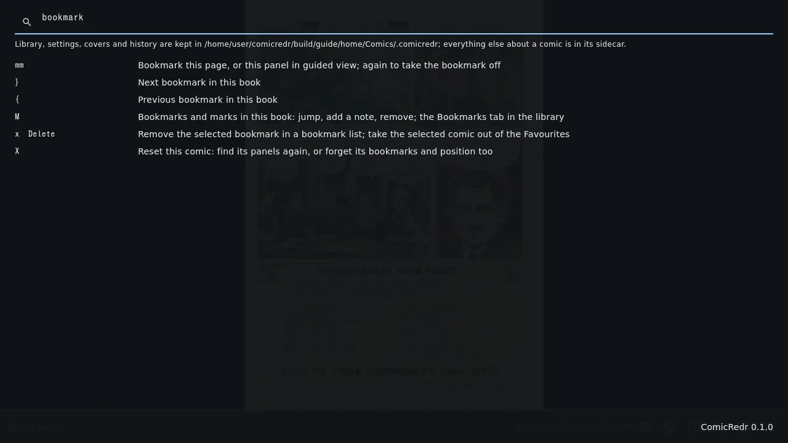

# 9. The keyboard

[Contents](README.md) · Previous: [Touch](08-touch.md) · Next: [On a phone or tablet](10-phone.md)

ComicRedr is made to be used from the keyboard. The usual keys (arrows,
`Space`, `PageDown`, `Home`, `Esc`) do what you expect, and a vi-style
layer on top gives quick single-letter keys, counts and marks. You never
need to learn the vi keys, but they are there.

## `?` shows every key

Press `?` anywhere for the list of every action and its keys. It always
shows the keys that are live right now, including your own changes.


Type `/` in it to search. Every word you type has to match, so `next
page` or `bookmark` narrow the list down. Spelling doesn't have to be
exact (`fulscr` finds fullscreen), a key finds its action (`gg`), and
`/regex/` searches with a regular expression. `Esc` clears the search,
and `Esc` again closes the list.



The top of the list also shows ComicRedr's data folder, and which
`keys.toml` is loaded when you have one.

## The keys you'll use most

| Key | In a comic | In the library |
|---|---|---|
| `→` `Space` `l` | Next page or panel | Next cover |
| `←` `h` | Back | Previous cover |
| `↓` `↑` `j` `k` | Move down and up a zoomed page | Cover below and above |
| `Enter` | | Open |
| `Esc` | Out of guided view, then back to the library | Back out of a series, folder or search |
| `v` | [Guided view](05-guided-view.md) | |
| `b` | [Balloon by balloon](05-guided-view.md#balloon-by-balloon) | |
| `d` | [Two pages](04-reading.md#two-pages-side-by-side) | |
| `p` | [Page grid](04-reading.md#see-every-page-at-once) | |
| `mm` `M` | [Bookmark, bookmark list](06-bookmarks.md) | `M`: the Bookmarks tab |
| `*` | [Favourite](03-library.md#favourites) | Favourite the selected cover |
| `I` | [Details](07-managing-comics.md#details-of-a-comic) | Details of the selected book |
| `f` | [Fullscreen](04-reading.md#fullscreen) | Fullscreen |
| `/` | | [Search](03-library.md#search) |
| `?` | Every key | Every key |

The full list, with every key and a line on what it does, is
[docs/keys.toml](../keys.toml).

## Sequences and counts

Some keys are two keys in a row: `gg` (first page), `mm` (bookmark),
`zw` (fit width), `gt` (tap zones). Type them one after the other; the
status line shows the first key while it waits for the second.

A number before a key repeats it or picks a page:

- `12G` goes to page 12, `G` alone to the last page.
- `3l` goes three steps on.
- `2>` turns the comic upside down.
- In the library, `5G` goes to the fifth cover.

## Your own keys

Every key can be changed in a small text file, `keys.toml`. It goes in
`~/Comics/.comicredr/` when ComicRedr keeps its data there (`?` names the
data folder), otherwise in `~/.config/comicredr/`. On the phone it is
`Android/data/org.snonux.comicredr/files/keys.toml`.

The easiest start is `make keys` in the ComicRedr checkout, which copies
the full list of actions ([docs/keys.toml](../keys.toml)) to the right
place. Keep only the lines you change. For example, to turn pages with
`Ctrl+n` and `Ctrl+p` as well as the usual keys, and to take the `D` key
away from shifting the spread:

```toml
[keys]
nextStep = ["l", "Right", "Space", "C-n"]
prevStep = ["h", "Left", "S-Space", "C-p"]
shiftSpread = []
```

- An action you list gets exactly the keys you give it; `[]` leaves it
  with none. Actions you leave out keep their usual keys.
- `C-f` is `Ctrl+f`, `S-Space` is `Shift+Space`, and named keys are
  written `Left`, `PageDown`, `Home`, `Esc`, `F11` and so on.
- `gg` is two keys in a row. Put spaces between keys when one of them is
  named: `"g Home"`.
- The `[touch]` section sets [gestures](08-touch.md#your-own-gestures).

Restart ComicRedr to load your changes. If a line is wrong, ComicRedr
says so when it starts, and `?` lists the problem in red with the keys it
uses instead.

[Contents](README.md) · Previous: [Touch](08-touch.md) · Next: [On a phone or tablet](10-phone.md)
