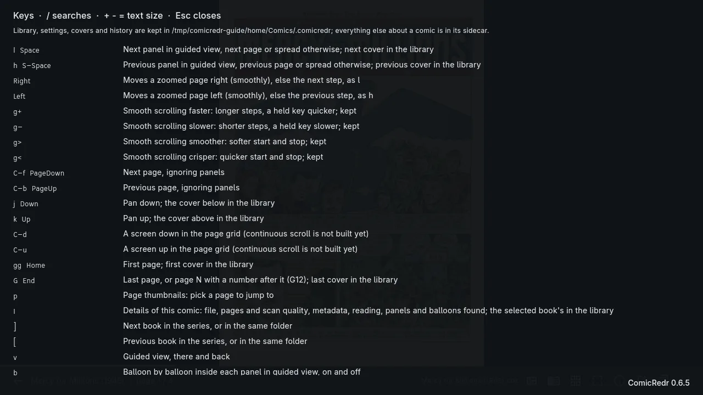
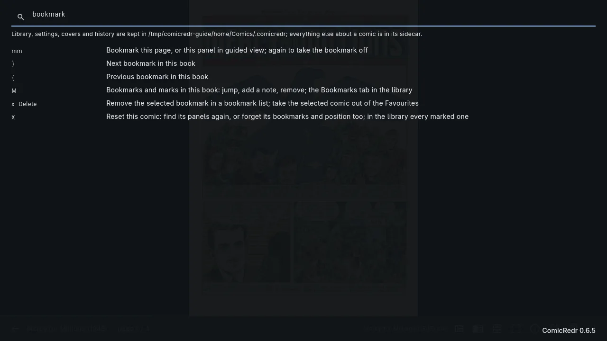

# 9. The keyboard

[Contents](README.md) · Previous: [Touch](08-touch.md) · Next: [On a phone or tablet](10-phone.md)

ComicRedr is made to be used from the keyboard. The usual keys (arrows,
`Space`, `PageDown`, `Home`, `Esc`) do what you expect, and a vi-style
layer on top gives quick single-letter keys, counts and marks. You never
need to learn the vi keys, but they are there.

## `?` shows every key

Press `?` anywhere for the list of every action and its keys. It always
shows the keys that are live right now, including your own changes.



Type `/` in it to search. Every word you type has to match, so `next
page` or `bookmark` narrow the list down. Spelling doesn't have to be
exact (`fulscr` finds fullscreen), a key finds its action (`gg`), and
`/regex/` searches with a regular expression. `Esc` clears the search,
and `Esc` again closes the list.



The top of the list also shows ComicRedr's data folder, and which
`keys.toml` is loaded when you have one.

### Bigger and smaller text

When the list is hard to read, press `+` in it: every press makes all of
its text a step bigger, up to three times the usual size. `-` makes it
smaller again, down to seven tenths of the usual size, and `=` puts the
usual size back. `Ctrl` and the mouse wheel do the same, and so does a
pinch on a touchpad or two fingers on a touchscreen. The first line of
the list names the keys; it makes way for the search field while you
search or keep what you found.

The list stays where you were reading: what was along its top, an
action or part of the title, is still there after the text has changed
size. The version in the bottom right corner keeps its size.

Say you sit back from the screen with the keyboard on your lap: press
`?`, then `+` three times, and the keys can be read from there. The size
stays for the next time you press `?`, also after a restart, and it goes
into a [settings export](11-your-data.md#back-up-and-restore-your-settings).

With big text in a narrow window there is no room for the keys and what
they do side by side; each action then has its keys on one line and what
it does below. Scroll with the mouse wheel or a finger as before.

These are the same keys that [zoom a page](04-reading.md#zoom) and
[size the covers](03-library.md#bigger-and-smaller-covers), so if you
gave zooming other keys in your `keys.toml`, those work here too. While
the help is open they change only the help, never the comic or the
library behind it. While you type in the search, `+` and `-` are typed
like any other character, so you can search for them; press `Enter` to
keep what you found and get the keys back, and then they size the text.

## The keys you'll use most

| Key | In a comic | In the library |
|---|---|---|
| `→` `Space` `l` | Next page or panel (`→` first [moves across a zoomed page](04-reading.md#smooth-scrolling)) | Next cover |
| `←` `h` | Back (`←` first moves across a zoomed page) | Previous cover |
| `↓` `↑` `j` `k` | Move down and up a zoomed page | Cover below and above |
| `g+` `g-` | [Smooth scrolling](04-reading.md#how-fast) faster and slower | The same |
| `g>` `g<` | [Smooth scrolling](04-reading.md#how-smooth) smoother and crisper | The same |
| `+` `-` `=` | [Zoom](04-reading.md#zoom) in, out, and back to the fit | [Covers bigger, smaller](03-library.md#bigger-and-smaller-covers), and back to the usual size |
| `Enter` | | Open |
| `C` | [The comic read before this one](02-getting-started.md#carry-on-where-you-stopped-c) | The comic read last, where you stopped |
| `Esc` | Out of guided view, then back to the library | Back out of a series, folder or search |
| `v` | [Guided view](05-guided-view.md) | |
| `b` | [Balloon by balloon](05-guided-view.md#balloon-by-balloon) | |
| `d` | [Two pages](04-reading.md#two-pages-side-by-side) | |
| `p` | [Page grid](04-reading.md#see-every-page-at-once) | |
| `H1`-`Q4`, or `21`-`54` | [A part of the page](04-reading.md#parts-of-a-page), enlarged | `11` whole, `00` leave |
| `gp` | [Pick a part of the page](04-reading.md#by-touch) on a small copy of it, by click or touch | |
| `11` `00` | Whole page in the split; leave the split | |
| `mm` `M` | [Bookmark, bookmark list](06-bookmarks.md) | `M`: the Bookmarks tab |
| `*` | [Favourite](03-library.md#favourites) this comic, also from the page grid or bookmark list | Favourite the selected cover, or the marked ones |
| `gc` | Put this comic in a [collection](03-library.md#collections), also from the page grid or bookmark list | The selected cover, or the marked ones |
| `Shift`+arrows | As the arrows alone | [Mark a run of comics](03-library.md#several-comics-at-once) |
| `Ctrl+A` | | Mark every comic shown |
| `gd` `X` | Delete, reset this comic | Delete, reset the selected or the marked comics |
| `I` | [Details](07-managing-comics.md#details-of-a-comic) | Details of the selected book |
| `f` | [Fullscreen](04-reading.md#fullscreen) | Fullscreen |
| `/` | | [Search](03-library.md#search) |
| `g,` | [Settings](12-settings.md), over the comic | Settings |
| `u` | Undo what the notice along the bottom offers to undo, while it shows | The same |
| `?` | Every key (`+` `-` `=` in it: [bigger and smaller text](#bigger-and-smaller-text)) | Every key |

The full list, with every key and a line on what it does, is
[docs/keys.toml](../keys.toml).

## A key for every button

Everything you can click has a key, so the mouse can stay where it is.

**On the library and in a comic** every button belongs to an action of
the keymap. Rest the pointer on a button and its tooltip names the key:
*Settings (g,)*, *Favourites (gf)*, *Rescan the library folders (R)*.
The tooltip reads the keymap as it is now, so after you change a key in
your [`keys.toml`](#your-own-keys) the button names your key. `?` lists
them all. The buttons that had no key before have one now:

| Key | Button |
|---|---|
| `g,` | The gear at the top of the library: [Settings](12-settings.md). It works in a comic too, and the comic keeps its page. |
| `u` | **Undo** in the notice along the bottom, after `x` took a comic out of the [Favourites](03-library.md#favourites) or a [collection](03-library.md#collections), or `gA` a folder out of the library. It works wherever the notice shows, also over a comic you opened in the meantime or with the `?` help up, and only while it shows: the notice goes by itself after about ten seconds, or when another notice takes its place, and with no such notice `u` does nothing. |
| `x` | In an open collection: takes the selected comic out of it (the **x** on its chip in the details), or all the [marked](03-library.md#several-comics-at-once) ones. |
| `gA` | **Take out of the library** in a library folder's details: select the folder at the top of the Folders tab first. Its comics stay on disk, and the notice has an **Undo** (`u`) that puts the folder back. |
| `gD` | **Download** on a comic that is [only on S3](13-s3-sync.md#on-the-other-device), or on the marked ones. |
| `g!` | The count of comics that could not be read, in the line at the bottom: which ones, and why. |

A few buttons are shortcuts to something the keys reach in two steps,
and have no key of their own: the names along the top of the Folders
tab (`Backspace` goes up a folder at a time), **Read** in a series'
details (`Enter` shows its books, `Enter` on one reads it), the **x** on
a part of the [filter](03-library.md#filter-by-type-size-and-date)
(`F`, then pick it off there), and **Note** and **Remove** on a bookmark
in a book's details (`e` and `x` on the Bookmarks tab). The tabs are
`Tab` and `Shift+Tab`, covers and pages the arrows and `Enter`.

**In a dialog** (Settings, a question before deleting, the filter, a
name to type) the keys are the ones of any Linux desktop:

| Key | In a dialog |
|---|---|
| `Alt` + the underlined letter | Presses that button: `Alt+C` is **Cancel**, `Alt+D` **Delete for good**, `Alt+S` **Save**. `Alt`, so that a letter typed into a name stays a letter. |
| `Enter` | The button with the ring around it. A dialog starts on its safe button: **Cancel** where something would be lost. In a field you type in, `Enter` is the dialog's main button. |
| `Esc` | Closes the dialog and changes nothing. |
| `Tab` `Shift+Tab` | To the next and the previous control, every one of them in turn, also in a dialog that scrolls. A ring shows where you are. |
| Arrows | To the control in that direction; on a slider, a notch left or right. |
| `Space` | Switches a switch, picks a choice, presses a button. |


For example, to switch on **Clean up old scans** without the mouse:
`g,` opens Settings, `Tab` goes to the first switch, `Space` switches
it, and `Alt+C` (or `Esc`) closes Settings. Or to delete the comic you
are on: `gd`, look at what it says, then `Alt+D`; a stray `Enter` only
presses **Cancel**. While a dialog is open no key reaches the comic or
the library behind it.

On a phone or tablet the letters are underlined only while `Alt` is
held on a keyboard you have plugged in; the keys work the same.

## Sequences and counts

Some keys are two keys in a row: `gg` (first page), `mm` (bookmark),
`zw` (fit width), `gt` (tap zones). Type them one after the other; the
status line shows the first key while it waits for the second.

A page number goes after `G`:

- `G12` goes to page 12. The number ends with Enter, any other key, or
  half a second's pause; the status line shows `G12` while you type.
- `G` alone goes to the last page, after that half second (`End` at
  once).
- In the library, `G5` goes to the fifth cover.

A number before another key repeats it:

- `3l` goes three steps on.
- `2>` turns the comic upside down.

Two digits typed quickly are a key of their own. The first digit is how
many parts you are thinking in:

- `11` shows the [whole page](04-reading.md#parts-of-a-page) (still in
  that split); `00` leaves the split.
- `21` `22` are the halves, `31`-`33` the thirds, `41`-`44` four strips,
  `51`-`54` the quarters — the same as `H1`, `B1`, `L1` and `Q1` to `Q4`.

The part shows the moment the second digit comes within half a second of
the first. So `22` enlarges the lower half at once; typed slowly, `2`
then `2l` is still twenty-two steps on.

## Your own keys

Every key can be changed in a small text file, `keys.toml`. It goes in
`~/Comics/.comicredr/` when ComicRedr keeps its data there (`?` names the
data folder), otherwise in `~/.config/comicredr/`. On the phone it is
`Android/data/org.snonux.comicredr/files/keys.toml`.

The easiest start is to download [docs/keys.toml](../keys.toml), the
full list of actions with their keys, and save it as `keys.toml` in that
folder (if you built ComicRedr yourself, `make keys` does this for you).
Keep only the lines you change. For example, to turn pages with
`Ctrl+n` and `Ctrl+p` as well as the usual keys, and to take the `D` key
away from shifting the spread:

```toml
[keys]
nextStep = ["l", "Space", "C-n"]
prevStep = ["h", "S-Space", "C-p"]
shiftSpread = []
```

- An action you list gets exactly the keys you give it; `[]` leaves it
  with none. Actions you leave out keep their usual keys, except a key
  you gave to another action: it moves there.
- `Left` and `Right` belong to `scrollLeft` and `scrollRight`: on a
  zoomed page they move across it, otherwise they turn like `h` and `l`.
  To make them always turn, even on a zoomed page:

  ```toml
  nextStep = ["l", "Space", "Right"]
  prevStep = ["h", "S-Space", "Left"]
  ```

- `C-f` is `Ctrl+f`, `S-Space` is `Shift+Space`, and named keys are
  written `Left`, `PageDown`, `Home`, `Esc`, `F11` and so on.
- `gg` is two keys in a row. When a sequence includes a named key, put
  spaces between the keys: `"g Home"` is `g`, then `Home`.
- A key can't start with a digit from 1 to 9 (those type a count), except
  two or more digits typed quickly: `regionUpperHalf = ["H1", "21"]`. A
  key that is the start of a longer one hides it (`g` alone would hide
  `gg`); ComicRedr warns about that.
- The `[touch]` section sets [gestures](08-touch.md#your-own-gestures).

Restart ComicRedr to load your changes. If a line is wrong, ComicRedr
says so when it starts, and `?` lists the problem in red with the keys it
uses instead.

[Contents](README.md) · Previous: [Touch](08-touch.md) · Next: [On a phone or tablet](10-phone.md)
