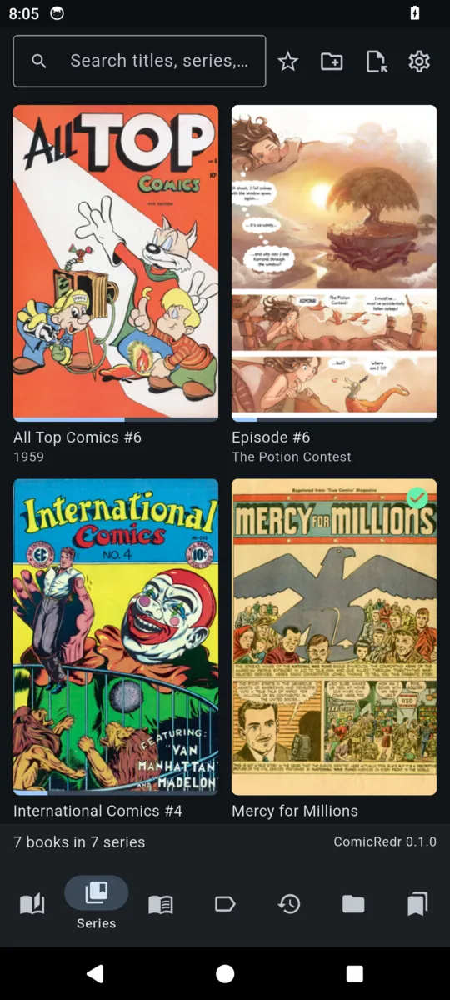
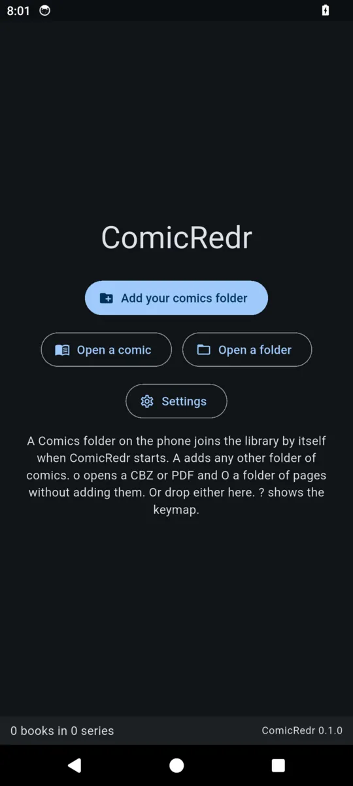
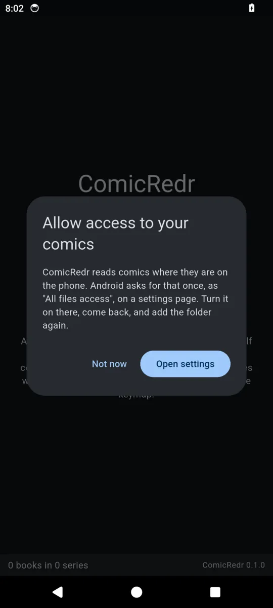
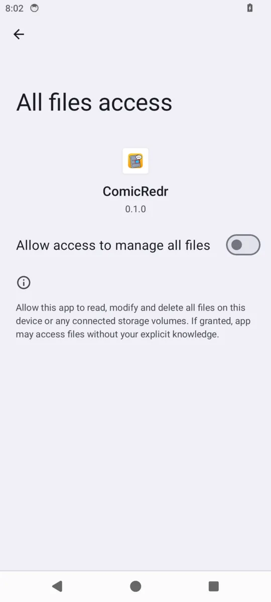

# 10. On the phone

[Contents](README.md) · Previous: [The keyboard](09-keyboard.md) · Next: [Your data](11-your-data.md)

ComicRedr on an Android phone is the same app as on the laptop, laid out
for a narrow screen. How to build it and put it on the phone is in
[Installing](01-installing.md#on-an-android-phone).

| | | |
|---|---|---|
|  |  |  |
| The library, with its tabs at the bottom | A page, with the status line's buttons | Guided view: a panel fills the width |

These pictures are from the Android 14 emulator.

## First start

1. Copy some comics into the phone's `Comics` folder (over USB, or
   however you like).
2. Start ComicRedr and tap the folder button.
3. Android asks you to allow **All files access** for ComicRedr on a
   settings page. Allow it, then come back. (Android 10 and older ask
   in a dialog instead.)
4. `Comics` is now in the library. The folder button adds any other
   folder.

| | | |
|---|---|---|
|  |  |  |
| The first start | ComicRedr explains what it needs | Android's settings page: turn the switch on |

## What is different on the phone

- The library's tabs are at the bottom, and tapping a cover opens a page
  with its details and a **Read** button. A long press does the same.
- The reader's status line has buttons for guided view, balloons, the
  page grid, bookmarks and fullscreen; see [Touch](08-touch.md) for the
  gestures.
- The back gesture works like `Esc`: out of guided view, then out of the
  book, then up through the library.
- The phone turns with you: turning it keeps your page, zoom and panel.
- Finding the panels of the whole library in the background is off, to
  save the battery. Guided view still finds each book's panels as you
  read it, and Settings can turn the background pass on.
- A Bluetooth keyboard works, with all the same keys.

## From the laptop to the phone and back

Every comic carries a small hidden [sidecar file](11-your-data.md) with
its bookmarks, found panels and where you are. Copy the comic together
with its sidecar (`.book.cbz.crdb` beside `book.cbz`) and it opens on the
phone ready to read, without finding its panels again.

If you read further on the other device, ComicRedr notices when you open
the comic and asks whether to go there:

> **Read further on phone**
> This comic was last read on phone, up to page 24, panel 3. Go there?

Your own keys and a detector model of your own can go onto the phone
too: `make push-keys` and `make push-model MODEL=file.onnx` from the
laptop.

[Contents](README.md) · Previous: [The keyboard](09-keyboard.md) · Next: [Your data](11-your-data.md)
