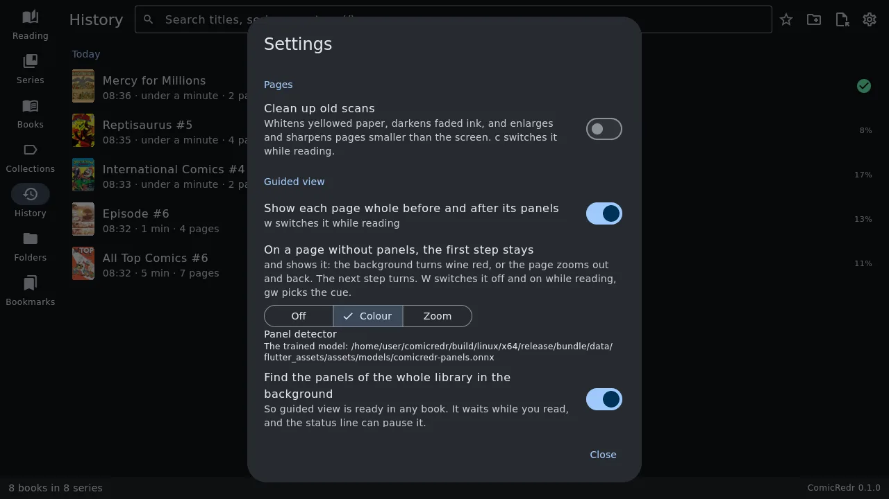
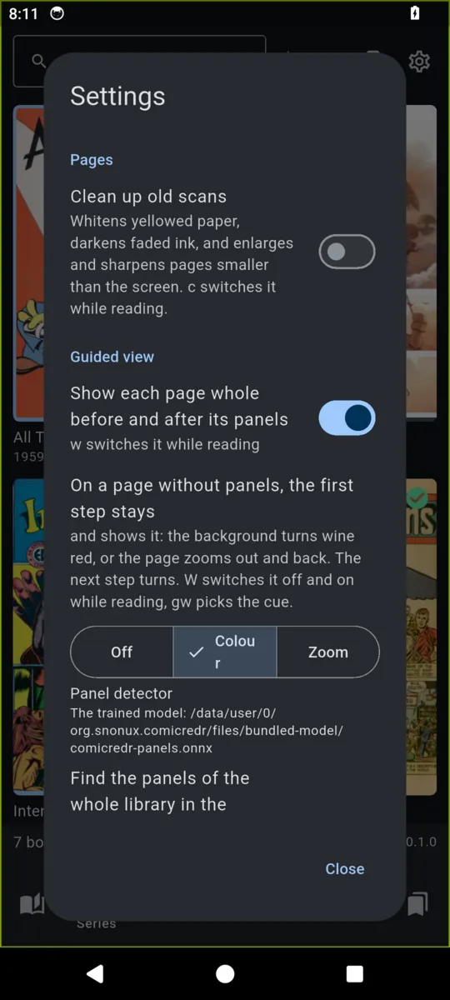

# 11. Settings

[Contents](README.md) · Previous: [Your data](10-your-data.md) · Next: [Credits](README.md#credits)

Open Settings with the gear button at the top of the library. Most
settings can also be switched while reading, with the key named in
brackets.

| Setting | What it does |
|---|---|
| **Pages → Clean up old scans** (`c`) | Whitens yellowed paper, darkens faded ink, and enlarges and sharpens pages smaller than the screen. See [clean-up](03-reading.md#old-scans-clean-up-trim-and-the-night-filter). |
| **Guided view → Show each page whole before and after its panels** (`w`) | See [panel by panel](04-guided-view.md#panel-by-panel). On by default. |
| **Guided view → On a page without panels, the first step stays** (`W`, `gw`) | **Off**, **Colour** (the wine-red background) or **Zoom** (the page zooms out and back). See [the first press stays](04-guided-view.md#the-first-press-stays). |
| **Guided view → Panel detector** | Which detector finds the panels: the model built into the app, or one you added. |
| **Guided view → Find the panels of the whole library in the background** | So guided view is ready in every book. It waits while you read. Off on the phone unless you turn it on. |
| **Sidecars → Save panels, bookmarks and position in a file for each comic** | The [sidecar](10-your-data.md#the-sidecar-beside-each-comic) files. On by default. |
| **Sidecars → Beside each comic / In one folder** | Where the sidecars go. See [keeping them in one folder](10-your-data.md#keeping-the-sidecars-in-one-folder). |
| **Sidecars → Export sidecars to a folder…** | A copy of every sidecar, for a backup. |
| **Touch** | **Standard**, **Left-handed** or **One thumb**. See [the tap zones](07-touch.md#the-tap-zones). |
| **Reading history → Clear reading history** | Empties the [History tab](02-library.md#history). Positions, bookmarks and collections stay. |

The bottom of the dialog shows ComicRedr's version.

A few more choices are made while reading and remembered without a
setting: [fullscreen](03-reading.md#fullscreen), the page grid's size,
[shuffle](02-library.md#shuffle) in the Folders tab, and, for each comic,
[two pages](03-reading.md#two-pages-side-by-side), the reading direction
and [the turn](03-reading.md#turn-the-comic).

[Contents](README.md) · Previous: [Your data](10-your-data.md) · Next: [Credits](README.md#credits)
