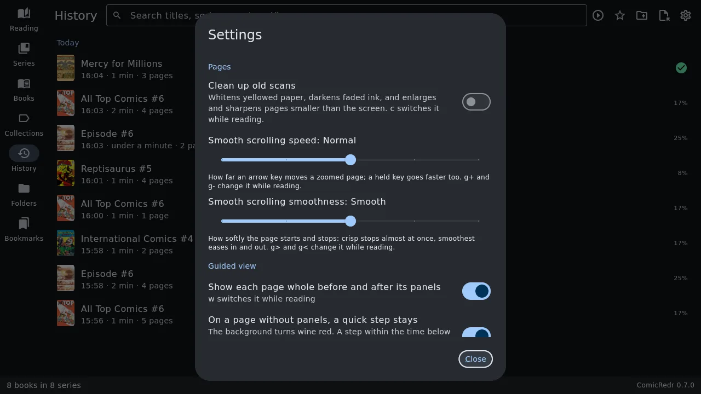
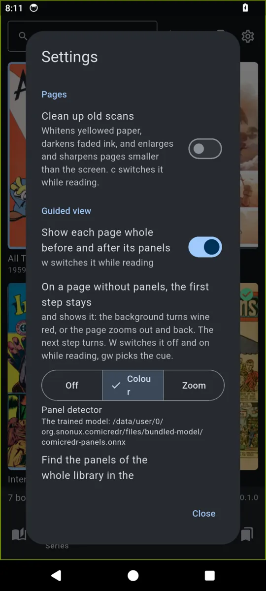

# 12. Settings

[Contents](README.md) · Previous: [Your data](11-your-data.md) · Next: [Syncing through S3](13-s3-sync.md)

Open Settings with the gear button at the top of the library. Most
settings can also be switched while reading, with the key named in
brackets.

| Setting | What it does |
|---|---|
| **Pages → Clean up old scans** (`c`) | Whitens yellowed paper, darkens faded ink, and enlarges and sharpens pages smaller than the screen. See [clean-up](04-reading.md#old-scans-clean-up-trim-and-the-night-filter). |
| **Pages → Smooth scrolling speed** (`g+` `g-`) | How far an arrow key moves a zoomed page, from **Slowest** to **Fastest**; a held key goes faster too. **Normal** by default. See [how fast](04-reading.md#how-fast). |
| **Pages → Smooth scrolling smoothness** (`g>` `g<`) | How softly that glide starts and stops, from **Crisp** to **Smoothest**, without changing how far it goes. **Smooth** by default. See [how smooth](04-reading.md#how-smooth). |
| **Guided view → Show each page whole before and after its panels** (`w`) | See [panel by panel](05-guided-view.md#panel-by-panel). On by default. |
| **Guided view → On a page without panels, a quick step stays** (`W`) | On a page guided view shows whole, the background turns wine red. If you press on again quickly, the page stays and gives a small zoom so you notice it; the next press turns. How quick counts as quick is picked below it: **1**, **2**, **3**, **5** or **10 s** (2 by default; can be picked only while this is on). On by default. See [a quick press stays](05-guided-view.md#a-quick-press-stays). |
| **Guided view → Panel detector** | Shows which detector finds the panels and where its file is. It can't be changed here; see [the panel detector](01-installing.md#the-panel-detector). |
| **Library → Cover size** (`+` `-` `=`) | Two buttons make the library's covers smaller and bigger, a column more or fewer a tap, and **Usual size** puts them back; the line says how many covers there are in a row. The covers behind the dialog change as you tap. For a phone, where there is no `+` key, when pinching is not for you. The buttons are greyed out when Settings was opened where no covers show (the History or Bookmarks tab, an empty library). See [bigger and smaller covers](03-library.md#bigger-and-smaller-covers). |
| **Sidecars → Save panels, bookmarks and position in a file for each comic** | The [sidecar](11-your-data.md#the-sidecar-beside-each-comic) files. On by default. |
| **Sidecars → Beside each comic / In one folder** | Where the sidecars go. Switching offers to move the ones already written. See [keeping them in one folder](11-your-data.md#keeping-the-sidecars-in-one-folder). |
| **Sidecars → Export sidecars to a folder…** | A copy of every sidecar, for a backup. |
| **Touch** | **Standard**, **Left-handed** or **One thumb**, with a drawing of what each zone does. If your `keys.toml` changes gestures, it says how many. See [the tap zones](08-touch.md#the-tap-zones). |
| **Reading history → Clear reading history** | Empties the [History tab](03-library.md#history). Positions, bookmarks and collections stay. |
| **Back up → Export settings…** / **Import settings…** | Every setting, your library folders, `keys.toml`, positions, bookmarks, collections, edits and reading history in one file, and back. See [back up and restore](11-your-data.md#back-up-and-restore-your-settings). |
| **S3 sync → Set up S3 sync…** (**Change S3 sync…** once it is on) | Your own S3 bucket, to carry comics and their sidecars between devices. See [syncing through S3](13-s3-sync.md). |

The bottom of the dialog shows ComicRedr's version.

A few more choices are made while reading and remembered without a
setting: [fullscreen](04-reading.md#fullscreen), the page grid's size,
the night filter and auto-trim ([old scans](04-reading.md#old-scans-clean-up-trim-and-the-night-filter)),
[shuffle](03-library.md#shuffle) and the [filter](03-library.md#filter-by-type-size-and-date)
in the Folders tab, and, for each comic,
[two pages](04-reading.md#two-pages-side-by-side), the reading direction
and [the turn](04-reading.md#turn-the-comic).

[Contents](README.md) · Previous: [Your data](11-your-data.md) · Next: [Syncing through S3](13-s3-sync.md)
