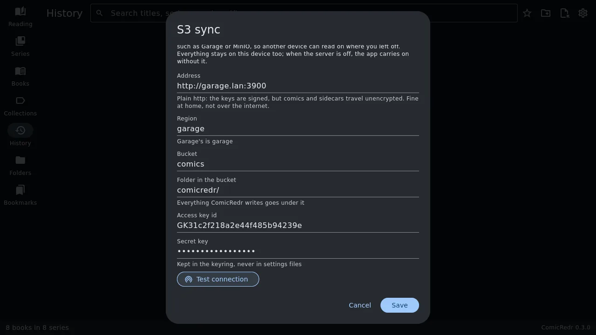

# 13. Syncing through S3

[Contents](README.md) · Previous: [Settings](12-settings.md) · Next: [Credits](README.md#credits)

Upload a comic from the laptop, carry on reading it on the phone, and
back again, through a bucket on your own S3 server: [Garage](https://garagehq.deuxfleurs.fr),
MinIO, or any other that speaks S3. Nothing goes anywhere else, and
everything stays on each device too, so a server that is switched off
now and then is fine: ComicRedr carries on without it.

S3 sync is being built in steps. This version sets up the connection to
your bucket; uploading comics, keeping their sidecars in step and
finding them on the other device come next.

## Setting it up

You need a bucket and a key that may read and write it. On Garage, for
example:

```sh
garage bucket create comics
garage key create comicredr
garage bucket allow --read --write comics --key comicredr
garage key info comicredr --show-secret   # the access key id (GK…) and the secret key
```

Then in ComicRedr, Settings → **S3 sync** → **Set up S3 sync…**:

| Field | What goes in it |
|---|---|
| **Address** | Your S3 server, like `https://garage.example.org` or `http://garage.lan:3900`. |
| **Region** | Garage's is `garage`, the default. |
| **Bucket** | The bucket's name. |
| **Folder in the bucket** | Everything ComicRedr writes goes under it, `comicredr/` by default, so the bucket can hold other things too. |
| **Access key id** and **Secret key** | The key's two halves. |



**Test connection** writes a small file to the bucket, reads it back,
finds it in a listing and deletes it again, and says which step failed
if one did: a server that does not answer, keys that were refused, a
bucket that does not exist. **Save** keeps the settings.

Do the same on each device, with the same bucket and folder.

## The secret key

The secret key is kept in the system keyring: GNOME Keyring (or
another Secret Service) on Linux, the Android Keystore on the phone.
When no keyring answers, as in a bare window manager session, it goes
in `~/.config/comicredr/s3-secret` instead, a file only you can read;
the note under the field says which one is in use. It is never shown
again, never in the app's database or a sidecar, and never in an
[exported settings file](11-your-data.md#back-up-and-restore-your-settings).
To change it, type the new one; leave the field empty to keep it.

A settings file carries the rest (address, region, bucket, folder and
access key id), so importing the laptop's settings on the phone leaves
only the secret key to type. A settings file without S3 settings, like
one made before this version, leaves the ones on the device alone.

## Plain http

A Garage at home often answers on plain `http://`. ComicRedr allows it
and says so under the address: the keys themselves are never sent (each
request is signed with them), but comics and sidecars travel
unencrypted. That is fine on your own network; over the internet, use
`https://`.

## Turning it off

**Turn off** in the S3 sync dialog forgets the bucket and the keys on
this device. Nothing in the bucket and nothing on the device is deleted.
