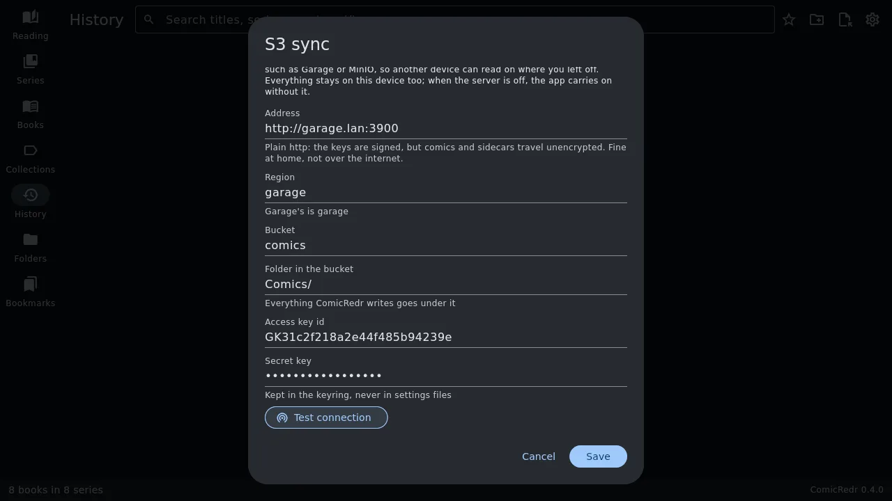

# 13. Syncing through S3

[Contents](README.md) · Previous: [Settings](12-settings.md) · Next: [Credits](README.md#credits)

Upload a comic from the laptop, carry on reading it on the phone, and
back again, through a bucket on your own S3 server: [Garage](https://garagehq.deuxfleurs.fr),
MinIO, or any other that speaks S3. Nothing goes anywhere else, and
everything stays on each device too, so a server that is switched off
now and then is fine: ComicRedr carries on without it.

In short: set up the bucket on each device, upload a comic from one,
download it on the other, and each picks up where the other left off.

## Setting it up

You need a bucket and a key that may read and write it. On Garage, for
example:

```sh
garage bucket create comics
garage key create comicredr
garage bucket allow --read --write comics --key comicredr
garage key info comicredr --show-secret   # the access key id (GK…) and the secret key
```

Then in ComicRedr, Settings → **S3 sync** → **Set up S3 sync…**:

| Field | What goes in it |
|---|---|
| **Address** | Your S3 server, like `https://garage.example.org` or `http://garage.lan:3900`. |
| **Region** | Garage's is `garage`, the default. |
| **Bucket** | The bucket's name. |
| **Folder in the bucket** | Everything ComicRedr writes goes under it, `comicredr/` by default, so the bucket can hold other things too. |
| **Access key id** and **Secret key** | The key's two halves. |



**Test connection** writes a small file to the bucket, reads it back,
finds it in a listing and deletes it again, and says which step failed
if one did: a server that does not answer, keys that were refused, a
bucket that does not exist. **Save** keeps the settings.

Do the same on each device, with the same bucket and folder.

## Uploading comics

Nothing goes to the bucket until you ask. Select a cover in the library
and press `gu`, or press **Upload to S3** on the comic's page; in the
reader, `gu` uploads the open comic. On a series or a folder, `gu`
uploads every comic in it.

To upload several at once, [mark them first](03-library.md#several-comics-at-once):
`Shift` and the arrow keys mark a run, `Ctrl+A` everything shown, `V` the
selected cover, Ctrl+click and Shift+click with the mouse, and on a
phone the **Select** button (the list with ticks) in the header turns
taps into marking. Marked covers show a tick, and a bar over the grid says how
many are marked, with **Upload to S3**, **Download**, **Remove from S3**
and the other actions on several comics. `gu` uploads the marked ones,
`gU` takes them off S3; Esc clears the marks.

Uploads run in the background: the comic, its cover, its sidecar (your
place, bookmarks, panels, collections and edits), then a small
description of it last, so the other device never sees half a comic.
A folder of page images goes up picture by picture.

## The cloud on a cover

A comic on S3 has a small cloud in the corner of its cover:

| Cloud | Means |
|---|---|
| Cloud with a tick | On this device and on S3, in step. |
| Cloud with an arrow up | Uploading, or changes waiting to go up; a ring shows how far an upload got. |
| Cloud crossed out, in red | On S3, but the bucket is out of reach right now; everything is saved here and goes up later. |
| Cloud with an arrow down, cover dimmed | On S3 only, not downloaded to this device. |

The comic's page says it in words, like "On S3 since 26 Sep 2026,
uploaded from thinkpad".

## On the other device

Once the bucket is set up on the phone, the comics you uploaded appear
in its library by themselves, with their covers dimmed and the cloud
with the arrow down, in the same folders as on the laptop. Only the
title, the details and the cover come over, a few kilobytes each: the
comic itself is downloaded only when you ask. The app looks at the
bucket when it starts, when it comes back to the front, on `R` and every
five minutes.

Open such a comic (a tap on a phone, Enter on the laptop) and its page
has a **Download** button with the size. The comic goes into the same
folder under your first library folder (`~/Comics` on Linux,
`Comics` on the phone's storage), with its sidecar, so it opens with its
panels found and at the place you left it on the other device. Marked
comics are downloaded together with **Download** in the bar.

A comic that is already on the device, under any name, is recognised
and simply gets its cloud; nothing is downloaded twice.

## Carrying on where you left off

Each device writes the comic's sidecar on its own disk as you read, and
sends it to the bucket a few seconds later, when you close the comic or
when the app goes to the background. Opening a comic that is on S3
first asks the bucket whether its sidecar is newer, for up to two
seconds; if it is, it replaces the one on this device before the page
shows. When the other device was somewhere else in the book, you are
asked:

> **Read further on Android**
> This comic was last read on Android, up to page 7. Go there?

The newest sidecar always wins, whole: there is no merging. That is
safe while you read on one device at a time. If you read the same comic
on both while the bucket was off, the device that writes last when it
is back wins, and what the other did meanwhile in that comic (its place,
a bookmark) is lost.

## When the server is off

A home server that is switched off is expected. The first call that
gets no answer shows one notice, "S3 (garage.lan:3900) is out of reach;
saving on this device", and the clouds turn red. Reading is never
slowed and nothing is lost: every change is saved on the device, and
what waits for the bucket is kept in the app's database, across
restarts. The app tries again after 30 seconds, then less often, up to
every five minutes, and at once on start, when it comes back to the
front and on `R`. When the bucket answers again: "S3 is back; 3 comics
caught up".

## Taking a comic off S3

**Remove from S3** (`gU`, the button on the comic's page, or the bar for
marked comics) deletes the comic and its sidecar from the bucket after
asking. The comic stays on this device, and the other device keeps its
own copy if it downloaded one; a comic it had not downloaded disappears
from its library.

Deleting a comic that is on S3 (`gd`, Shift+Delete) asks which you mean,
with Cancel focused as ever:

- **Delete only here**: the comic goes from this device, the copy in the
  bucket stays, and the comic stays in the library with the down arrow,
  to download again.
- **Delete here and from S3**: gone from this device and from the bucket.

Neither ever deletes the other device's copy.

If the bucket is off, the removal waits and happens when it is back.

## Keys

| Key | Does |
|---|---|
| `gu` | Upload the selected comic, the marked ones, or the open one to S3 |
| `gU` | Remove the selected, marked or open comic from S3, after asking |
| `V` | Mark or unmark the selected cover and move on |
| `Shift`+arrows, `Ctrl+A` | Mark a run of covers, every cover shown |
| Ctrl+click, Shift+click | Mark or unmark a cover, mark up to a cover |
| Esc | Clear the marks |

## The secret key

The secret key is kept in the system keyring: GNOME Keyring (or
another Secret Service) on Linux, the Android Keystore on the phone.
When no keyring answers, as in a bare window manager session, it goes
in `~/.config/comicredr/s3-secret` instead, a file only you can read;
the note under the field says which one is in use. It is never shown
again, never in the app's database or a sidecar, and never in an
[exported settings file](11-your-data.md#back-up-and-restore-your-settings).
To change it, type the new one; leave the field empty to keep it.

A settings file carries the rest (address, region, bucket, folder and
access key id), so importing the laptop's settings on the phone leaves
only the secret key to type. A settings file without S3 settings, like
one made before this version, leaves the ones on the device alone.

## Plain http

A Garage at home often answers on plain `http://`. ComicRedr allows it
and says so under the address: the keys themselves are never sent (each
request is signed with them), but comics and sidecars travel
unencrypted. That is fine on your own network; over the internet, use
`https://`.

## Turning it off

**Turn off** in the S3 sync dialog forgets the bucket and the keys on
this device, and the clouds go from the covers. Nothing in the bucket and
nothing on the device is deleted.
